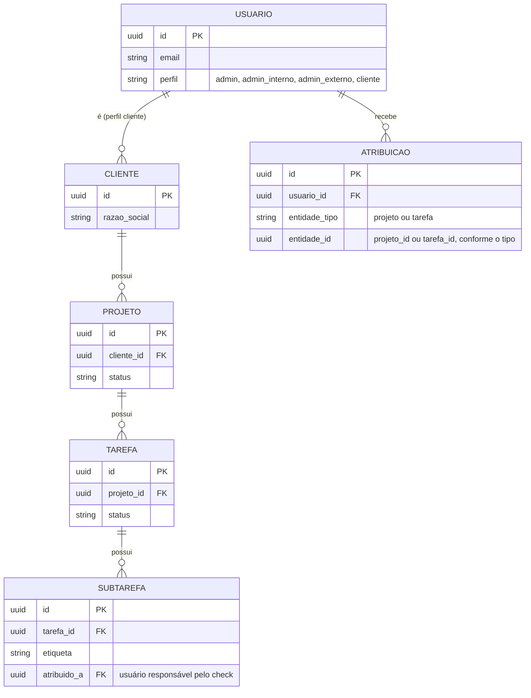
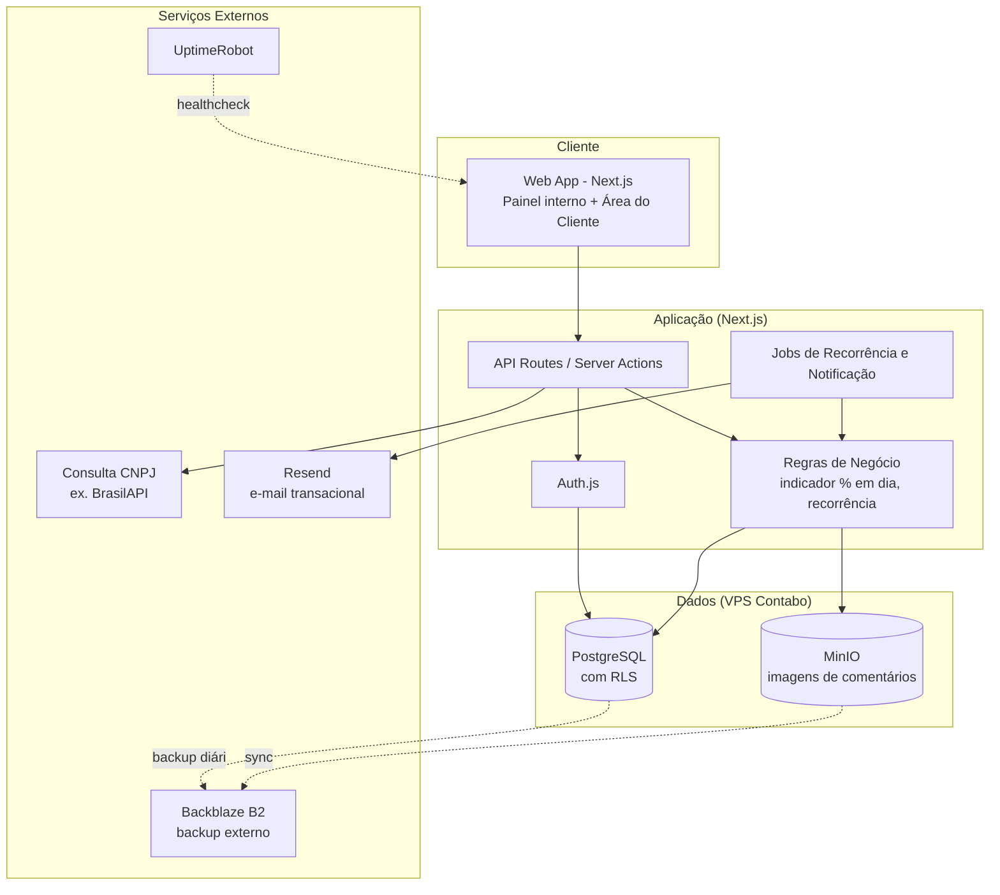
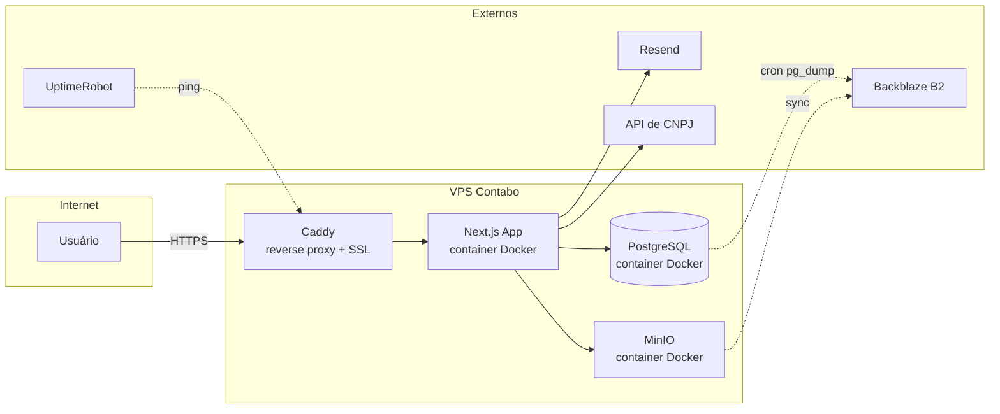
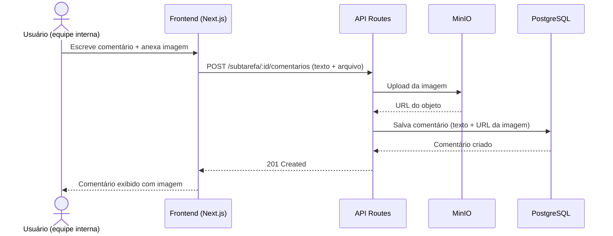

# Architecture Design Document — Múltiplus Software

**Versão:** 1.1
**Data:** 02/09/2026
**Autor:** André (Somma)
**Baseado em:** SRS v1.1 (RF-001 a RF-029)

---

## 1. Contexto e Inputs Utilizados

Sistema SaaS com múltiplos perfis (equipe interna + portal do cliente), desenvolvido solo
por André via Claude Code (vibe coding), com hospedagem self-hosted na Contabo por
preferência explícita de controle total do servidor.

**Constraints principais do SRS:**
- RNF-001/RNF-002: segurança de acesso e conformidade LGPD — cada cliente só vê os próprios dados
- RNF-003: disponibilidade em melhor esforço, sem SLA formal
- Seção 6.1: dependência de serviço externo de consulta de CNPJ, sujeito a instabilidade
- Seção 7: orçamento de infra limitado ao plano de manutenção contratado (R$150/mês no
  ciclo mensal, R$119-133/mês nos ciclos com desconto)
- RF-016/RF-017 (adição de escopo): comentários com anexo de imagem/link em subtarefa, tarefa e projeto
- **RF-018 a RF-021 (adição de escopo): modelo de 4 perfis com 3 granularidades de atribuição**
  **— este é o ponto que mais impacta a arquitetura desta revisão.** Ver Seção 3.1.

---

## 2. Arquitetura Recomendada: Monolito com Infra Self-hosted

**Por quê este padrão:**
- Solo dev usando Claude Code — monolito é o que a IA constrói com mais coerência, menos
  contexto espalhado entre serviços
- Preferência explícita por controle total do servidor (VPS Contabo, não BaaS)
- Escala pequena (2 usuários internos + poucos clientes) — não há motivo técnico para
  separar serviços

**O que este padrão implica:**
- Toda a stack roda em containers Docker num único VPS
- André assume responsabilidades que um provedor gerenciado cobriria: backup, atualização
  de segurança, monitoramento, certificado SSL

**Alternativa considerada:** Vercel + Supabase (BaaS gerenciado) — descartada porque o
usuário optou explicitamente por controle total do servidor em vez de conveniência gerenciada.

**Riscos e mitigações:**
- Risco: sem SLA de provedor gerenciado, falha de infra é responsabilidade exclusiva do André
  → Mitigação: backup automático diário + monitoramento externo (Seção 4)
- Risco: volume de imagens (RF-017) crescendo sem controle no storage
  → Mitigação: storage de objeto separado do banco, com política de tamanho máximo por
  upload a definir na implementação

---

## 3. Modelo de Dados e Estratégia de Permissões (⚠️ Revisão por adição de escopo)

O modelo original (RF-014/015) previa apenas dois níveis: equipe interna (acesso total) e
cliente (somente leitura). O SRS v1.1 exige **3 granularidades de atribuição** na mesma
hierarquia Cliente → Projeto → Tarefa → Subtarefa:

| Perfil | Atribuído em nível de | Visualiza |
|---|---|---|
| Administrador (Talita) | — (acesso total) | Tudo |
| Administrador Interno | **Projeto** | Todas as tarefas/subtarefas do(s) projeto(s) atribuído(s) |
| Administrador Externo | **Tarefa** | Apenas a(s) tarefa(s) específica(s) atribuída(s) |
| Check de subtarefa (RN-004) | **Subtarefa** | Só quem está atribuído àquela subtarefa, ou Talita |
| Cliente | **Cliente** (implícito) | Apenas os próprios projetos, somente leitura |

**Consequência direta:** não dá pra resolver isso com uma única tabela de "role" simples.
Precisa de uma tabela de **atribuições** (`atribuicoes`) separada, que registra *quem* tem
acesso a *qual entidade* (projeto, tarefa ou subtarefa), e as políticas de RLS do Postgres
precisam consultar essa tabela em cascata.

### 3.1 Esboço de Modelo de Dados (simplificado)

**Nota técnica:** `ATRIBUICAO` é uma tabela polimórfica simples (`entidade_tipo` + `entidade_id`)
em vez de duas tabelas separadas (`atribuicao_projeto`, `atribuicao_tarefa`) — mais fácil de
consultar numa política de RLS única, ao custo de não ter FK nativa do Postgres apontando pra
`entidade_id` (validação de integridade fica na aplicação, não no banco).

### 3.2 Estratégia de RLS

As políticas de RLS do Postgres precisam checar, em cascata:
1. **Administrador:** bypass total (política sempre verdadeira)
2. **Cliente:** `projeto.cliente_id = usuario.cliente_id` (já previsto)
3. **Administrador Interno:** existe registro em `ATRIBUICAO` com `entidade_tipo = 'projeto'`
   e `entidade_id = projeto.id` para aquele usuário
4. **Administrador Externo:** existe registro em `ATRIBUICAO` com `entidade_tipo = 'tarefa'`
   e `entidade_id = tarefa.id` para aquele usuário (e, por herança, a subtarefa dessa tarefa)
5. **Check de subtarefa (RN-004):** política adicional, mais restritiva, só na operação de
   marcar `concluida = true` — verifica `subtarefa.atribuido_a = usuario.id` OU perfil admin

Isso é mais complexo que RLS de um único nível (cliente vs equipe), mas ainda é resolvível
com Postgres puro — não precisa de biblioteca de autorização externa (ex. Casbin, OPA) nessa
escala.

---

## 4. Stack Recomendada

| Camada | Tecnologia | Justificativa |
|--------|-----------|---------------|
| Frontend + Backend | **Next.js** (App Router, TypeScript) | Monolito full-stack; melhor stack pra Claude Code trabalhar com coerência |
| Banco de dados | **PostgreSQL self-hosted** (Docker) | RLS nativo cobre RF-014/RF-015; portável, sem lock-in |
| Auth | **Auth.js (NextAuth) + adapter Postgres** | Login por credenciais, cobre os 4 perfis (admin, admin interno, admin externo, cliente) via RLS + tabela de atribuições (Seção 3) |
| Storage de imagens | **MinIO self-hosted** (Docker, S3-compatible) | RF-017 — mantém imagem fora do Postgres; roda no mesmo VPS, alinhado à preferência de controle total |
| Reverse proxy / SSL | **Caddy** | HTTPS automático via Let's Encrypt, config mínima pra manter sozinho |
| Orquestração | **Docker Compose** | App + Postgres + MinIO + Caddy num único `docker-compose.yml` |
| Jobs/Recorrência | **Cron do próprio VPS** (node-cron ou cron do sistema) | RF-006 (recorrência) e RF-007 (notificação de prazo) |
| E-mail transacional | **Resend** | Independe da hospedagem; free tier cobre o volume esperado |
| Backup | **Cron + pg_dump** → Backblaze B2 (banco) + sync do bucket MinIO → B2 (imagens) | Sem isso, falha no VPS apaga tudo |
| Monitoramento | **UptimeRobot** (free) | Alerta de queda sem depender de provedor gerenciado |
| CI/CD | **GitHub Actions** → deploy via SSH | Testes rodam antes do deploy (ver padrão de testes por sprint) |

**Custo estimado mensal:**
- VPS Contabo (básico): ~R$30-35
- Backblaze B2 (backup de banco + imagens, volume baixo): poucos reais
- Resend, UptimeRobot, GitHub Actions: free tier
- **Total: bem abaixo do R$150/mês já precificado no plano de manutenção**

---

## 5. Diagramas

### 5.1 Diagrama de Componentes

### 5.2 Diagrama de Deploy / Infraestrutura

### 5.3 Fluxo de Dados — Comentário com Imagem em Subtarefa (RF-016/RF-017)

---

## 6. Architecture Decision Records

### ADR-001: Escolha de padrão arquitetural — Monolito self-hosted

**Data:** 02/09/2026
**Status:** Aceita
**Contexto do projeto:** Múltiplus Software

**Contexto:** Solo dev via Claude Code, precisa decidir entre monolito e serviços separados
antes de iniciar a Sprint 1 (infra).

**Opções Consideradas:**

**Opção 1: Monolito Next.js**
- ✅ Menos peças móveis pra Claude Code manter coerente
- ✅ Deploy único, mais simples de operar sozinho
- ❌ Menos flexível se precisar escalar partes independentemente no futuro

**Opção 2: Backend separado (NestJS) + Frontend separado**
- ✅ Separação de responsabilidades mais clara
- ❌ Mais complexidade operacional pra um único dev sem ganho real nessa escala

**Decisão:** Escolhemos Monolito Next.js. Escala e equipe (1 dev) não justificam a
complexidade adicional de serviços separados.

**Consequências:**
- Positivas: deploy e manutenção mais simples; Claude Code trabalha com mais consistência
- Negativas: se o sistema crescer muito além do escopo atual, pode exigir refatoração
- Ações necessárias: [x] Estrutura de projeto Next.js definida na Sprint 1

---

### ADR-002: Hospedagem — VPS Contabo self-hosted em vez de BaaS gerenciado

**Data:** 02/09/2026
**Status:** Aceita
**Contexto do projeto:** Múltiplus Software

**Contexto:** Definição inicial era Vercel + Supabase (gerenciado). André optou por Contabo
por preferência de controle total do servidor.

**Opções Consideradas:**

**Opção 1: Vercel + Supabase (BaaS)**
- ✅ Zero manutenção de infra, backup e auth gerenciados
- ❌ Menos controle, dependência total dos provedores

**Opção 2: VPS Contabo self-hosted**
- ✅ Controle total do servidor e dos dados
- ✅ Custo previsível e mais barato no longo prazo
- ❌ André assume responsabilidade por backup, segurança, SSL e monitoramento

**Decisão:** Escolhemos VPS Contabo self-hosted, por preferência explícita do André por
controle total, aceitando conscientemente o trade-off de responsabilidade operacional.

**Consequências:**
- Positivas: controle total, custo previsível, sem lock-in de provedor
- Negativas: sem SLA — qualquer falha de infra é responsabilidade do André; exige disciplina
  de backup e monitoramento
- Ações necessárias:
  - [ ] Backup automático (pg_dump + sync MinIO → Backblaze B2)
  - [ ] Monitoramento externo (UptimeRobot)
  - [ ] Documentar processo de recuperação de desastre (runbook simples)

---

### ADR-003: Armazenamento de imagens em comentários — MinIO em vez de blob no Postgres

**Data:** 02/09/2026
**Status:** Aceita
**Contexto do projeto:** Múltiplus Software

**Contexto:** RF-017 (adição de escopo, fora da proposta fechada) exige anexar imagem a
comentários de subtarefa. Era necessário decidir onde/como armazenar essas imagens.

**Opções Consideradas:**

**Opção 1: Blob binário direto no Postgres**
- ✅ Simplicidade inicial, um único lugar pra tudo
- ❌ Infla o tamanho do banco e dos backups rapidamente
- ❌ Degrada performance de query à medida que o volume de imagens cresce

**Opção 2: MinIO self-hosted (S3-compatible)**
- ✅ Banco continua leve — só guarda a URL de referência
- ✅ Alinhado à preferência de controle total (roda no mesmo VPS)
- ❌ Mais um container pra manter e fazer backup

**Decisão:** Escolhemos MinIO self-hosted. Banco de dados guarda apenas metadados e URL;
o arquivo em si fica no MinIO, com sync periódico pro Backblaze B2 como backup externo.

**Consequências:**
- Positivas: Postgres permanece leve e rápido; backups do banco continuam pequenos
- Negativas: mais um serviço no Docker Compose pra monitorar e atualizar
- Ações necessárias:
  - [ ] Adicionar MinIO ao `docker-compose.yml`
  - [ ] Definir tamanho máximo por upload de imagem (evitar abuso de espaço em disco)
  - [ ] Incluir bucket do MinIO na rotina de backup

---

### ADR-004: Estratégia de permissão — tabela de atribuições + RLS em cascata, sem lib externa

**Data:** 02/09/2026
**Status:** Aceita
**Contexto do projeto:** Múltiplus Software

**Contexto:** RF-018 a RF-021 (adição de escopo) exigem 3 granularidades de atribuição
(projeto, tarefa, subtarefa) para 4 perfis. Era necessário decidir como modelar isso no banco.

**Opções Consideradas:**

**Opção 1: Tabela de atribuições polimórfica + RLS nativo do Postgres**
- ✅ Resolve com Postgres puro, sem dependência nova
- ✅ Alinhado à stack já decidida (ADR-002/003)
- ❌ Política de RLS mais complexa de escrever e testar que um RLS de nível único

**Opção 2: Biblioteca de autorização externa (ex. Casbin, Open Policy Agent)**
- ✅ Modelo de permissão mais expressivo e testável isoladamente
- ❌ Complexidade e dependência desnecessárias pra essa escala (4 perfis, 1 dev)

**Decisão:** Escolhemos a Opção 1 — tabela `atribuicoes` + RLS em cascata no Postgres. A
escala do projeto (4 perfis, poucos usuários) não justifica uma camada de autorização externa.

**Consequências:**
- Positivas: sem dependência nova; mantém a stack simples e dentro do que Claude Code
  constrói bem
- Negativas: políticas de RLS exigem teste dedicado (ver Padrão de Testes por Sprint,
  categoria "Teste de permissão/RLS") — é a parte mais fácil de errar silenciosamente
- Ações necessárias:
  - [ ] Modelar tabela `atribuicoes` (Seção 3.1)
  - [ ] Escrever políticas de RLS para os 4 perfis + regra de check de subtarefa (RN-004)
  - [ ] Cobrir cada perfil com teste de integração antes de considerar a Sprint correspondente pronta

---

## 7. Estimativa de Custo de Infra

| Item | Custo mensal aproximado |
|------|--------------------------|
| VPS Contabo (básico) | R$ 30-35 |
| Backblaze B2 (backup banco + imagens) | R$ 5-10 (volume baixo) |
| Resend (e-mail) | R$ 0 (free tier) |
| UptimeRobot | R$ 0 (free tier) |
| GitHub Actions | R$ 0 (free tier, uso baixo) |
| **Total estimado** | **~R$ 35-45/mês** |

Bem abaixo do R$150/mês do ciclo mensal de manutenção já precificado na proposta — margem
confortável mesmo com crescimento moderado de uso.

---

## 8. Próximos Passos

- Sprint 1 (infra/auth) pode seguir como planejado — modelagem de usuários/RLS já inclui a
  tabela de atribuições e as políticas em cascata (Seção 3.2), sem pendência comercial
- Seguir para Fase 4 (Design de Produto) módulo a módulo, conforme os checkpoints de
  revisão já combinados
- Aplicar o Padrão de Testes por Sprint (já definido) a partir da Sprint 1, com atenção
  especial à categoria de teste de permissão/RLS dado o novo modelo

---

## Histórico de Revisões

| Versão | Data | Autor | Alterações |
|--------|------|-------|------------|
| 1.0 | 02/09/2026 | André | Versão inicial — arquitetura self-hosted na Contabo, incluindo decisão de storage de imagem (RF-016/RF-017) |
| 1.1 | 02/09/2026 | André | Modelo de dados e RLS revisados para suportar 4 perfis com 3 granularidades de atribuição (RF-018 a RF-021); novo ADR-004; stack de Auth atualizada |
| 1.2 | 02/09/2026 | André | Removida pendência de aditivo contratual — escopo absorvido por decisão do André. Sprint 1 liberada para início. |
