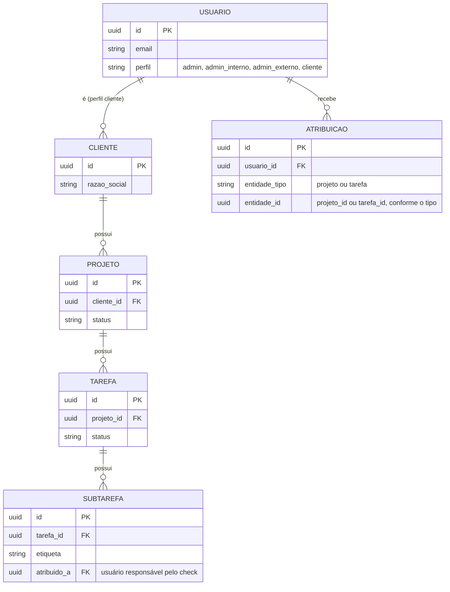
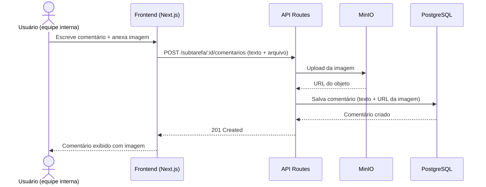

# Architecture Design Document — Múltiplus Software

**Versão:** 1.10
**Data:** 16/09/2026
**Autor:** André (Somma)
**Baseado em:** SRS v2.1 (RF-001 a RF-047, incluindo RF-002a a RF-002d)

---

## 1. Contexto e Inputs Utilizados

Sistema SaaS com múltiplos perfis (equipe interna + portal do cliente), desenvolvido solo
por André via Claude Code (vibe coding), com hospedagem self-hosted na Contabo por
preferência explícita de controle total do servidor.

**Constraints principais do SRS:**

- RNF-001/RNF-002: segurança de acesso e conformidade LGPD — cada cliente só vê os próprios dados
- RNF-003: disponibilidade em melhor esforço, sem SLA formal
- Seção 6.1: dependência de serviço externo de consulta de CNPJ, sujeito a instabilidade
- Seção 7: orçamento de infra limitado ao plano de manutenção contratado (R$150/mês no
  ciclo mensal, R$119-133/mês nos ciclos com desconto)
- RF-016/RF-017 (adição de escopo): comentários com anexo de imagem/link em subtarefa, tarefa e projeto
- **RF-018 a RF-021 (adição de escopo): modelo de 4 perfis com 3 granularidades de atribuição**
  **— este é o ponto que mais impacta a arquitetura desta revisão.** Ver Seção 3.1.

---

## 2. Arquitetura Recomendada: Monolito com Infra Self-hosted

**Por quê este padrão:**

- Solo dev usando Claude Code — monolito é o que a IA constrói com mais coerência, menos
  contexto espalhado entre serviços
- Preferência explícita por controle total do servidor (VPS Contabo, não BaaS)
- Escala pequena (2 usuários internos + poucos clientes) — não há motivo técnico para
  separar serviços

**O que este padrão implica:**

- Toda a stack roda em containers Docker num único VPS
- André assume responsabilidades que um provedor gerenciado cobriria: backup, atualização
  de segurança, monitoramento, certificado SSL

**Alternativa considerada:** Vercel + Supabase (BaaS gerenciado) — descartada porque o
usuário optou explicitamente por controle total do servidor em vez de conveniência gerenciada.

**Riscos e mitigações:**

- Risco: sem SLA de provedor gerenciado, falha de infra é responsabilidade exclusiva do André
  → Mitigação: backup automático diário + monitoramento externo (Seção 4)
- Risco: volume de imagens (RF-017) crescendo sem controle no storage
  → Mitigação: storage de objeto separado do banco, com política de tamanho máximo por
  upload a definir na implementação

---

## 3. Modelo de Dados e Estratégia de Permissões (⚠️ Revisão por adição de escopo)

O modelo original (RF-014/015) previa apenas dois níveis: equipe interna (acesso total) e
cliente (somente leitura). O SRS v1.1 exige **3 granularidades de atribuição** na mesma
hierarquia Cliente → Projeto → Tarefa → Subtarefa:

| Perfil                      | Atribuído em nível de        | Visualiza                                                  |
| --------------------------- | ------------------------------ | ---------------------------------------------------------- |
| Administrador (Talita)      | — (acesso total)              | Tudo                                                       |
| Colaborador Interno         | **Projeto**              | Todas as tarefas/subtarefas do(s) projeto(s) atribuído(s) |
| Colaborador Externo         | **Tarefa**               | Apenas a(s) tarefa(s) específica(s) atribuída(s)         |
| Check de subtarefa (RN-004) | **Subtarefa**            | Só quem está atribuído àquela subtarefa, ou Talita     |
| Cliente                     | **Cliente** (implícito) | Apenas os próprios projetos, somente leitura              |

**Consequência direta:** não dá pra resolver isso com uma única tabela de "role" simples.
Precisa de uma tabela de **atribuições** (`atribuicoes`) separada, que registra *quem* tem
acesso a *qual entidade* (projeto, tarefa ou subtarefa), e as políticas de RLS do Postgres
precisam consultar essa tabela em cascata.

### 3.1 Esboço de Modelo de Dados (simplificado)

**Nota técnica:** `ATRIBUICAO` é uma tabela polimórfica simples (`entidade_tipo` + `entidade_id`)
em vez de duas tabelas separadas (`atribuicao_projeto`, `atribuicao_tarefa`) — mais fácil de
consultar numa política de RLS única, ao custo de não ter FK nativa do Postgres apontando pra
`entidade_id` (validação de integridade fica na aplicação, não no banco).

**Nota sobre desativação (RF-039/ADR-008):** o esboço acima continua simplificado de
propósito. As colunas `ativo`, `desativado_em` e `desativado_por` existem em `CLIENTE`,
`PESSOA_ENVOLVIDA`, `DOCUMENTO` e `USUARIO` (nesta última, `ativo` desde a Sprint 1, pelo
RF-029), e entram em `PROJETO`, `TAREFA` e `SUBTAREFA` na Sprint 4. O schema completo, com
todas as tabelas e colunas, é `prisma/schema.prisma` — este diagrama existe para mostrar a
forma das relações que sustentam a RLS, não para duplicá-lo.

### 3.2 Estratégia de RLS

As políticas de RLS do Postgres precisam checar, em cascata:

1. **Administrador:** bypass total (política sempre verdadeira)
2. **Cliente:** `projeto.cliente_id = usuario.cliente_id` (já previsto)
3. **Colaborador Interno:** existe registro em `ATRIBUICAO` com `entidade_tipo = 'projeto'`
   e `entidade_id = projeto.id` para aquele usuário
4. **Colaborador Externo:** existe registro em `ATRIBUICAO` com `entidade_tipo = 'tarefa'`
   e `entidade_id = tarefa.id` para aquele usuário (e, por herança, a subtarefa dessa tarefa)
5. **Check de subtarefa (RN-004):** política adicional, mais restritiva, só na operação de
   marcar `concluida = true` — verifica `subtarefa.atribuido_a = usuario.id` OU perfil admin

Isso é mais complexo que RLS de um único nível (cliente vs equipe), mas ainda é resolvível
com Postgres puro — não precisa de biblioteca de autorização externa (ex. Casbin, OPA) nessa
escala.

---

## 4. Stack Recomendada

| Camada              | Tecnologia                                                                               | Justificativa                                                                                                                         |
| ------------------- | ---------------------------------------------------------------------------------------- | ------------------------------------------------------------------------------------------------------------------------------------- |
| Frontend + Backend  | **Next.js** (App Router, TypeScript)                                               | Monolito full-stack; melhor stack pra Claude Code trabalhar com coerência                                                            |
| Banco de dados      | **PostgreSQL self-hosted** (Docker)                                                | RLS nativo cobre RF-014/RF-015; portável, sem lock-in                                                                                |
| Auth                | **Auth.js (NextAuth) + adapter Postgres**                                          | Login por credenciais, cobre os 4 perfis (admin, admin interno, admin externo, cliente) via RLS + tabela de atribuições (Seção 3) |
| Storage de imagens  | **MinIO self-hosted** (Docker, S3-compatible)                                      | RF-017 — mantém imagem fora do Postgres; roda no mesmo VPS, alinhado à preferência de controle total                              |
| Reverse proxy / SSL | **Caddy**                                                                          | HTTPS automático via Let's Encrypt, config mínima pra manter sozinho                                                                |
| Orquestração      | **Docker Compose**                                                                 | App + Postgres + MinIO + Caddy num único`docker-compose.yml`                                                                       |
| Jobs/Recorrência   | **Cron do próprio VPS** (node-cron ou cron do sistema)                            | RF-006 (recorrência) e RF-007 (notificação de prazo)                                                                               |
| E-mail transacional | **Resend**                                                                         | Independe da hospedagem; free tier cobre o volume esperado                                                                            |
| Backup              | **Cron + pg_dump** → Cloudflare R2 (banco) + sync do bucket MinIO → R2 (imagens) | Sem isso, falha no VPS apaga tudo                                                                                                     |
| Monitoramento       | **UptimeRobot** (free)                                                             | Alerta de queda sem depender de provedor gerenciado                                                                                   |
| CI/CD               | **GitHub Actions** → deploy via SSH                                               | Testes rodam antes do deploy (ver padrão de testes por sprint)                                                                       |

**Custo estimado mensal:**

- VPS Contabo (básico): ~R$30-35
- Cloudflare R2 (backup de banco + imagens): R$0, dentro do free tier de 10GB — egress sempre grátis, importante pro teste de restore
- Resend, UptimeRobot, GitHub Actions: free tier
- **Total: bem abaixo do R$150/mês já precificado no plano de manutenção**

---

## 5. Diagramas

### 5.1 Diagrama de Componentes

### 5.2 Diagrama de Deploy / Infraestrutura

### 5.3 Fluxo de Dados — Comentário com Imagem em Subtarefa (RF-016/RF-017)

---

## 6. Architecture Decision Records

### ADR-001: Escolha de padrão arquitetural — Monolito self-hosted

**Data:** 02/09/2026
**Status:** Aceita
**Contexto do projeto:** Múltiplus Software

**Contexto:** Solo dev via Claude Code, precisa decidir entre monolito e serviços separados
antes de iniciar a Sprint 1 (infra).

**Opções Consideradas:**

**Opção 1: Monolito Next.js**

- ✅ Menos peças móveis pra Claude Code manter coerente
- ✅ Deploy único, mais simples de operar sozinho
- ❌ Menos flexível se precisar escalar partes independentemente no futuro

**Opção 2: Backend separado (NestJS) + Frontend separado**

- ✅ Separação de responsabilidades mais clara
- ❌ Mais complexidade operacional pra um único dev sem ganho real nessa escala

**Decisão:** Escolhemos Monolito Next.js. Escala e equipe (1 dev) não justificam a
complexidade adicional de serviços separados.

**Consequências:**

- Positivas: deploy e manutenção mais simples; Claude Code trabalha com mais consistência
- Negativas: se o sistema crescer muito além do escopo atual, pode exigir refatoração
- Ações necessárias: [x] Estrutura de projeto Next.js definida na Sprint 1

---

### ADR-002: Hospedagem — VPS Contabo self-hosted em vez de BaaS gerenciado

**Data:** 02/09/2026
**Status:** Aceita
**Contexto do projeto:** Múltiplus Software

**Contexto:** Definição inicial era Vercel + Supabase (gerenciado). André optou por Contabo
por preferência de controle total do servidor.

**Opções Consideradas:**

**Opção 1: Vercel + Supabase (BaaS)**

- ✅ Zero manutenção de infra, backup e auth gerenciados
- ❌ Menos controle, dependência total dos provedores

**Opção 2: VPS Contabo self-hosted**

- ✅ Controle total do servidor e dos dados
- ✅ Custo previsível e mais barato no longo prazo
- ❌ André assume responsabilidade por backup, segurança, SSL e monitoramento

**Decisão:** Escolhemos VPS Contabo self-hosted, por preferência explícita do André por
controle total, aceitando conscientemente o trade-off de responsabilidade operacional.

**Consequências:**

- Positivas: controle total, custo previsível, sem lock-in de provedor
- Negativas: sem SLA — qualquer falha de infra é responsabilidade do André; exige disciplina
  de backup e monitoramento
- Ações necessárias:
  - [ ] Backup automático (pg_dump + sync MinIO → Cloudflare R2)
  - [ ] Monitoramento externo (UptimeRobot)
  - [ ] Documentar processo de recuperação de desastre (runbook simples)

---

### ADR-003: Armazenamento de imagens em comentários — MinIO em vez de blob no Postgres

**Data:** 02/09/2026
**Status:** Aceita
**Contexto do projeto:** Múltiplus Software

**Contexto:** RF-017 (adição de escopo, fora da proposta fechada) exige anexar imagem a
comentários de subtarefa. Era necessário decidir onde/como armazenar essas imagens.

**Opções Consideradas:**

**Opção 1: Blob binário direto no Postgres**

- ✅ Simplicidade inicial, um único lugar pra tudo
- ❌ Infla o tamanho do banco e dos backups rapidamente
- ❌ Degrada performance de query à medida que o volume de imagens cresce

**Opção 2: MinIO self-hosted (S3-compatible)**

- ✅ Banco continua leve — só guarda a URL de referência
- ✅ Alinhado à preferência de controle total (roda no mesmo VPS)
- ❌ Mais um container pra manter e fazer backup

**Decisão:** Escolhemos MinIO self-hosted. Banco de dados guarda apenas metadados e URL;
o arquivo em si fica no MinIO, com sync periódico pro Cloudflare R2 como backup externo.

**Consequências:**

- Positivas: Postgres permanece leve e rápido; backups do banco continuam pequenos
- Negativas: mais um serviço no Docker Compose pra monitorar e atualizar
- Ações necessárias:
  - [ ] Adicionar MinIO ao `docker-compose.yml`
  - [ ] Definir tamanho máximo por upload de imagem (evitar abuso de espaço em disco)
  - [ ] Incluir bucket do MinIO na rotina de backup

---

### ADR-004: Estratégia de permissão — tabela de atribuições + RLS em cascata, sem lib externa

**Data:** 02/09/2026
**Status:** Aceita
**Contexto do projeto:** Múltiplus Software

**Contexto:** RF-018 a RF-021 (adição de escopo) exigem 3 granularidades de atribuição
(projeto, tarefa, subtarefa) para 4 perfis. Era necessário decidir como modelar isso no banco.

**Opções Consideradas:**

**Opção 1: Tabela de atribuições polimórfica + RLS nativo do Postgres**

- ✅ Resolve com Postgres puro, sem dependência nova
- ✅ Alinhado à stack já decidida (ADR-002/003)
- ❌ Política de RLS mais complexa de escrever e testar que um RLS de nível único

**Opção 2: Biblioteca de autorização externa (ex. Casbin, Open Policy Agent)**

- ✅ Modelo de permissão mais expressivo e testável isoladamente
- ❌ Complexidade e dependência desnecessárias pra essa escala (4 perfis, 1 dev)

**Decisão:** Escolhemos a Opção 1 — tabela `atribuicoes` + RLS em cascata no Postgres. A
escala do projeto (4 perfis, poucos usuários) não justifica uma camada de autorização externa.

**Consequências:**

- Positivas: sem dependência nova; mantém a stack simples e dentro do que Claude Code
  constrói bem
- Negativas: políticas de RLS exigem teste dedicado (ver Padrão de Testes por Sprint,
  categoria "Teste de permissão/RLS") — é a parte mais fácil de errar silenciosamente
- Ações necessárias:
  - [ ] Modelar tabela `atribuicoes` (Seção 3.1)
  - [ ] Escrever políticas de RLS para os 4 perfis + regra de check de subtarefa (RN-004)
  - [ ] Cobrir cada perfil com teste de integração antes de considerar a Sprint correspondente pronta

---

---

### ADR-005: Vínculo Pessoa do Operacional ↔ Colaborador Externo — FK opcional, sem fusão de entidades

**Data:** 02/09/2026
**Status:** Aceita
**Contexto do projeto:** Múltiplus Software

**Contexto:** Identificado durante teste manual da Sprint 2 — Colaborador Externo (RF-019,
acesso escopado por tarefa) e Pessoa do Operacional (RF-028, contato do time do cliente, sem
login) costumam ser a mesma pessoa física na maioria dos casos reais, mas não tinham nenhum
vínculo no schema, levando a cadastro duplicado sem rastreabilidade.

**Opções Consideradas:**

**Opção 1: FK opcional `pessoa_operacional_id` em `Usuario`, tabelas separadas**

- ✅ Mantém `Usuario` compatível com o schema esperado pelo Auth.js
- ✅ Cobre os dois casos: pessoa do time do cliente promovida a Admin Externo, e colaborador
  externo genuíno sem nenhum vínculo (campo fica null)
- ✅ `Atribuicao` não precisa mudar — continua referenciando só `Usuario`
- ❌ Exige um segundo fluxo de "criar acesso" (a partir da Pessoa do Operacional), além do
  que já existe pro Ponto de Contato (RF-031)

**Opção 2: Fundir `PessoaOperacional` e `Usuario` numa única entidade com login opcional**

- ✅ Uma única fonte de verdade por pessoa
- ❌ Conflita com o schema que o Auth.js espera de uma tabela de usuário — mesmo tipo de
  atrito já resolvido no ADR-003/004 com o adapter
- ❌ Mistura responsabilidades (registro de contato vs. identidade de autenticação) numa
  tabela só, dificultando RLS e queries que só precisam do contato, sem autenticação

**Decisão:** Escolhemos a Opção 1. FK opcional e única em `Usuario` apontando pra
`PessoaOperacional`, com cópia de dados uma única vez no momento da criação do acesso
(mesmo padrão do RF-027 — sem sincronização ao vivo).

**Consequências:**

- Positivas: resolve a duplicação sem atrito com Auth.js; cobre colaborador externo genuíno
  sem exceção especial (campo simplesmente fica null)
- Negativas: precisa de um segundo ponto de entrada pro fluxo de "criar acesso" (a partir da
  tela de Pessoa do Operacional, além da tela de Ponto de Contato)
- Ações necessárias:
  - [ ] Adicionar `pessoa_operacional_id` (nullable, unique) na tabela `Usuario`
  - [ ] Estender a ação "Criar acesso" (já existente pro Ponto de Contato) pra Pessoa do Operacional
  - [ ] Ao criar o acesso, solicitar a atribuição de tarefa(s)/projeto(s) na mesma tela (RF-033)
  - [ ] Manter caminho separado para cadastrar Colaborador Externo sem vínculo (colaborador
    genuinamente externo)

---

---

### ADR-006: Cliente PF e PJ — tabela única com discriminador `tipo`, sem tabelas separadas

**Data:** 02/09/2026
**Status:** Aceita
**Contexto do projeto:** Múltiplus Software

**Contexto:** Identificado durante a Sprint 2 — o modelo de `Cliente` foi construído assumindo
apenas Pessoa Jurídica, mas a Múltiplus atende também Pessoa Física. Correção necessária
antes da aprovação da Sprint 2 com a Talita.

**Opções Consideradas:**

**Opção 1: Tabela única `Cliente` com `tipo` (PF/PJ) e colunas nullable por tipo**

- ✅ Não exige alterar nenhuma FK existente — `Projeto.cliente_id`, RLS por `cliente_id`,
  tudo continua igual
- ✅ Menor esforço de retrofit em cima do que a Sprint 2 já entregou
- ❌ Tabela com colunas nullable (cpf/rg só para PF; cnpj/razão social só para PJ) — exige
  validação a nível de aplicação para garantir consistência por tipo

**Opção 2: Tabelas separadas `ClientePF` e `ClientePJ`, com uma tabela `Cliente` base**

- ✅ Mais normalizado, sem colunas nullable
- ❌ Exige migrar toda referência existente (`Projeto.cliente_id`, RLS, testes já escritos
  na Sprint 2) para apontar pra uma estrutura nova — retrofit muito mais custoso

**Decisão:** Escolhemos a Opção 1 — tabela única com discriminador `tipo`. A prioridade aqui
é o menor custo de retrofit em cima do que já foi testado e commitado na Sprint 2, não a
normalização máxima do schema. Validação de consistência (campos certos preenchidos pro tipo
certo) fica na camada de aplicação, não no banco.

**Consequências:**

- Positivas: retrofit rápido, sem quebrar RLS/FKs já testados; `Atribuicao` e `Projeto` não mudam
- Negativas: colunas nullable exigem disciplina de validação na aplicação; teoricamente
  permite um registro inconsistente (ex.: `tipo=PF` com `cnpj` preenchido) se a validação falhar
- Ações necessárias:
  - [ ] Adicionar coluna `tipo` (enum: PESSOA_FISICA, PESSOA_JURIDICA) em `Cliente`
  - [ ] Adicionar colunas nullable: `cpf`, `rg` (PF) e manter `cnpj`, `razao_social` (PJ)
  - [ ] Validação de aplicação: campos obrigatórios variam por `tipo`
  - [ ] Migration não-destrutiva — clientes PJ já cadastrados na Sprint 2 recebem `tipo=PESSOA_JURIDICA` automaticamente
  - [ ] Atualizar testes de integração da Sprint 2 para cobrir os dois tipos

---

---

### ADR-007: Pessoa Envolvida com tipo e acesso opcional — responsável de tarefa desacoplado de login

**Data:** 10/09/2026
**Status:** Aceita
**Contexto do projeto:** Múltiplus Software

**Contexto:** Na reunião de aprovação da Sprint 2, a Talita pediu que "Pessoa do Operacional"
virasse "Pessoa Envolvida", com um tipo (Pessoa/Empresa, mesmo padrão do ADR-006) e um
campo de acesso opcional — nem sempre quem está fazendo uma tarefa precisa logar no
sistema; às vezes é só controle e registro de quem está responsável.

**Opções Consideradas:**

**Opção 1: `PessoaOperacional` renomeada para `PessoaEnvolvida`, com `tipo` e `tem_acesso`; `TAREFA.responsavel`/`SUBTAREFA.atribuido_a` passam a referenciar `PessoaEnvolvida` em vez de `Usuario`**

- ✅ Separa corretamente "quem faz o trabalho" (qualquer Pessoa Envolvida) de "quem acessa o sistema" (só quem tem `tem_acesso = sim`, via `Usuario` + `Atribuicao`)
- ✅ Reaproveita o FK opcional já existente do ADR-005 (`pessoa_operacional_id` em `Usuario`) para ligar a Pessoa Envolvida ao Usuário quando há acesso
- ❌ Migração dos dados já existentes da Sprint 2 (`responsavel`/`atribuido_a` hoje apontam pra `Usuario`) — precisa de passo de dados, não só de schema

**Opção 2: Manter `responsavel`/`atribuido_a` apontando só pra `Usuario`, e tratar "responsável sem acesso" como um campo de texto livre separado**

- ✅ Sem mudança de FK, sem migração de dados
- ❌ Não é uma entidade real — não aparece em listas de "tarefas do José", não pode virar Colaborador Externo depois sem recadastro, quebra a rastreabilidade que o resto do sistema já tem

**Decisão:** Escolhemos a Opção 1. `PessoaOperacional` renomeada para `PessoaEnvolvida`, com
coluna `tipo` (pessoa/empresa) e `tem_acesso` (boolean). Quando `tem_acesso = sim` é marcado
no cadastro, o sistema cria automaticamente o `Usuario` vinculado (FK do ADR-005), em vez de
exigir uma ação separada (RF-033 continua existindo como via posterior, pra quem foi
cadastrado sem acesso e precisa ganhar depois). `TAREFA.responsavel` e
`SUBTAREFA.atribuido_a` trocam a FK de `Usuario` para `PessoaEnvolvida`.

**Consequência que precisa de teste dedicado (RN-004):** o check de subtarefa continua
exigindo que seja *a pessoa atribuída* — só que agora a verificação de RLS precisa ir de
`Usuario` → `pessoa_operacional_id` (reverso) → comparar com `subtarefa.atribuido_a`, em vez
de comparar `Usuario.id` direto. É mais um salto na cadeia de RLS — categoria de teste
"permissão/RLS" do padrão de testes por sprint precisa cobrir isso explicitamente.

**Consequências:**

- Positivas: modelo mais fiel ao que a Talita realmente faz no dia a dia (registrar
  responsável mesmo sem dar acesso); RF-033 continua útil como caminho de promoção posterior
- Negativas: migração de dados na coluna `responsavel`/`atribuido_a` das tarefas/subtarefas
  já criadas na Sprint 2 (poucos registros, mas precisa de script); RLS de check de subtarefa
  fica um salto mais indireto
- Ações necessárias:
  - [ ] Renomear `PessoaOperacional` → `PessoaEnvolvida`; adicionar colunas `tipo` e `tem_acesso`
  - [ ] Migrar `TAREFA.responsavel` e `SUBTAREFA.atribuido_a` de FK `Usuario` para FK `PessoaEnvolvida`
  - [ ] Criação automática de `Usuario` (perfil Colaborador Externo) quando `tem_acesso = sim` é marcado no cadastro
  - [ ] Criação automática de registro em `Atribuicao` quando uma Pessoa Envolvida com acesso é definida como responsável de tarefa (RN-006)
  - [X] Definir comportamento ao trocar o responsável de uma tarefa: **o `Atribuicao` do responsável anterior é removido automaticamente** — decisão fechada em 10/09/2026, depois de implementado e testado pelo Claude Code
  - [ ] Atualizar política de RLS de RN-004 para o salto adicional via `pessoa_operacional_id`
  - [X] Cobrir com teste de integração: responsável com acesso ganha visibilidade automática; responsável sem acesso não gera `Atribuicao`

**Bug real encontrado pelo teste de RN-004 (implementação, 10/09/2026):** a trigger de
permissão comparava valores que podiam ser `NULL` dos dois lados sem tratamento — em
PL/pgSQL, `NULL = NULL` não é verdadeiro nem falso, é `NULL`, e uma checagem que dependia
disso deixava passar batido uma comparação que deveria bloquear o acesso. Corrigido e
registrado como armadilha geral de RLS em PL/pgSQL — atenção redobrada em qualquer política
futura que compare colunas nullable.

**Achados de escopo (implementação, 10/09/2026):** (1) a Seção 0 PF/PJ do formulário já
existia desde o ADR-006 — só precisou de validação, não de código novo; (2) `segmento` já
usava lista fechada — não foi necessária migration, só o campo customizado em
"Outro/Outros"; (3) `Tarefa.responsavel` não existia ainda (módulo de Projetos/Tarefas não
tinha sido construído) — RF-005/RN-006 entraram como campo novo, não como migração de dado.

**Segundo bug real encontrado ao fechar o RN-006 (implementação, 10/09/2026):** o checkbox
"é um colaborador?" (RF-028) marcado no cadastro — tanto na criação do cliente quanto no
"+ Adicionar pessoa envolvida" da tela de Detalhe — gravava `tem_acesso: true` no banco sem
de fato criar o `Usuario` nem disparar o e-mail de definição de senha. A pessoa aparecia
como "colaboradora" sem ter acesso nenhum. Corrigido: `tem_acesso` na criação sempre reflete
se existe `Usuario` vinculado (não a intenção do checkbox), e a criação do acesso é
disparada imediatamente quando o checkbox vem marcado. Coberto por 2 smoke tests que
exercitam o caminho real de criação inline — antes só havia teste do fluxo separado
"criar acesso depois" (RF-033).

**Terceiro bug da mesma família, com o sinal trocado (Sprint 3, registrado em 16/09/2026 pela
auditoria):** o primeiro bug acima ensinou "cuidado com `NULL` em SQL". A lição verdadeira é
mais larga — **a semântica de nulo muda de um lado da fronteira para o outro**, e o mesmo
raciocínio que protege em PL/pgSQL desprotege em TypeScript.

Na Sprint 3, a origem de uma atribuição (Manual x Automática, RF-041/RN-006) é decidida
comparando `Usuario.pessoaEnvolvidaId` com `Tarefa.responsavelId` — dois campos nulos com
frequência. Em SQL, `NULL = NULL` não bloqueia porque não é verdadeiro. Em JavaScript,
`null === null` **é** `true`: sem as checagens `!= null` explícitas dos dois lados, toda
atribuição de um usuário sem Pessoa Envolvida a uma tarefa sem responsável seria classificada
como "automática" — e portanto **não removível**, porque a remoção manual é bloqueada nas
automáticas. Ninguém conseguiria desfazer uma atribuição feita à mão.

O código traz as duas guardas (`src/lib/usuarios.ts`, `listarAtribuicoesDetalhadas`) e um
caso-limite de integração ("usuário sem Pessoa Envolvida em tarefa sem responsável é MANUAL,
não automática"). Registrado aqui porque a regra prática vale para toda comparação futura que
atravesse a fronteira banco ↔ aplicação: **decidir em qual das duas linguagens a comparação
acontece antes de escrevê-la**, e tratar nulo explicitamente em qualquer das duas.

---

### ADR-008: Soft delete com cascata por herança, sem marcação de filhos

**Contexto:** decidido no planejamento das Sprints 3 e 4 que o sistema não oferece exclusão
permanente de registros, apenas desativação (RF-039). Um registro desativado sai das
listagens e de todo cálculo, mas continua no banco com o histórico intacto.

**Opção escolhida:** colunas `ativo` (boolean, padrão `true`), `desativado_em` e
`desativado_por`. A desativação de um pai torna os filhos inacessíveis por **herança de
acesso**, sem marcar cada filho individualmente.

**Opção descartada:** propagar a marcação para cada filho. Tornaria a reativação uma
operação destrutiva de informação, porque não haveria como distinguir o filho que já estava
desativado antes do que foi desativado pela cascata.

**Consequência que exige teste:** as políticas de RLS e todas as queries de indicador
precisam considerar `ativo` subindo a cadeia inteira (subtarefa → tarefa → projeto →
cliente). É a mesma categoria de erro silencioso do ADR-007: um `ativo` esquecido não
quebra nada visivelmente, só deixa vazar registro desativado.

**Como ficou na implementação (Sprint 3, 16/09/2026):**

- **Duas camadas com responsabilidades diferentes.** A RLS esconde o registro desativado de
  todo perfil que não seja o Administrador; a aplicação filtra `ativo = true` por padrão nas
  listagens, e o toggle "Mostrar desativados" desliga esse filtro. Não dá para esconder o
  desativado do Administrador no banco — é ele quem precisa enxergá-lo para reativar. O
  toggle, portanto, é conveniência de UI para quem a RLS já autoriza a ver tudo; pedir por
  ele como outro perfil não revela nada.
- **A herança é resolvida por uma função `SECURITY DEFINER`** (`cliente_esta_ativo`) em vez
  de um `EXISTS` direto em `clientes` dentro da política de cada filho. Um subselect faria o
  Postgres expandir `clientes_select` inteira (que já referencia projetos, tarefas e
  atribuicoes) ao montar o plano — exatamente o caminho que gerou a recursão corrigida na
  migration `20260903191825_fix_rls_projetos_tarefas_recursion`.
- **A função devolve `false`, nunca `NULL`, para cliente inexistente.** Numa cláusula
  `USING` os dois excluiriam a linha igual, mas o valor explícito impede que um futuro
  `NOT cliente_esta_ativo(...)` repita o bug de `NULL` corrigido no ADR-007.
- **"Somente leitura" tem duas metades.** As políticas `*_write` das tabelas filhas exigem
  cliente ativo, então o banco recusa criar ou editar filho de cliente desativado. Já
  `clientes_write` precisa continuar aceitando `UPDATE` em cliente desativado, porque é esse
  o comando que o reativa — a guarda contra editar o cadastro de um cliente desativado fica
  na aplicação (`src/lib/desativacao.ts#exigirClienteAtivo`), coberta por teste.
- **`usuarios.ativo` foi reaproveitada, não duplicada.** A coluna já existia desde a Sprint 1
  com a semântica do RF-029 (bloquear acesso do cliente), que é a mesma operação do RF-039.
  Duas colunas concorrentes dizendo se a pessoa entra no sistema seria pior que o
  reaproveitamento. O status de acesso da Tela A1 (Ativo / Pendente de ativação /
  Desativado) é derivado de `ativo` + `senha_hash`, também sem coluna nova.
- **Escopo aplicado:** as colunas `ativo`/`desativado_em`/`desativado_por` ficam em Cliente,
  Pessoa Envolvida, Documento e Usuário — Projeto, Tarefa e Subtarefa só as recebem na
  Sprint 4, quando tiverem CRUD (sem CRUD não há o que desativar). A **herança de acesso**,
  essa sim, vale para a cadeia inteira desde já, porque as três tabelas são filhas de
  `Cliente` e têm RLS desde a Sprint 1: desativar o cliente torna seus projetos, tarefas e
  subtarefas inacessíveis, e recusa escrita neles.
- **Correção de 16/09/2026 (auditoria da Sprint 3, item 1):** a herança parou nas quatro
  filhas diretas de `Cliente` na entrega original. Com o cliente desativado, um Colaborador
  Interno atribuído deixava de ver o cliente e continuava vendo o projeto e as tarefas dele —
  a "consequência que exige teste" registrada acima, acontecendo. A causa foi o plano da
  sprint, que descreveu Projeto/Tarefa/Subtarefa como tabelas que "entram na Sprint 4, quando
  existirem": elas existem desde a Sprint 1, e só o CRUD é da Sprint 4. Fechado antes de
  haver dado real nessas tabelas.
- **Uma função de herança por nível, nunca um subselect.** `cliente_esta_ativo("clienteId")`
  serve quem tem a FK direta; `cliente_do_projeto_esta_ativo("projetoId")` e
  `cliente_da_tarefa_esta_ativo("tarefaId")` servem os níveis que precisariam de um salto.
  Alcançar o cliente por subselect na política de `subtarefas` expandiria `tarefas_select`
  dentro dela — o caminho da recursão corrigida em
  `20260903191825_fix_rls_projetos_tarefas_recursion`. As três devolvem `false`, nunca `NULL`.

Migrations: `20260916110000_soft_delete_rf039` (colunas e índices, não-destrutiva — `ativo`
entra `NOT NULL DEFAULT true`, sem nenhum `UPDATE` de dados),
`20260916110500_rls_soft_delete_cascata` (políticas e a função de herança das filhas diretas)
e `20260916190000_rls_heranca_projetos_tarefas` (herança até Projeto, Tarefa e Subtarefa).

---

### ADR-009: Projeção visual de ocorrências recorrentes na agenda

**Contexto:** o RF-036 exige que a agenda mostre ocorrências recorrentes, mas o RF-006 só as
cria quando a anterior é concluída ou vence — meses futuros ficariam vazios.

**Opção escolhida:** calcular e exibir as ocorrências futuras em tempo de renderização, sem
persistir. São itens indicativos, não editáveis.

**Opção descartada:** gerar ocorrências antecipadamente no banco (por exemplo, manter as
próximas 12). Exigiria decidir a janela, tratar o cancelamento de série (RN-008) e evitar
poluir o Painel de Prazos com tarefas que ninguém criou.

**Consequência que exige teste:** a função de projeção precisa de teste unitário para cada
periodicidade, incluindo o caso-limite de meses com menos dias (prazo 31/01 mensal → 28/02).

**Status:** decisão registrada; implementação na Sprint 4, junto do módulo de Projetos e
Tarefas.

---

### Nota de arquitetura — API de localidades (Município/Estado)

A pedido da Talita (RF-002c), o cadastro de cliente passa a consultar uma API pública de
localização (ex.: API de Localidades do IBGE, `servicodados.ibge.gov.br`) para Estado e
Município, em vez de texto livre. Mesma categoria de risco do serviço de CNPJ (Seção 6.1
do SRS): API pública, sem autenticação, mas sujeita a instabilidade — precisa do mesmo
padrão de fallback já usado pro CNPJ (aviso de indisponibilidade, sem bloquear o cadastro,
já que os campos são opcionais).

---

## 7. Estimativa de Custo de Infra

| Item                                   | Custo mensal aproximado                                   |
| -------------------------------------- | --------------------------------------------------------- |
| VPS Contabo (básico)                  | R$ 30-35                                                  |
| Cloudflare R2 (backup banco + imagens) | R$ 0 (dentro do free tier de 10GB; egress sempre grátis) |
| Resend (e-mail)                        | R$ 0 (free tier)                                          |
| UptimeRobot                            | R$ 0 (free tier)                                          |
| GitHub Actions                         | R$ 0 (free tier, uso baixo)                               |
| **Total estimado**               | **~R$ 30-35/mês**                                  |

Bem abaixo do R$150/mês do ciclo mensal de manutenção já precificado na proposta — margem
confortável mesmo com crescimento moderado de uso.

---

## 8. Próximos Passos

- Sprint 1 (infra/auth) pode seguir como planejado — modelagem de usuários/RLS já inclui a
  tabela de atribuições e as políticas em cascata (Seção 3.2), sem pendência comercial
- Seguir para Fase 4 (Design de Produto) módulo a módulo, conforme os checkpoints de
  revisão já combinados
- Aplicar o Padrão de Testes por Sprint (já definido) a partir da Sprint 1, com atenção
  especial à categoria de teste de permissão/RLS dado o novo modelo

---

## Histórico de Revisões

| Versão | Data | Autor | Alterações |
| ------- | ---- | ----- | ---------- |
| 1.10 | 16/09/2026 | André (Somma) | ADR-008 revisado após a auditoria da Sprint 3: a herança de acesso passa a valer para a cadeia inteira (Projeto, Tarefa e Subtarefa), separada da questão das colunas `ativo`, que seguem para a Sprint 4; registradas as três funções de herança (uma por nível, nunca subselect) e a correção da premissa do plano que gerou o vazamento. Migration `20260916190000_rls_heranca_projetos_tarefas` |
| 1.9 | 16/09/2026 | André (Somma) | ADR-008 (soft delete com cascata por herança) registrado e implementado na Sprint 3, com as consequências que apareceram na implementação; ADR-009 (projeção de ocorrências recorrentes) registrado para a Sprint 4. Base atualizada para o SRS v2.1 |
| 1.8 | 10/09/2026 | André (Somma) | Fechamento do ADR-007 (Pessoa Envolvida), com os dois bugs reais encontrados na implementação |

> As versões anteriores do documento seguem abaixo, na íntegra, em ordem decrescente.

# Architecture Design Document — Múltiplus Software

**Versão:** 1.7
**Data:** 10/09/2026
**Autor:** André (Somma)
**Baseado em:** SRS v1.8 (RF-001 a RF-035, incluindo RF-002a a RF-002d)

---

## 1. Contexto e Inputs Utilizados

Sistema SaaS com múltiplos perfis (equipe interna + portal do cliente), desenvolvido solo
por André via Claude Code (vibe coding), com hospedagem self-hosted na Contabo por
preferência explícita de controle total do servidor.

**Constraints principais do SRS:**

- RNF-001/RNF-002: segurança de acesso e conformidade LGPD — cada cliente só vê os próprios dados
- RNF-003: disponibilidade em melhor esforço, sem SLA formal
- Seção 6.1: dependência de serviço externo de consulta de CNPJ, sujeito a instabilidade
- Seção 7: orçamento de infra limitado ao plano de manutenção contratado (R$150/mês no
  ciclo mensal, R$119-133/mês nos ciclos com desconto)
- RF-016/RF-017 (adição de escopo): comentários com anexo de imagem/link em subtarefa, tarefa e projeto
- **RF-018 a RF-021 (adição de escopo): modelo de 4 perfis com 3 granularidades de atribuição**
  **— este é o ponto que mais impacta a arquitetura desta revisão.** Ver Seção 3.1.

---

## 2. Arquitetura Recomendada: Monolito com Infra Self-hosted

**Por quê este padrão:**

- Solo dev usando Claude Code — monolito é o que a IA constrói com mais coerência, menos
  contexto espalhado entre serviços
- Preferência explícita por controle total do servidor (VPS Contabo, não BaaS)
- Escala pequena (2 usuários internos + poucos clientes) — não há motivo técnico para
  separar serviços

**O que este padrão implica:**

- Toda a stack roda em containers Docker num único VPS
- André assume responsabilidades que um provedor gerenciado cobriria: backup, atualização
  de segurança, monitoramento, certificado SSL

**Alternativa considerada:** Vercel + Supabase (BaaS gerenciado) — descartada porque o
usuário optou explicitamente por controle total do servidor em vez de conveniência gerenciada.

**Riscos e mitigações:**

- Risco: sem SLA de provedor gerenciado, falha de infra é responsabilidade exclusiva do André
  → Mitigação: backup automático diário + monitoramento externo (Seção 4)
- Risco: volume de imagens (RF-017) crescendo sem controle no storage
  → Mitigação: storage de objeto separado do banco, com política de tamanho máximo por
  upload a definir na implementação

---

## 3. Modelo de Dados e Estratégia de Permissões (⚠️ Revisão por adição de escopo)

O modelo original (RF-014/015) previa apenas dois níveis: equipe interna (acesso total) e
cliente (somente leitura). O SRS v1.1 exige **3 granularidades de atribuição** na mesma
hierarquia Cliente → Projeto → Tarefa → Subtarefa:

| Perfil                      | Atribuído em nível de        | Visualiza                                                  |
| --------------------------- | ------------------------------ | ---------------------------------------------------------- |
| Administrador (Talita)      | — (acesso total)              | Tudo                                                       |
| Colaborador Interno         | **Projeto**              | Todas as tarefas/subtarefas do(s) projeto(s) atribuído(s) |
| Colaborador Externo         | **Tarefa**               | Apenas a(s) tarefa(s) específica(s) atribuída(s)         |
| Check de subtarefa (RN-004) | **Subtarefa**            | Só quem está atribuído àquela subtarefa, ou Talita     |
| Cliente                     | **Cliente** (implícito) | Apenas os próprios projetos, somente leitura              |

**Consequência direta:** não dá pra resolver isso com uma única tabela de "role" simples.
Precisa de uma tabela de **atribuições** (`atribuicoes`) separada, que registra *quem* tem
acesso a *qual entidade* (projeto, tarefa ou subtarefa), e as políticas de RLS do Postgres
precisam consultar essa tabela em cascata.

### 3.1 Esboço de Modelo de Dados (simplificado)

**Nota técnica:** `ATRIBUICAO` é uma tabela polimórfica simples (`entidade_tipo` + `entidade_id`)
em vez de duas tabelas separadas (`atribuicao_projeto`, `atribuicao_tarefa`) — mais fácil de
consultar numa política de RLS única, ao custo de não ter FK nativa do Postgres apontando pra
`entidade_id` (validação de integridade fica na aplicação, não no banco).

### 3.2 Estratégia de RLS

As políticas de RLS do Postgres precisam checar, em cascata:

1. **Administrador:** bypass total (política sempre verdadeira)
2. **Cliente:** `projeto.cliente_id = usuario.cliente_id` (já previsto)
3. **Colaborador Interno:** existe registro em `ATRIBUICAO` com `entidade_tipo = 'projeto'`
   e `entidade_id = projeto.id` para aquele usuário
4. **Colaborador Externo:** existe registro em `ATRIBUICAO` com `entidade_tipo = 'tarefa'`
   e `entidade_id = tarefa.id` para aquele usuário (e, por herança, a subtarefa dessa tarefa)
5. **Check de subtarefa (RN-004):** política adicional, mais restritiva, só na operação de
   marcar `concluida = true` — verifica `subtarefa.atribuido_a = usuario.id` OU perfil admin

Isso é mais complexo que RLS de um único nível (cliente vs equipe), mas ainda é resolvível
com Postgres puro — não precisa de biblioteca de autorização externa (ex. Casbin, OPA) nessa
escala.

---

## 4. Stack Recomendada

| Camada              | Tecnologia                                                                               | Justificativa                                                                                                                         |
| ------------------- | ---------------------------------------------------------------------------------------- | ------------------------------------------------------------------------------------------------------------------------------------- |
| Frontend + Backend  | **Next.js** (App Router, TypeScript)                                               | Monolito full-stack; melhor stack pra Claude Code trabalhar com coerência                                                            |
| Banco de dados      | **PostgreSQL self-hosted** (Docker)                                                | RLS nativo cobre RF-014/RF-015; portável, sem lock-in                                                                                |
| Auth                | **Auth.js (NextAuth) + adapter Postgres**                                          | Login por credenciais, cobre os 4 perfis (admin, admin interno, admin externo, cliente) via RLS + tabela de atribuições (Seção 3) |
| Storage de imagens  | **MinIO self-hosted** (Docker, S3-compatible)                                      | RF-017 — mantém imagem fora do Postgres; roda no mesmo VPS, alinhado à preferência de controle total                              |
| Reverse proxy / SSL | **Caddy**                                                                          | HTTPS automático via Let's Encrypt, config mínima pra manter sozinho                                                                |
| Orquestração      | **Docker Compose**                                                                 | App + Postgres + MinIO + Caddy num único`docker-compose.yml`                                                                       |
| Jobs/Recorrência   | **Cron do próprio VPS** (node-cron ou cron do sistema)                            | RF-006 (recorrência) e RF-007 (notificação de prazo)                                                                               |
| E-mail transacional | **Resend**                                                                         | Independe da hospedagem; free tier cobre o volume esperado                                                                            |
| Backup              | **Cron + pg_dump** → Cloudflare R2 (banco) + sync do bucket MinIO → R2 (imagens) | Sem isso, falha no VPS apaga tudo                                                                                                     |
| Monitoramento       | **UptimeRobot** (free)                                                             | Alerta de queda sem depender de provedor gerenciado                                                                                   |
| CI/CD               | **GitHub Actions** → deploy via SSH                                               | Testes rodam antes do deploy (ver padrão de testes por sprint)                                                                       |

**Custo estimado mensal:**

- VPS Contabo (básico): ~R$30-35
- Cloudflare R2 (backup de banco + imagens): R$0, dentro do free tier de 10GB — egress sempre grátis, importante pro teste de restore
- Resend, UptimeRobot, GitHub Actions: free tier
- **Total: bem abaixo do R$150/mês já precificado no plano de manutenção**

---

## 5. Diagramas

### 5.1 Diagrama de Componentes

### 5.2 Diagrama de Deploy / Infraestrutura

### 5.3 Fluxo de Dados — Comentário com Imagem em Subtarefa (RF-016/RF-017)

---

## 6. Architecture Decision Records

### ADR-001: Escolha de padrão arquitetural — Monolito self-hosted

**Data:** 02/09/2026
**Status:** Aceita
**Contexto do projeto:** Múltiplus Software

**Contexto:** Solo dev via Claude Code, precisa decidir entre monolito e serviços separados
antes de iniciar a Sprint 1 (infra).

**Opções Consideradas:**

**Opção 1: Monolito Next.js**

- ✅ Menos peças móveis pra Claude Code manter coerente
- ✅ Deploy único, mais simples de operar sozinho
- ❌ Menos flexível se precisar escalar partes independentemente no futuro

**Opção 2: Backend separado (NestJS) + Frontend separado**

- ✅ Separação de responsabilidades mais clara
- ❌ Mais complexidade operacional pra um único dev sem ganho real nessa escala

**Decisão:** Escolhemos Monolito Next.js. Escala e equipe (1 dev) não justificam a
complexidade adicional de serviços separados.

**Consequências:**

- Positivas: deploy e manutenção mais simples; Claude Code trabalha com mais consistência
- Negativas: se o sistema crescer muito além do escopo atual, pode exigir refatoração
- Ações necessárias: [x] Estrutura de projeto Next.js definida na Sprint 1

---

### ADR-002: Hospedagem — VPS Contabo self-hosted em vez de BaaS gerenciado

**Data:** 02/09/2026
**Status:** Aceita
**Contexto do projeto:** Múltiplus Software

**Contexto:** Definição inicial era Vercel + Supabase (gerenciado). André optou por Contabo
por preferência de controle total do servidor.

**Opções Consideradas:**

**Opção 1: Vercel + Supabase (BaaS)**

- ✅ Zero manutenção de infra, backup e auth gerenciados
- ❌ Menos controle, dependência total dos provedores

**Opção 2: VPS Contabo self-hosted**

- ✅ Controle total do servidor e dos dados
- ✅ Custo previsível e mais barato no longo prazo
- ❌ André assume responsabilidade por backup, segurança, SSL e monitoramento

**Decisão:** Escolhemos VPS Contabo self-hosted, por preferência explícita do André por
controle total, aceitando conscientemente o trade-off de responsabilidade operacional.

**Consequências:**

- Positivas: controle total, custo previsível, sem lock-in de provedor
- Negativas: sem SLA — qualquer falha de infra é responsabilidade do André; exige disciplina
  de backup e monitoramento
- Ações necessárias:
  - [ ] Backup automático (pg_dump + sync MinIO → Cloudflare R2)
  - [ ] Monitoramento externo (UptimeRobot)
  - [ ] Documentar processo de recuperação de desastre (runbook simples)

---

### ADR-003: Armazenamento de imagens em comentários — MinIO em vez de blob no Postgres

**Data:** 02/09/2026
**Status:** Aceita
**Contexto do projeto:** Múltiplus Software

**Contexto:** RF-017 (adição de escopo, fora da proposta fechada) exige anexar imagem a
comentários de subtarefa. Era necessário decidir onde/como armazenar essas imagens.

**Opções Consideradas:**

**Opção 1: Blob binário direto no Postgres**

- ✅ Simplicidade inicial, um único lugar pra tudo
- ❌ Infla o tamanho do banco e dos backups rapidamente
- ❌ Degrada performance de query à medida que o volume de imagens cresce

**Opção 2: MinIO self-hosted (S3-compatible)**

- ✅ Banco continua leve — só guarda a URL de referência
- ✅ Alinhado à preferência de controle total (roda no mesmo VPS)
- ❌ Mais um container pra manter e fazer backup

**Decisão:** Escolhemos MinIO self-hosted. Banco de dados guarda apenas metadados e URL;
o arquivo em si fica no MinIO, com sync periódico pro Cloudflare R2 como backup externo.

**Consequências:**

- Positivas: Postgres permanece leve e rápido; backups do banco continuam pequenos
- Negativas: mais um serviço no Docker Compose pra monitorar e atualizar
- Ações necessárias:
  - [ ] Adicionar MinIO ao `docker-compose.yml`
  - [ ] Definir tamanho máximo por upload de imagem (evitar abuso de espaço em disco)
  - [ ] Incluir bucket do MinIO na rotina de backup

---

### ADR-004: Estratégia de permissão — tabela de atribuições + RLS em cascata, sem lib externa

**Data:** 02/09/2026
**Status:** Aceita
**Contexto do projeto:** Múltiplus Software

**Contexto:** RF-018 a RF-021 (adição de escopo) exigem 3 granularidades de atribuição
(projeto, tarefa, subtarefa) para 4 perfis. Era necessário decidir como modelar isso no banco.

**Opções Consideradas:**

**Opção 1: Tabela de atribuições polimórfica + RLS nativo do Postgres**

- ✅ Resolve com Postgres puro, sem dependência nova
- ✅ Alinhado à stack já decidida (ADR-002/003)
- ❌ Política de RLS mais complexa de escrever e testar que um RLS de nível único

**Opção 2: Biblioteca de autorização externa (ex. Casbin, Open Policy Agent)**

- ✅ Modelo de permissão mais expressivo e testável isoladamente
- ❌ Complexidade e dependência desnecessárias pra essa escala (4 perfis, 1 dev)

**Decisão:** Escolhemos a Opção 1 — tabela `atribuicoes` + RLS em cascata no Postgres. A
escala do projeto (4 perfis, poucos usuários) não justifica uma camada de autorização externa.

**Consequências:**

- Positivas: sem dependência nova; mantém a stack simples e dentro do que Claude Code
  constrói bem
- Negativas: políticas de RLS exigem teste dedicado (ver Padrão de Testes por Sprint,
  categoria "Teste de permissão/RLS") — é a parte mais fácil de errar silenciosamente
- Ações necessárias:
  - [ ] Modelar tabela `atribuicoes` (Seção 3.1)
  - [ ] Escrever políticas de RLS para os 4 perfis + regra de check de subtarefa (RN-004)
  - [ ] Cobrir cada perfil com teste de integração antes de considerar a Sprint correspondente pronta

---

---

### ADR-005: Vínculo Pessoa do Operacional ↔ Colaborador Externo — FK opcional, sem fusão de entidades

**Data:** 02/09/2026
**Status:** Aceita
**Contexto do projeto:** Múltiplus Software

**Contexto:** Identificado durante teste manual da Sprint 2 — Colaborador Externo (RF-019,
acesso escopado por tarefa) e Pessoa do Operacional (RF-028, contato do time do cliente, sem
login) costumam ser a mesma pessoa física na maioria dos casos reais, mas não tinham nenhum
vínculo no schema, levando a cadastro duplicado sem rastreabilidade.

**Opções Consideradas:**

**Opção 1: FK opcional `pessoa_operacional_id` em `Usuario`, tabelas separadas**

- ✅ Mantém `Usuario` compatível com o schema esperado pelo Auth.js
- ✅ Cobre os dois casos: pessoa do time do cliente promovida a Admin Externo, e colaborador
  externo genuíno sem nenhum vínculo (campo fica null)
- ✅ `Atribuicao` não precisa mudar — continua referenciando só `Usuario`
- ❌ Exige um segundo fluxo de "criar acesso" (a partir da Pessoa do Operacional), além do
  que já existe pro Ponto de Contato (RF-031)

**Opção 2: Fundir `PessoaOperacional` e `Usuario` numa única entidade com login opcional**

- ✅ Uma única fonte de verdade por pessoa
- ❌ Conflita com o schema que o Auth.js espera de uma tabela de usuário — mesmo tipo de
  atrito já resolvido no ADR-003/004 com o adapter
- ❌ Mistura responsabilidades (registro de contato vs. identidade de autenticação) numa
  tabela só, dificultando RLS e queries que só precisam do contato, sem autenticação

**Decisão:** Escolhemos a Opção 1. FK opcional e única em `Usuario` apontando pra
`PessoaOperacional`, com cópia de dados uma única vez no momento da criação do acesso
(mesmo padrão do RF-027 — sem sincronização ao vivo).

**Consequências:**

- Positivas: resolve a duplicação sem atrito com Auth.js; cobre colaborador externo genuíno
  sem exceção especial (campo simplesmente fica null)
- Negativas: precisa de um segundo ponto de entrada pro fluxo de "criar acesso" (a partir da
  tela de Pessoa do Operacional, além da tela de Ponto de Contato)
- Ações necessárias:
  - [ ] Adicionar `pessoa_operacional_id` (nullable, unique) na tabela `Usuario`
  - [ ] Estender a ação "Criar acesso" (já existente pro Ponto de Contato) pra Pessoa do Operacional
  - [ ] Ao criar o acesso, solicitar a atribuição de tarefa(s)/projeto(s) na mesma tela (RF-033)
  - [ ] Manter caminho separado para cadastrar Colaborador Externo sem vínculo (colaborador
    genuinamente externo)

---

---

### ADR-006: Cliente PF e PJ — tabela única com discriminador `tipo`, sem tabelas separadas

**Data:** 02/09/2026
**Status:** Aceita
**Contexto do projeto:** Múltiplus Software

**Contexto:** Identificado durante a Sprint 2 — o modelo de `Cliente` foi construído assumindo
apenas Pessoa Jurídica, mas a Múltiplus atende também Pessoa Física. Correção necessária
antes da aprovação da Sprint 2 com a Talita.

**Opções Consideradas:**

**Opção 1: Tabela única `Cliente` com `tipo` (PF/PJ) e colunas nullable por tipo**

- ✅ Não exige alterar nenhuma FK existente — `Projeto.cliente_id`, RLS por `cliente_id`,
  tudo continua igual
- ✅ Menor esforço de retrofit em cima do que a Sprint 2 já entregou
- ❌ Tabela com colunas nullable (cpf/rg só para PF; cnpj/razão social só para PJ) — exige
  validação a nível de aplicação para garantir consistência por tipo

**Opção 2: Tabelas separadas `ClientePF` e `ClientePJ`, com uma tabela `Cliente` base**

- ✅ Mais normalizado, sem colunas nullable
- ❌ Exige migrar toda referência existente (`Projeto.cliente_id`, RLS, testes já escritos
  na Sprint 2) para apontar pra uma estrutura nova — retrofit muito mais custoso

**Decisão:** Escolhemos a Opção 1 — tabela única com discriminador `tipo`. A prioridade aqui
é o menor custo de retrofit em cima do que já foi testado e commitado na Sprint 2, não a
normalização máxima do schema. Validação de consistência (campos certos preenchidos pro tipo
certo) fica na camada de aplicação, não no banco.

**Consequências:**

- Positivas: retrofit rápido, sem quebrar RLS/FKs já testados; `Atribuicao` e `Projeto` não mudam
- Negativas: colunas nullable exigem disciplina de validação na aplicação; teoricamente
  permite um registro inconsistente (ex.: `tipo=PF` com `cnpj` preenchido) se a validação falhar
- Ações necessárias:
  - [ ] Adicionar coluna `tipo` (enum: PESSOA_FISICA, PESSOA_JURIDICA) em `Cliente`
  - [ ] Adicionar colunas nullable: `cpf`, `rg` (PF) e manter `cnpj`, `razao_social` (PJ)
  - [ ] Validação de aplicação: campos obrigatórios variam por `tipo`
  - [ ] Migration não-destrutiva — clientes PJ já cadastrados na Sprint 2 recebem `tipo=PESSOA_JURIDICA` automaticamente
  - [ ] Atualizar testes de integração da Sprint 2 para cobrir os dois tipos

---

---

### ADR-007: Pessoa Envolvida com tipo e acesso opcional — responsável de tarefa desacoplado de login

**Data:** 10/09/2026
**Status:** Aceita
**Contexto do projeto:** Múltiplus Software

**Contexto:** Na reunião de aprovação da Sprint 2, a Talita pediu que "Pessoa do Operacional"
virasse "Pessoa Envolvida", com um tipo (Pessoa/Empresa, mesmo padrão do ADR-006) e um
campo de acesso opcional — nem sempre quem está fazendo uma tarefa precisa logar no
sistema; às vezes é só controle e registro de quem está responsável.

**Opções Consideradas:**

**Opção 1: `PessoaOperacional` renomeada para `PessoaEnvolvida`, com `tipo` e `tem_acesso`; `TAREFA.responsavel`/`SUBTAREFA.atribuido_a` passam a referenciar `PessoaEnvolvida` em vez de `Usuario`**

- ✅ Separa corretamente "quem faz o trabalho" (qualquer Pessoa Envolvida) de "quem acessa o sistema" (só quem tem `tem_acesso = sim`, via `Usuario` + `Atribuicao`)
- ✅ Reaproveita o FK opcional já existente do ADR-005 (`pessoa_operacional_id` em `Usuario`) para ligar a Pessoa Envolvida ao Usuário quando há acesso
- ❌ Migração dos dados já existentes da Sprint 2 (`responsavel`/`atribuido_a` hoje apontam pra `Usuario`) — precisa de passo de dados, não só de schema

**Opção 2: Manter `responsavel`/`atribuido_a` apontando só pra `Usuario`, e tratar "responsável sem acesso" como um campo de texto livre separado**

- ✅ Sem mudança de FK, sem migração de dados
- ❌ Não é uma entidade real — não aparece em listas de "tarefas do José", não pode virar Colaborador Externo depois sem recadastro, quebra a rastreabilidade que o resto do sistema já tem

**Decisão:** Escolhemos a Opção 1. `PessoaOperacional` renomeada para `PessoaEnvolvida`, com
coluna `tipo` (pessoa/empresa) e `tem_acesso` (boolean). Quando `tem_acesso = sim` é marcado
no cadastro, o sistema cria automaticamente o `Usuario` vinculado (FK do ADR-005), em vez de
exigir uma ação separada (RF-033 continua existindo como via posterior, pra quem foi
cadastrado sem acesso e precisa ganhar depois). `TAREFA.responsavel` e
`SUBTAREFA.atribuido_a` trocam a FK de `Usuario` para `PessoaEnvolvida`.

**Consequência que precisa de teste dedicado (RN-004):** o check de subtarefa continua
exigindo que seja *a pessoa atribuída* — só que agora a verificação de RLS precisa ir de
`Usuario` → `pessoa_operacional_id` (reverso) → comparar com `subtarefa.atribuido_a`, em vez
de comparar `Usuario.id` direto. É mais um salto na cadeia de RLS — categoria de teste
"permissão/RLS" do padrão de testes por sprint precisa cobrir isso explicitamente.

**Consequências:**

- Positivas: modelo mais fiel ao que a Talita realmente faz no dia a dia (registrar
  responsável mesmo sem dar acesso); RF-033 continua útil como caminho de promoção posterior
- Negativas: migração de dados na coluna `responsavel`/`atribuido_a` das tarefas/subtarefas
  já criadas na Sprint 2 (poucos registros, mas precisa de script); RLS de check de subtarefa
  fica um salto mais indireto
- Ações necessárias:
  - [ ] Renomear `PessoaOperacional` → `PessoaEnvolvida`; adicionar colunas `tipo` e `tem_acesso`
  - [ ] Migrar `TAREFA.responsavel` e `SUBTAREFA.atribuido_a` de FK `Usuario` para FK `PessoaEnvolvida`
  - [ ] Criação automática de `Usuario` (perfil Colaborador Externo) quando `tem_acesso = sim` é marcado no cadastro
  - [ ] Criação automática de registro em `Atribuicao` quando uma Pessoa Envolvida com acesso é definida como responsável de tarefa (RN-006)
  - [X] Definir comportamento ao trocar o responsável de uma tarefa: **o `Atribuicao` do responsável anterior é removido automaticamente** — decisão fechada em 10/09/2026, depois de implementado e testado pelo Claude Code
  - [ ] Atualizar política de RLS de RN-004 para o salto adicional via `pessoa_operacional_id`
  - [X] Cobrir com teste de integração: responsável com acesso ganha visibilidade automática; responsável sem acesso não gera `Atribuicao`

**Bug real encontrado pelo teste de RN-004 (implementação, 10/09/2026):** a trigger de
permissão comparava valores que podiam ser `NULL` dos dois lados sem tratamento — em
PL/pgSQL, `NULL = NULL` não é verdadeiro nem falso, é `NULL`, e uma checagem que dependia
disso deixava passar batido uma comparação que deveria bloquear o acesso. Corrigido e
registrado como armadilha geral de RLS em PL/pgSQL — atenção redobrada em qualquer política
futura que compare colunas nullable.

**Achados de escopo (implementação, 10/09/2026):** (1) a Seção 0 PF/PJ do formulário já
existia desde o ADR-006 — só precisou de validação, não de código novo; (2) `segmento` já
usava lista fechada — não foi necessária migration, só o campo customizado em
"Outro/Outros"; (3) `Tarefa.responsavel` não existia ainda (módulo de Projetos/Tarefas não
tinha sido construído) — RF-005/RN-006 entraram como campo novo, não como migração de dado.

---

### Nota de arquitetura — API de localidades (Município/Estado)

A pedido da Talita (RF-002c), o cadastro de cliente passa a consultar uma API pública de
localização (ex.: API de Localidades do IBGE, `servicodados.ibge.gov.br`) para Estado e
Município, em vez de texto livre. Mesma categoria de risco do serviço de CNPJ (Seção 6.1
do SRS): API pública, sem autenticação, mas sujeita a instabilidade — precisa do mesmo
padrão de fallback já usado pro CNPJ (aviso de indisponibilidade, sem bloquear o cadastro,
já que os campos são opcionais).

---

## 7. Estimativa de Custo de Infra

| Item                                   | Custo mensal aproximado                                   |
| -------------------------------------- | --------------------------------------------------------- |
| VPS Contabo (básico)                  | R$ 30-35                                                  |
| Cloudflare R2 (backup banco + imagens) | R$ 0 (dentro do free tier de 10GB; egress sempre grátis) |
| Resend (e-mail)                        | R$ 0 (free tier)                                          |
| UptimeRobot                            | R$ 0 (free tier)                                          |
| GitHub Actions                         | R$ 0 (free tier, uso baixo)                               |
| **Total estimado**               | **~R$ 30-35/mês**                                  |

Bem abaixo do R$150/mês do ciclo mensal de manutenção já precificado na proposta — margem
confortável mesmo com crescimento moderado de uso.

---

## 8. Próximos Passos

- Sprint 1 (infra/auth) pode seguir como planejado — modelagem de usuários/RLS já inclui a
  tabela de atribuições e as políticas em cascata (Seção 3.2), sem pendência comercial
- Seguir para Fase 4 (Design de Produto) módulo a módulo, conforme os checkpoints de
  revisão já combinados
- Aplicar o Padrão de Testes por Sprint (já definido) a partir da Sprint 1, com atenção
  especial à categoria de teste de permissão/RLS dado o novo modelo

---

## Histórico de Revisõe

# Architecture Design Document — Múltiplus Software

**Versão:** 1.6
**Data:** 10/09/2026
**Autor:** André (Somma)
**Baseado em:** SRS v1.7 (RF-001 a RF-035, incluindo RF-002a a RF-002d)

---

## 1. Contexto e Inputs Utilizados

Sistema SaaS com múltiplos perfis (equipe interna + portal do cliente), desenvolvido solo
por André via Claude Code (vibe coding), com hospedagem self-hosted na Contabo por
preferência explícita de controle total do servidor.

**Constraints principais do SRS:**

- RNF-001/RNF-002: segurança de acesso e conformidade LGPD — cada cliente só vê os próprios dados
- RNF-003: disponibilidade em melhor esforço, sem SLA formal
- Seção 6.1: dependência de serviço externo de consulta de CNPJ, sujeito a instabilidade
- Seção 7: orçamento de infra limitado ao plano de manutenção contratado (R$150/mês no
  ciclo mensal, R$119-133/mês nos ciclos com desconto)
- RF-016/RF-017 (adição de escopo): comentários com anexo de imagem/link em subtarefa, tarefa e projeto
- **RF-018 a RF-021 (adição de escopo): modelo de 4 perfis com 3 granularidades de atribuição**
  **— este é o ponto que mais impacta a arquitetura desta revisão.** Ver Seção 3.1.

---

## 2. Arquitetura Recomendada: Monolito com Infra Self-hosted

**Por quê este padrão:**

- Solo dev usando Claude Code — monolito é o que a IA constrói com mais coerência, menos
  contexto espalhado entre serviços
- Preferência explícita por controle total do servidor (VPS Contabo, não BaaS)
- Escala pequena (2 usuários internos + poucos clientes) — não há motivo técnico para
  separar serviços

**O que este padrão implica:**

- Toda a stack roda em containers Docker num único VPS
- André assume responsabilidades que um provedor gerenciado cobriria: backup, atualização
  de segurança, monitoramento, certificado SSL

**Alternativa considerada:** Vercel + Supabase (BaaS gerenciado) — descartada porque o
usuário optou explicitamente por controle total do servidor em vez de conveniência gerenciada.

**Riscos e mitigações:**

- Risco: sem SLA de provedor gerenciado, falha de infra é responsabilidade exclusiva do André
  → Mitigação: backup automático diário + monitoramento externo (Seção 4)
- Risco: volume de imagens (RF-017) crescendo sem controle no storage
  → Mitigação: storage de objeto separado do banco, com política de tamanho máximo por
  upload a definir na implementação

---

## 3. Modelo de Dados e Estratégia de Permissões (⚠️ Revisão por adição de escopo)

O modelo original (RF-014/015) previa apenas dois níveis: equipe interna (acesso total) e
cliente (somente leitura). O SRS v1.1 exige **3 granularidades de atribuição** na mesma
hierarquia Cliente → Projeto → Tarefa → Subtarefa:

| Perfil                      | Atribuído em nível de        | Visualiza                                                  |
| --------------------------- | ------------------------------ | ---------------------------------------------------------- |
| Administrador (Talita)      | — (acesso total)              | Tudo                                                       |
| Colaborador Interno         | **Projeto**              | Todas as tarefas/subtarefas do(s) projeto(s) atribuído(s) |
| Colaborador Externo         | **Tarefa**               | Apenas a(s) tarefa(s) específica(s) atribuída(s)         |
| Check de subtarefa (RN-004) | **Subtarefa**            | Só quem está atribuído àquela subtarefa, ou Talita     |
| Cliente                     | **Cliente** (implícito) | Apenas os próprios projetos, somente leitura              |

**Consequência direta:** não dá pra resolver isso com uma única tabela de "role" simples.
Precisa de uma tabela de **atribuições** (`atribuicoes`) separada, que registra *quem* tem
acesso a *qual entidade* (projeto, tarefa ou subtarefa), e as políticas de RLS do Postgres
precisam consultar essa tabela em cascata.

### 3.1 Esboço de Modelo de Dados (simplificado)

**Nota técnica:** `ATRIBUICAO` é uma tabela polimórfica simples (`entidade_tipo` + `entidade_id`)
em vez de duas tabelas separadas (`atribuicao_projeto`, `atribuicao_tarefa`) — mais fácil de
consultar numa política de RLS única, ao custo de não ter FK nativa do Postgres apontando pra
`entidade_id` (validação de integridade fica na aplicação, não no banco).

### 3.2 Estratégia de RLS

As políticas de RLS do Postgres precisam checar, em cascata:

1. **Administrador:** bypass total (política sempre verdadeira)
2. **Cliente:** `projeto.cliente_id = usuario.cliente_id` (já previsto)
3. **Colaborador Interno:** existe registro em `ATRIBUICAO` com `entidade_tipo = 'projeto'`
   e `entidade_id = projeto.id` para aquele usuário
4. **Colaborador Externo:** existe registro em `ATRIBUICAO` com `entidade_tipo = 'tarefa'`
   e `entidade_id = tarefa.id` para aquele usuário (e, por herança, a subtarefa dessa tarefa)
5. **Check de subtarefa (RN-004):** política adicional, mais restritiva, só na operação de
   marcar `concluida = true` — verifica `subtarefa.atribuido_a = usuario.id` OU perfil admin

Isso é mais complexo que RLS de um único nível (cliente vs equipe), mas ainda é resolvível
com Postgres puro — não precisa de biblioteca de autorização externa (ex. Casbin, OPA) nessa
escala.

---

## 4. Stack Recomendada

| Camada              | Tecnologia                                                                               | Justificativa                                                                                                                         |
| ------------------- | ---------------------------------------------------------------------------------------- | ------------------------------------------------------------------------------------------------------------------------------------- |
| Frontend + Backend  | **Next.js** (App Router, TypeScript)                                               | Monolito full-stack; melhor stack pra Claude Code trabalhar com coerência                                                            |
| Banco de dados      | **PostgreSQL self-hosted** (Docker)                                                | RLS nativo cobre RF-014/RF-015; portável, sem lock-in                                                                                |
| Auth                | **Auth.js (NextAuth) + adapter Postgres**                                          | Login por credenciais, cobre os 4 perfis (admin, admin interno, admin externo, cliente) via RLS + tabela de atribuições (Seção 3) |
| Storage de imagens  | **MinIO self-hosted** (Docker, S3-compatible)                                      | RF-017 — mantém imagem fora do Postgres; roda no mesmo VPS, alinhado à preferência de controle total                              |
| Reverse proxy / SSL | **Caddy**                                                                          | HTTPS automático via Let's Encrypt, config mínima pra manter sozinho                                                                |
| Orquestração      | **Docker Compose**                                                                 | App + Postgres + MinIO + Caddy num único`docker-compose.yml`                                                                       |
| Jobs/Recorrência   | **Cron do próprio VPS** (node-cron ou cron do sistema)                            | RF-006 (recorrência) e RF-007 (notificação de prazo)                                                                               |
| E-mail transacional | **Resend**                                                                         | Independe da hospedagem; free tier cobre o volume esperado                                                                            |
| Backup              | **Cron + pg_dump** → Cloudflare R2 (banco) + sync do bucket MinIO → R2 (imagens) | Sem isso, falha no VPS apaga tudo                                                                                                     |
| Monitoramento       | **UptimeRobot** (free)                                                             | Alerta de queda sem depender de provedor gerenciado                                                                                   |
| CI/CD               | **GitHub Actions** → deploy via SSH                                               | Testes rodam antes do deploy (ver padrão de testes por sprint)                                                                       |

**Custo estimado mensal:**

- VPS Contabo (básico): ~R$30-35
- Cloudflare R2 (backup de banco + imagens): R$0, dentro do free tier de 10GB — egress sempre grátis, importante pro teste de restore
- Resend, UptimeRobot, GitHub Actions: free tier
- **Total: bem abaixo do R$150/mês já precificado no plano de manutenção**

---

## 5. Diagramas

### 5.1 Diagrama de Componentes

### 5.2 Diagrama de Deploy / Infraestrutura

### 5.3 Fluxo de Dados — Comentário com Imagem em Subtarefa (RF-016/RF-017)

---

## 6. Architecture Decision Records

### ADR-001: Escolha de padrão arquitetural — Monolito self-hosted

**Data:** 02/09/2026
**Status:** Aceita
**Contexto do projeto:** Múltiplus Software

**Contexto:** Solo dev via Claude Code, precisa decidir entre monolito e serviços separados
antes de iniciar a Sprint 1 (infra).

**Opções Consideradas:**

**Opção 1: Monolito Next.js**

- ✅ Menos peças móveis pra Claude Code manter coerente
- ✅ Deploy único, mais simples de operar sozinho
- ❌ Menos flexível se precisar escalar partes independentemente no futuro

**Opção 2: Backend separado (NestJS) + Frontend separado**

- ✅ Separação de responsabilidades mais clara
- ❌ Mais complexidade operacional pra um único dev sem ganho real nessa escala

**Decisão:** Escolhemos Monolito Next.js. Escala e equipe (1 dev) não justificam a
complexidade adicional de serviços separados.

**Consequências:**

- Positivas: deploy e manutenção mais simples; Claude Code trabalha com mais consistência
- Negativas: se o sistema crescer muito além do escopo atual, pode exigir refatoração
- Ações necessárias: [x] Estrutura de projeto Next.js definida na Sprint 1

---

### ADR-002: Hospedagem — VPS Contabo self-hosted em vez de BaaS gerenciado

**Data:** 02/09/2026
**Status:** Aceita
**Contexto do projeto:** Múltiplus Software

**Contexto:** Definição inicial era Vercel + Supabase (gerenciado). André optou por Contabo
por preferência de controle total do servidor.

**Opções Consideradas:**

**Opção 1: Vercel + Supabase (BaaS)**

- ✅ Zero manutenção de infra, backup e auth gerenciados
- ❌ Menos controle, dependência total dos provedores

**Opção 2: VPS Contabo self-hosted**

- ✅ Controle total do servidor e dos dados
- ✅ Custo previsível e mais barato no longo prazo
- ❌ André assume responsabilidade por backup, segurança, SSL e monitoramento

**Decisão:** Escolhemos VPS Contabo self-hosted, por preferência explícita do André por
controle total, aceitando conscientemente o trade-off de responsabilidade operacional.

**Consequências:**

- Positivas: controle total, custo previsível, sem lock-in de provedor
- Negativas: sem SLA — qualquer falha de infra é responsabilidade do André; exige disciplina
  de backup e monitoramento
- Ações necessárias:
  - [ ] Backup automático (pg_dump + sync MinIO → Cloudflare R2)
  - [ ] Monitoramento externo (UptimeRobot)
  - [ ] Documentar processo de recuperação de desastre (runbook simples)

---

### ADR-003: Armazenamento de imagens em comentários — MinIO em vez de blob no Postgres

**Data:** 02/09/2026
**Status:** Aceita
**Contexto do projeto:** Múltiplus Software

**Contexto:** RF-017 (adição de escopo, fora da proposta fechada) exige anexar imagem a
comentários de subtarefa. Era necessário decidir onde/como armazenar essas imagens.

**Opções Consideradas:**

**Opção 1: Blob binário direto no Postgres**

- ✅ Simplicidade inicial, um único lugar pra tudo
- ❌ Infla o tamanho do banco e dos backups rapidamente
- ❌ Degrada performance de query à medida que o volume de imagens cresce

**Opção 2: MinIO self-hosted (S3-compatible)**

- ✅ Banco continua leve — só guarda a URL de referência
- ✅ Alinhado à preferência de controle total (roda no mesmo VPS)
- ❌ Mais um container pra manter e fazer backup

**Decisão:** Escolhemos MinIO self-hosted. Banco de dados guarda apenas metadados e URL;
o arquivo em si fica no MinIO, com sync periódico pro Cloudflare R2 como backup externo.

**Consequências:**

- Positivas: Postgres permanece leve e rápido; backups do banco continuam pequenos
- Negativas: mais um serviço no Docker Compose pra monitorar e atualizar
- Ações necessárias:
  - [ ] Adicionar MinIO ao `docker-compose.yml`
  - [ ] Definir tamanho máximo por upload de imagem (evitar abuso de espaço em disco)
  - [ ] Incluir bucket do MinIO na rotina de backup

---

### ADR-004: Estratégia de permissão — tabela de atribuições + RLS em cascata, sem lib externa

**Data:** 02/09/2026
**Status:** Aceita
**Contexto do projeto:** Múltiplus Software

**Contexto:** RF-018 a RF-021 (adição de escopo) exigem 3 granularidades de atribuição
(projeto, tarefa, subtarefa) para 4 perfis. Era necessário decidir como modelar isso no banco.

**Opções Consideradas:**

**Opção 1: Tabela de atribuições polimórfica + RLS nativo do Postgres**

- ✅ Resolve com Postgres puro, sem dependência nova
- ✅ Alinhado à stack já decidida (ADR-002/003)
- ❌ Política de RLS mais complexa de escrever e testar que um RLS de nível único

**Opção 2: Biblioteca de autorização externa (ex. Casbin, Open Policy Agent)**

- ✅ Modelo de permissão mais expressivo e testável isoladamente
- ❌ Complexidade e dependência desnecessárias pra essa escala (4 perfis, 1 dev)

**Decisão:** Escolhemos a Opção 1 — tabela `atribuicoes` + RLS em cascata no Postgres. A
escala do projeto (4 perfis, poucos usuários) não justifica uma camada de autorização externa.

**Consequências:**

- Positivas: sem dependência nova; mantém a stack simples e dentro do que Claude Code
  constrói bem
- Negativas: políticas de RLS exigem teste dedicado (ver Padrão de Testes por Sprint,
  categoria "Teste de permissão/RLS") — é a parte mais fácil de errar silenciosamente
- Ações necessárias:
  - [ ] Modelar tabela `atribuicoes` (Seção 3.1)
  - [ ] Escrever políticas de RLS para os 4 perfis + regra de check de subtarefa (RN-004)
  - [ ] Cobrir cada perfil com teste de integração antes de considerar a Sprint correspondente pronta

---

---

### ADR-005: Vínculo Pessoa do Operacional ↔ Colaborador Externo — FK opcional, sem fusão de entidades

**Data:** 02/09/2026
**Status:** Aceita
**Contexto do projeto:** Múltiplus Software

**Contexto:** Identificado durante teste manual da Sprint 2 — Colaborador Externo (RF-019,
acesso escopado por tarefa) e Pessoa do Operacional (RF-028, contato do time do cliente, sem
login) costumam ser a mesma pessoa física na maioria dos casos reais, mas não tinham nenhum
vínculo no schema, levando a cadastro duplicado sem rastreabilidade.

**Opções Consideradas:**

**Opção 1: FK opcional `pessoa_operacional_id` em `Usuario`, tabelas separadas**

- ✅ Mantém `Usuario` compatível com o schema esperado pelo Auth.js
- ✅ Cobre os dois casos: pessoa do time do cliente promovida a Admin Externo, e colaborador
  externo genuíno sem nenhum vínculo (campo fica null)
- ✅ `Atribuicao` não precisa mudar — continua referenciando só `Usuario`
- ❌ Exige um segundo fluxo de "criar acesso" (a partir da Pessoa do Operacional), além do
  que já existe pro Ponto de Contato (RF-031)

**Opção 2: Fundir `PessoaOperacional` e `Usuario` numa única entidade com login opcional**

- ✅ Uma única fonte de verdade por pessoa
- ❌ Conflita com o schema que o Auth.js espera de uma tabela de usuário — mesmo tipo de
  atrito já resolvido no ADR-003/004 com o adapter
- ❌ Mistura responsabilidades (registro de contato vs. identidade de autenticação) numa
  tabela só, dificultando RLS e queries que só precisam do contato, sem autenticação

**Decisão:** Escolhemos a Opção 1. FK opcional e única em `Usuario` apontando pra
`PessoaOperacional`, com cópia de dados uma única vez no momento da criação do acesso
(mesmo padrão do RF-027 — sem sincronização ao vivo).

**Consequências:**

- Positivas: resolve a duplicação sem atrito com Auth.js; cobre colaborador externo genuíno
  sem exceção especial (campo simplesmente fica null)
- Negativas: precisa de um segundo ponto de entrada pro fluxo de "criar acesso" (a partir da
  tela de Pessoa do Operacional, além da tela de Ponto de Contato)
- Ações necessárias:
  - [ ] Adicionar `pessoa_operacional_id` (nullable, unique) na tabela `Usuario`
  - [ ] Estender a ação "Criar acesso" (já existente pro Ponto de Contato) pra Pessoa do Operacional
  - [ ] Ao criar o acesso, solicitar a atribuição de tarefa(s)/projeto(s) na mesma tela (RF-033)
  - [ ] Manter caminho separado para cadastrar Colaborador Externo sem vínculo (colaborador
    genuinamente externo)

---

---

### ADR-006: Cliente PF e PJ — tabela única com discriminador `tipo`, sem tabelas separadas

**Data:** 02/09/2026
**Status:** Aceita
**Contexto do projeto:** Múltiplus Software

**Contexto:** Identificado durante a Sprint 2 — o modelo de `Cliente` foi construído assumindo
apenas Pessoa Jurídica, mas a Múltiplus atende também Pessoa Física. Correção necessária
antes da aprovação da Sprint 2 com a Talita.

**Opções Consideradas:**

**Opção 1: Tabela única `Cliente` com `tipo` (PF/PJ) e colunas nullable por tipo**

- ✅ Não exige alterar nenhuma FK existente — `Projeto.cliente_id`, RLS por `cliente_id`,
  tudo continua igual
- ✅ Menor esforço de retrofit em cima do que a Sprint 2 já entregou
- ❌ Tabela com colunas nullable (cpf/rg só para PF; cnpj/razão social só para PJ) — exige
  validação a nível de aplicação para garantir consistência por tipo

**Opção 2: Tabelas separadas `ClientePF` e `ClientePJ`, com uma tabela `Cliente` base**

- ✅ Mais normalizado, sem colunas nullable
- ❌ Exige migrar toda referência existente (`Projeto.cliente_id`, RLS, testes já escritos
  na Sprint 2) para apontar pra uma estrutura nova — retrofit muito mais custoso

**Decisão:** Escolhemos a Opção 1 — tabela única com discriminador `tipo`. A prioridade aqui
é o menor custo de retrofit em cima do que já foi testado e commitado na Sprint 2, não a
normalização máxima do schema. Validação de consistência (campos certos preenchidos pro tipo
certo) fica na camada de aplicação, não no banco.

**Consequências:**

- Positivas: retrofit rápido, sem quebrar RLS/FKs já testados; `Atribuicao` e `Projeto` não mudam
- Negativas: colunas nullable exigem disciplina de validação na aplicação; teoricamente
  permite um registro inconsistente (ex.: `tipo=PF` com `cnpj` preenchido) se a validação falhar
- Ações necessárias:
  - [ ] Adicionar coluna `tipo` (enum: PESSOA_FISICA, PESSOA_JURIDICA) em `Cliente`
  - [ ] Adicionar colunas nullable: `cpf`, `rg` (PF) e manter `cnpj`, `razao_social` (PJ)
  - [ ] Validação de aplicação: campos obrigatórios variam por `tipo`
  - [ ] Migration não-destrutiva — clientes PJ já cadastrados na Sprint 2 recebem `tipo=PESSOA_JURIDICA` automaticamente
  - [ ] Atualizar testes de integração da Sprint 2 para cobrir os dois tipos

---

---

### ADR-007: Pessoa Envolvida com tipo e acesso opcional — responsável de tarefa desacoplado de login

**Data:** 10/09/2026
**Status:** Aceita
**Contexto do projeto:** Múltiplus Software

**Contexto:** Na reunião de aprovação da Sprint 2, a Talita pediu que "Pessoa do Operacional"
virasse "Pessoa Envolvida", com um tipo (Pessoa/Empresa, mesmo padrão do ADR-006) e um
campo de acesso opcional — nem sempre quem está fazendo uma tarefa precisa logar no
sistema; às vezes é só controle e registro de quem está responsável.

**Opções Consideradas:**

**Opção 1: `PessoaOperacional` renomeada para `PessoaEnvolvida`, com `tipo` e `tem_acesso`; `TAREFA.responsavel`/`SUBTAREFA.atribuido_a` passam a referenciar `PessoaEnvolvida` em vez de `Usuario`**

- ✅ Separa corretamente "quem faz o trabalho" (qualquer Pessoa Envolvida) de "quem acessa o sistema" (só quem tem `tem_acesso = sim`, via `Usuario` + `Atribuicao`)
- ✅ Reaproveita o FK opcional já existente do ADR-005 (`pessoa_operacional_id` em `Usuario`) para ligar a Pessoa Envolvida ao Usuário quando há acesso
- ❌ Migração dos dados já existentes da Sprint 2 (`responsavel`/`atribuido_a` hoje apontam pra `Usuario`) — precisa de passo de dados, não só de schema

**Opção 2: Manter `responsavel`/`atribuido_a` apontando só pra `Usuario`, e tratar "responsável sem acesso" como um campo de texto livre separado**

- ✅ Sem mudança de FK, sem migração de dados
- ❌ Não é uma entidade real — não aparece em listas de "tarefas do José", não pode virar Colaborador Externo depois sem recadastro, quebra a rastreabilidade que o resto do sistema já tem

**Decisão:** Escolhemos a Opção 1. `PessoaOperacional` renomeada para `PessoaEnvolvida`, com
coluna `tipo` (pessoa/empresa) e `tem_acesso` (boolean). Quando `tem_acesso = sim` é marcado
no cadastro, o sistema cria automaticamente o `Usuario` vinculado (FK do ADR-005), em vez de
exigir uma ação separada (RF-033 continua existindo como via posterior, pra quem foi
cadastrado sem acesso e precisa ganhar depois). `TAREFA.responsavel` e
`SUBTAREFA.atribuido_a` trocam a FK de `Usuario` para `PessoaEnvolvida`.

**Consequência que precisa de teste dedicado (RN-004):** o check de subtarefa continua
exigindo que seja *a pessoa atribuída* — só que agora a verificação de RLS precisa ir de
`Usuario` → `pessoa_operacional_id` (reverso) → comparar com `subtarefa.atribuido_a`, em vez
de comparar `Usuario.id` direto. É mais um salto na cadeia de RLS — categoria de teste
"permissão/RLS" do padrão de testes por sprint precisa cobrir isso explicitamente.

**Consequências:**

- Positivas: modelo mais fiel ao que a Talita realmente faz no dia a dia (registrar
  responsável mesmo sem dar acesso); RF-033 continua útil como caminho de promoção posterior
- Negativas: migração de dados na coluna `responsavel`/`atribuido_a` das tarefas/subtarefas
  já criadas na Sprint 2 (poucos registros, mas precisa de script); RLS de check de subtarefa
  fica um salto mais indireto
- Ações necessárias:
  - [ ] Renomear `PessoaOperacional` → `PessoaEnvolvida`; adicionar colunas `tipo` e `tem_acesso`
  - [ ] Migrar `TAREFA.responsavel` e `SUBTAREFA.atribuido_a` de FK `Usuario` para FK `PessoaEnvolvida`
  - [ ] Criação automática de `Usuario` (perfil Colaborador Externo) quando `tem_acesso = sim` é marcado no cadastro
  - [ ] Criação automática de registro em `Atribuicao` quando uma Pessoa Envolvida com acesso é definida como responsável de tarefa (RN-006)
  - [ ] Definir comportamento ao trocar o responsável de uma tarefa: o `Atribuicao` do responsável anterior é removido junto, ou permanece? — **pendente de decisão**, sinalizado no fechamento da Sprint 2
  - [ ] Atualizar política de RLS de RN-004 para o salto adicional via `pessoa_operacional_id`
  - [ ] Cobrir com teste de integração: responsável com acesso ganha visibilidade automática; responsável sem acesso não gera `Atribuicao`

---

### Nota de arquitetura — API de localidades (Município/Estado)

A pedido da Talita (RF-002c), o cadastro de cliente passa a consultar uma API pública de
localização (ex.: API de Localidades do IBGE, `servicodados.ibge.gov.br`) para Estado e
Município, em vez de texto livre. Mesma categoria de risco do serviço de CNPJ (Seção 6.1
do SRS): API pública, sem autenticação, mas sujeita a instabilidade — precisa do mesmo
padrão de fallback já usado pro CNPJ (aviso de indisponibilidade, sem bloquear o cadastro,
já que os campos são opcionais).

---

## 7. Estimativa de Custo de Infra

| Item                                   | Custo mensal aproximado                                   |
| -------------------------------------- | --------------------------------------------------------- |
| VPS Contabo (básico)                  | R$ 30-35                                                  |
| Cloudflare R2 (backup banco + imagens) | R$ 0 (dentro do free tier de 10GB; egress sempre grátis) |
| Resend (e-mail)                        | R$ 0 (free tier)                                          |
| UptimeRobot                            | R$ 0 (free tier)                                          |
| GitHub Actions                         | R$ 0 (free tier, uso baixo)                               |
| **Total estimado**               | **~R$ 30-35/mês**                                  |

Bem abaixo do R$150/mês do ciclo mensal de manutenção já precificado na proposta — margem
confortável mesmo com crescimento moderado de uso.

---

## 8. Próximos Passos

- Sprint 1 (infra/auth) pode seguir como planejado — modelagem de usuários/RLS já inclui a
  tabela de atribuições e as políticas em cascata (Seção 3.2), sem pendência comercial
- Seguir para Fase 4 (Design de Produto) módulo a módulo, conforme os checkpoints de
  revisão já combinados
- Aplicar o Padrão de Testes por Sprint (já definido) a partir da Sprint 1, com atenção
  especial à categoria de teste de permissão/RLS dado o novo modelo

---

## Histórico de Revisõe

# Architecture Design Document — Múltiplus Software

**Versão:** 1.5
**Data:** 02/09/2026
**Autor:** André (Somma)
**Baseado em:** SRS v1.6 (RF-001 a RF-035)

---

## 1. Contexto e Inputs Utilizados

Sistema SaaS com múltiplos perfis (equipe interna + portal do cliente), desenvolvido solo
por André via Claude Code (vibe coding), com hospedagem self-hosted na Contabo por
preferência explícita de controle total do servidor.

**Constraints principais do SRS:**

- RNF-001/RNF-002: segurança de acesso e conformidade LGPD — cada cliente só vê os próprios dados
- RNF-003: disponibilidade em melhor esforço, sem SLA formal
- Seção 6.1: dependência de serviço externo de consulta de CNPJ, sujeito a instabilidade
- Seção 7: orçamento de infra limitado ao plano de manutenção contratado (R$150/mês no
  ciclo mensal, R$119-133/mês nos ciclos com desconto)
- RF-016/RF-017 (adição de escopo): comentários com anexo de imagem/link em subtarefa, tarefa e projeto
- **RF-018 a RF-021 (adição de escopo): modelo de 4 perfis com 3 granularidades de atribuição**
  **— este é o ponto que mais impacta a arquitetura desta revisão.** Ver Seção 3.1.

---

## 2. Arquitetura Recomendada: Monolito com Infra Self-hosted

**Por quê este padrão:**

- Solo dev usando Claude Code — monolito é o que a IA constrói com mais coerência, menos
  contexto espalhado entre serviços
- Preferência explícita por controle total do servidor (VPS Contabo, não BaaS)
- Escala pequena (2 usuários internos + poucos clientes) — não há motivo técnico para
  separar serviços

**O que este padrão implica:**

- Toda a stack roda em containers Docker num único VPS
- André assume responsabilidades que um provedor gerenciado cobriria: backup, atualização
  de segurança, monitoramento, certificado SSL

**Alternativa considerada:** Vercel + Supabase (BaaS gerenciado) — descartada porque o
usuário optou explicitamente por controle total do servidor em vez de conveniência gerenciada.

**Riscos e mitigações:**

- Risco: sem SLA de provedor gerenciado, falha de infra é responsabilidade exclusiva do André
  → Mitigação: backup automático diário + monitoramento externo (Seção 4)
- Risco: volume de imagens (RF-017) crescendo sem controle no storage
  → Mitigação: storage de objeto separado do banco, com política de tamanho máximo por
  upload a definir na implementação

---

## 3. Modelo de Dados e Estratégia de Permissões (⚠️ Revisão por adição de escopo)

O modelo original (RF-014/015) previa apenas dois níveis: equipe interna (acesso total) e
cliente (somente leitura). O SRS v1.1 exige **3 granularidades de atribuição** na mesma
hierarquia Cliente → Projeto → Tarefa → Subtarefa:

| Perfil                      | Atribuído em nível de        | Visualiza                                                  |
| --------------------------- | ------------------------------ | ---------------------------------------------------------- |
| Administrador (Talita)      | — (acesso total)              | Tudo                                                       |
| Administrador Interno       | **Projeto**              | Todas as tarefas/subtarefas do(s) projeto(s) atribuído(s) |
| Administrador Externo       | **Tarefa**               | Apenas a(s) tarefa(s) específica(s) atribuída(s)         |
| Check de subtarefa (RN-004) | **Subtarefa**            | Só quem está atribuído àquela subtarefa, ou Talita     |
| Cliente                     | **Cliente** (implícito) | Apenas os próprios projetos, somente leitura              |

**Consequência direta:** não dá pra resolver isso com uma única tabela de "role" simples.
Precisa de uma tabela de **atribuições** (`atribuicoes`) separada, que registra *quem* tem
acesso a *qual entidade* (projeto, tarefa ou subtarefa), e as políticas de RLS do Postgres
precisam consultar essa tabela em cascata.

### 3.1 Esboço de Modelo de Dados (simplificado)

**Nota técnica:** `ATRIBUICAO` é uma tabela polimórfica simples (`entidade_tipo` + `entidade_id`)
em vez de duas tabelas separadas (`atribuicao_projeto`, `atribuicao_tarefa`) — mais fácil de
consultar numa política de RLS única, ao custo de não ter FK nativa do Postgres apontando pra
`entidade_id` (validação de integridade fica na aplicação, não no banco).

### 3.2 Estratégia de RLS

As políticas de RLS do Postgres precisam checar, em cascata:

1. **Administrador:** bypass total (política sempre verdadeira)
2. **Cliente:** `projeto.cliente_id = usuario.cliente_id` (já previsto)
3. **Administrador Interno:** existe registro em `ATRIBUICAO` com `entidade_tipo = 'projeto'`
   e `entidade_id = projeto.id` para aquele usuário
4. **Administrador Externo:** existe registro em `ATRIBUICAO` com `entidade_tipo = 'tarefa'`
   e `entidade_id = tarefa.id` para aquele usuário (e, por herança, a subtarefa dessa tarefa)
5. **Check de subtarefa (RN-004):** política adicional, mais restritiva, só na operação de
   marcar `concluida = true` — verifica `subtarefa.atribuido_a = usuario.id` OU perfil admin

Isso é mais complexo que RLS de um único nível (cliente vs equipe), mas ainda é resolvível
com Postgres puro — não precisa de biblioteca de autorização externa (ex. Casbin, OPA) nessa
escala.

---

## 4. Stack Recomendada

| Camada              | Tecnologia                                                                               | Justificativa                                                                                                                         |
| ------------------- | ---------------------------------------------------------------------------------------- | ------------------------------------------------------------------------------------------------------------------------------------- |
| Frontend + Backend  | **Next.js** (App Router, TypeScript)                                               | Monolito full-stack; melhor stack pra Claude Code trabalhar com coerência                                                            |
| Banco de dados      | **PostgreSQL self-hosted** (Docker)                                                | RLS nativo cobre RF-014/RF-015; portável, sem lock-in                                                                                |
| Auth                | **Auth.js (NextAuth) + adapter Postgres**                                          | Login por credenciais, cobre os 4 perfis (admin, admin interno, admin externo, cliente) via RLS + tabela de atribuições (Seção 3) |
| Storage de imagens  | **MinIO self-hosted** (Docker, S3-compatible)                                      | RF-017 — mantém imagem fora do Postgres; roda no mesmo VPS, alinhado à preferência de controle total                              |
| Reverse proxy / SSL | **Caddy**                                                                          | HTTPS automático via Let's Encrypt, config mínima pra manter sozinho                                                                |
| Orquestração      | **Docker Compose**                                                                 | App + Postgres + MinIO + Caddy num único`docker-compose.yml`                                                                       |
| Jobs/Recorrência   | **Cron do próprio VPS** (node-cron ou cron do sistema)                            | RF-006 (recorrência) e RF-007 (notificação de prazo)                                                                               |
| E-mail transacional | **Resend**                                                                         | Independe da hospedagem; free tier cobre o volume esperado                                                                            |
| Backup              | **Cron + pg_dump** → Cloudflare R2 (banco) + sync do bucket MinIO → R2 (imagens) | Sem isso, falha no VPS apaga tudo                                                                                                     |
| Monitoramento       | **UptimeRobot** (free)                                                             | Alerta de queda sem depender de provedor gerenciado                                                                                   |
| CI/CD               | **GitHub Actions** → deploy via SSH                                               | Testes rodam antes do deploy (ver padrão de testes por sprint)                                                                       |

**Custo estimado mensal:**

- VPS Contabo (básico): ~R$30-35
- Cloudflare R2 (backup de banco + imagens): R$0, dentro do free tier de 10GB — egress sempre grátis, importante pro teste de restore
- Resend, UptimeRobot, GitHub Actions: free tier
- **Total: bem abaixo do R$150/mês já precificado no plano de manutenção**

---

## 5. Diagramas

### 5.1 Diagrama de Componentes

### 5.2 Diagrama de Deploy / Infraestrutura

### 5.3 Fluxo de Dados — Comentário com Imagem em Subtarefa (RF-016/RF-017)

---

## 6. Architecture Decision Records

### ADR-001: Escolha de padrão arquitetural — Monolito self-hosted

**Data:** 02/09/2026
**Status:** Aceita
**Contexto do projeto:** Múltiplus Software

**Contexto:** Solo dev via Claude Code, precisa decidir entre monolito e serviços separados
antes de iniciar a Sprint 1 (infra).

**Opções Consideradas:**

**Opção 1: Monolito Next.js**

- ✅ Menos peças móveis pra Claude Code manter coerente
- ✅ Deploy único, mais simples de operar sozinho
- ❌ Menos flexível se precisar escalar partes independentemente no futuro

**Opção 2: Backend separado (NestJS) + Frontend separado**

- ✅ Separação de responsabilidades mais clara
- ❌ Mais complexidade operacional pra um único dev sem ganho real nessa escala

**Decisão:** Escolhemos Monolito Next.js. Escala e equipe (1 dev) não justificam a
complexidade adicional de serviços separados.

**Consequências:**

- Positivas: deploy e manutenção mais simples; Claude Code trabalha com mais consistência
- Negativas: se o sistema crescer muito além do escopo atual, pode exigir refatoração
- Ações necessárias: [x] Estrutura de projeto Next.js definida na Sprint 1

---

### ADR-002: Hospedagem — VPS Contabo self-hosted em vez de BaaS gerenciado

**Data:** 02/09/2026
**Status:** Aceita
**Contexto do projeto:** Múltiplus Software

**Contexto:** Definição inicial era Vercel + Supabase (gerenciado). André optou por Contabo
por preferência de controle total do servidor.

**Opções Consideradas:**

**Opção 1: Vercel + Supabase (BaaS)**

- ✅ Zero manutenção de infra, backup e auth gerenciados
- ❌ Menos controle, dependência total dos provedores

**Opção 2: VPS Contabo self-hosted**

- ✅ Controle total do servidor e dos dados
- ✅ Custo previsível e mais barato no longo prazo
- ❌ André assume responsabilidade por backup, segurança, SSL e monitoramento

**Decisão:** Escolhemos VPS Contabo self-hosted, por preferência explícita do André por
controle total, aceitando conscientemente o trade-off de responsabilidade operacional.

**Consequências:**

- Positivas: controle total, custo previsível, sem lock-in de provedor
- Negativas: sem SLA — qualquer falha de infra é responsabilidade do André; exige disciplina
  de backup e monitoramento
- Ações necessárias:
  - [ ] Backup automático (pg_dump + sync MinIO → Cloudflare R2)
  - [ ] Monitoramento externo (UptimeRobot)
  - [ ] Documentar processo de recuperação de desastre (runbook simples)

---

### ADR-003: Armazenamento de imagens em comentários — MinIO em vez de blob no Postgres

**Data:** 02/09/2026
**Status:** Aceita
**Contexto do projeto:** Múltiplus Software

**Contexto:** RF-017 (adição de escopo, fora da proposta fechada) exige anexar imagem a
comentários de subtarefa. Era necessário decidir onde/como armazenar essas imagens.

**Opções Consideradas:**

**Opção 1: Blob binário direto no Postgres**

- ✅ Simplicidade inicial, um único lugar pra tudo
- ❌ Infla o tamanho do banco e dos backups rapidamente
- ❌ Degrada performance de query à medida que o volume de imagens cresce

**Opção 2: MinIO self-hosted (S3-compatible)**

- ✅ Banco continua leve — só guarda a URL de referência
- ✅ Alinhado à preferência de controle total (roda no mesmo VPS)
- ❌ Mais um container pra manter e fazer backup

**Decisão:** Escolhemos MinIO self-hosted. Banco de dados guarda apenas metadados e URL;
o arquivo em si fica no MinIO, com sync periódico pro Cloudflare R2 como backup externo.

**Consequências:**

- Positivas: Postgres permanece leve e rápido; backups do banco continuam pequenos
- Negativas: mais um serviço no Docker Compose pra monitorar e atualizar
- Ações necessárias:
  - [ ] Adicionar MinIO ao `docker-compose.yml`
  - [ ] Definir tamanho máximo por upload de imagem (evitar abuso de espaço em disco)
  - [ ] Incluir bucket do MinIO na rotina de backup

---

### ADR-004: Estratégia de permissão — tabela de atribuições + RLS em cascata, sem lib externa

**Data:** 02/09/2026
**Status:** Aceita
**Contexto do projeto:** Múltiplus Software

**Contexto:** RF-018 a RF-021 (adição de escopo) exigem 3 granularidades de atribuição
(projeto, tarefa, subtarefa) para 4 perfis. Era necessário decidir como modelar isso no banco.

**Opções Consideradas:**

**Opção 1: Tabela de atribuições polimórfica + RLS nativo do Postgres**

- ✅ Resolve com Postgres puro, sem dependência nova
- ✅ Alinhado à stack já decidida (ADR-002/003)
- ❌ Política de RLS mais complexa de escrever e testar que um RLS de nível único

**Opção 2: Biblioteca de autorização externa (ex. Casbin, Open Policy Agent)**

- ✅ Modelo de permissão mais expressivo e testável isoladamente
- ❌ Complexidade e dependência desnecessárias pra essa escala (4 perfis, 1 dev)

**Decisão:** Escolhemos a Opção 1 — tabela `atribuicoes` + RLS em cascata no Postgres. A
escala do projeto (4 perfis, poucos usuários) não justifica uma camada de autorização externa.

**Consequências:**

- Positivas: sem dependência nova; mantém a stack simples e dentro do que Claude Code
  constrói bem
- Negativas: políticas de RLS exigem teste dedicado (ver Padrão de Testes por Sprint,
  categoria "Teste de permissão/RLS") — é a parte mais fácil de errar silenciosamente
- Ações necessárias:
  - [ ] Modelar tabela `atribuicoes` (Seção 3.1)
  - [ ] Escrever políticas de RLS para os 4 perfis + regra de check de subtarefa (RN-004)
  - [ ] Cobrir cada perfil com teste de integração antes de considerar a Sprint correspondente pronta

---

---

### ADR-005: Vínculo Pessoa do Operacional ↔ Administrador Externo — FK opcional, sem fusão de entidades

**Data:** 02/09/2026
**Status:** Aceita
**Contexto do projeto:** Múltiplus Software

**Contexto:** Identificado durante teste manual da Sprint 2 — Administrador Externo (RF-019,
acesso escopado por tarefa) e Pessoa do Operacional (RF-028, contato do time do cliente, sem
login) costumam ser a mesma pessoa física na maioria dos casos reais, mas não tinham nenhum
vínculo no schema, levando a cadastro duplicado sem rastreabilidade.

**Opções Consideradas:**

**Opção 1: FK opcional `pessoa_operacional_id` em `Usuario`, tabelas separadas**

- ✅ Mantém `Usuario` compatível com o schema esperado pelo Auth.js
- ✅ Cobre os dois casos: pessoa do time do cliente promovida a Admin Externo, e colaborador
  externo genuíno sem nenhum vínculo (campo fica null)
- ✅ `Atribuicao` não precisa mudar — continua referenciando só `Usuario`
- ❌ Exige um segundo fluxo de "criar acesso" (a partir da Pessoa do Operacional), além do
  que já existe pro Ponto de Contato (RF-031)

**Opção 2: Fundir `PessoaOperacional` e `Usuario` numa única entidade com login opcional**

- ✅ Uma única fonte de verdade por pessoa
- ❌ Conflita com o schema que o Auth.js espera de uma tabela de usuário — mesmo tipo de
  atrito já resolvido no ADR-003/004 com o adapter
- ❌ Mistura responsabilidades (registro de contato vs. identidade de autenticação) numa
  tabela só, dificultando RLS e queries que só precisam do contato, sem autenticação

**Decisão:** Escolhemos a Opção 1. FK opcional e única em `Usuario` apontando pra
`PessoaOperacional`, com cópia de dados uma única vez no momento da criação do acesso
(mesmo padrão do RF-027 — sem sincronização ao vivo).

**Consequências:**

- Positivas: resolve a duplicação sem atrito com Auth.js; cobre colaborador externo genuíno
  sem exceção especial (campo simplesmente fica null)
- Negativas: precisa de um segundo ponto de entrada pro fluxo de "criar acesso" (a partir da
  tela de Pessoa do Operacional, além da tela de Ponto de Contato)
- Ações necessárias:
  - [ ] Adicionar `pessoa_operacional_id` (nullable, unique) na tabela `Usuario`
  - [ ] Estender a ação "Criar acesso" (já existente pro Ponto de Contato) pra Pessoa do Operacional
  - [ ] Ao criar o acesso, solicitar a atribuição de tarefa(s)/projeto(s) na mesma tela (RF-033)
  - [ ] Manter caminho separado para cadastrar Administrador Externo sem vínculo (colaborador
    genuinamente externo)

---

### ADR-006: Cliente PF e PJ — tabela única com discriminador `tipo`, sem tabelas separadas

**Data:** 02/09/2026
**Status:** Aceita
**Contexto do projeto:** Múltiplus Software

**Contexto:** Identificado durante a Sprint 2 — o modelo de `Cliente` foi construído assumindo
apenas Pessoa Jurídica, mas a Múltiplus atende também Pessoa Física. Correção necessária
antes da aprovação da Sprint 2 com a Talita.

**Opções Consideradas:**

**Opção 1: Tabela única `Cliente` com `tipo` (PF/PJ) e colunas nullable por tipo**

- ✅ Não exige alterar nenhuma FK existente — `Projeto.cliente_id`, RLS por `cliente_id`,
  tudo continua igual
- ✅ Menor esforço de retrofit em cima do que a Sprint 2 já entregou
- ❌ Tabela com colunas nullable (cpf/rg só para PF; cnpj/razão social só para PJ) — exige
  validação a nível de aplicação para garantir consistência por tipo

**Opção 2: Tabelas separadas `ClientePF` e `ClientePJ`, com uma tabela `Cliente` base**

- ✅ Mais normalizado, sem colunas nullable
- ❌ Exige migrar toda referência existente (`Projeto.cliente_id`, RLS, testes já escritos
  na Sprint 2) para apontar pra uma estrutura nova — retrofit muito mais custoso

**Decisão:** Escolhemos a Opção 1 — tabela única com discriminador `tipo`. A prioridade aqui
é o menor custo de retrofit em cima do que já foi testado e commitado na Sprint 2, não a
normalização máxima do schema. Validação de consistência (campos certos preenchidos pro tipo
certo) fica na camada de aplicação, não no banco.

**Consequências:**

- Positivas: retrofit rápido, sem quebrar RLS/FKs já testados; `Atribuicao` e `Projeto` não mudam
- Negativas: colunas nullable exigem disciplina de validação na aplicação; teoricamente
  permite um registro inconsistente (ex.: `tipo=PF` com `cnpj` preenchido) se a validação falhar
- Ações necessárias:
  - [ ] Adicionar coluna `tipo` (enum: PESSOA_FISICA, PESSOA_JURIDICA) em `Cliente`
  - [ ] Adicionar colunas nullable: `cpf`, `rg` (PF) e manter `cnpj`, `razao_social` (PJ)
  - [ ] Validação de aplicação: campos obrigatórios variam por `tipo`
  - [ ] Migration não-destrutiva — clientes PJ já cadastrados na Sprint 2 recebem `tipo=PESSOA_JURIDICA` automaticamente
  - [ ] Atualizar testes de integração da Sprint 2 para cobrir os dois tipos

---

## 7. Estimativa de Custo de Infra

| Item                                   | Custo mensal aproximado                                   |
| -------------------------------------- | --------------------------------------------------------- |
| VPS Contabo (básico)                  | R$ 30-35                                                  |
| Cloudflare R2 (backup banco + imagens) | R$ 0 (dentro do free tier de 10GB; egress sempre grátis) |
| Resend (e-mail)                        | R$ 0 (free tier)                                          |
| UptimeRobot                            | R$ 0 (free tier)                                          |
| GitHub Actions                         | R$ 0 (free tier, uso baixo)                               |
| **Total estimado**               | **~R$ 30-35/mês**                                  |

Bem abaixo do R$150/mês do ciclo mensal de manutenção já precificado na proposta — margem
confortável mesmo com crescimento moderado de uso.

---

## 8. Próximos Passos

- Sprint 1 (infra/auth) pode seguir como planejado — modelagem de usuários/RLS já inclui a
  tabela de atribuições e as políticas em cascata (Seção 3.2), sem pendência comercial
- Seguir para Fase 4 (Design de Produto) módulo a módulo, conforme os checkpoints de
  revisão já combinados
- Aplicar o Padrão de Testes por Sprint (já definido) a partir da Sprint 1, com atenção
  especial à categoria de teste de permissão/RLS dado o novo modelo
- **ADR-005 resolvido** (FK opcional `PessoaOperacional` ↔ `Usuario`) — ações necessárias
  ficam para a Sprint de Controle de Projetos e Tarefas, junto de RF-033
- **ADR-006 (Cliente PF/PJ) precisa de retrofit no que a Sprint 2 já entregou** antes da
  aprovação com a Talita: migration não-destrutiva na tabela `clientes`, validação de
  aplicação por `tipo`, formulário começando pela escolha do tipo (RF-034), e os testes de
  integração da Sprint 2 cobrindo os dois tipos

---

## Histórico de Revisões

| Versão | Data       | Autor                    | Alterações                                                                                                                                                                                                                                                                                                                                                                                                                                                               |
| ------- | ---------- | ------------------------ | -------------------------------------------------------------------------------------------------------------------------------------------------------------------------------------------------------------------------------------------------------------------------------------------------------------------------------------------------------------------------------------------------------------------------------------------------------------------------- |
| 1.0     | 02/09/2026 | André                   | Versão inicial — arquitetura self-hosted na Contabo, incluindo decisão de storage de imagem (RF-016/RF-017)                                                                                                                                                                                                                                                                                                                                                             |
| 1.1     | 02/09/2026 | André                   | Modelo de dados e RLS revisados para suportar 4 perfis com 3 granularidades de atribuição (RF-018 a RF-021); novo ADR-004; stack de Auth atualizada                                                                                                                                                                                                                                                                                                                      |
| 1.2     | 02/09/2026 | André                   | Removida pendência de aditivo contratual — escopo absorvido por decisão do André. Sprint 1 liberada para início.                                                                                                                                                                                                                                                                                                                                                      |
| 1.3     | 09/09/2026 | André (via Claude Code) | Novo ADR-005 (em aberto): sobreposição entre Administrador Externo e Pessoa do Operacional, identificada durante a Sprint 2 — precisa ser resolvida antes da Sprint de Controle de Projetos e Tarefas.                                                                                                                                                                                                                                                                  |
| 1.4     | 09/09/2026 | André                   | ADR-005 resolvido (Aceita) — FK opcional`pessoa_operacional_id` em `Usuario`, sem fundir as duas entidades; novo RF-033 no SRS. Novo ADR-006: Cliente passa a suportar Pessoa Física além de Pessoa Jurídica (tabela única com discriminador `tipo`), correção estrutural identificada durante a Sprint 2, antes da aprovação com a Talita. Corrigida duplicação mecânica do conteúdo do SRS que tinha sido colada por engano no final deste documento. |
