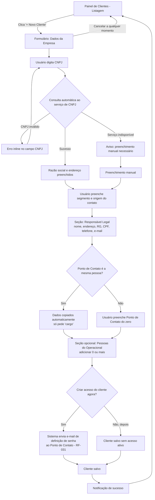
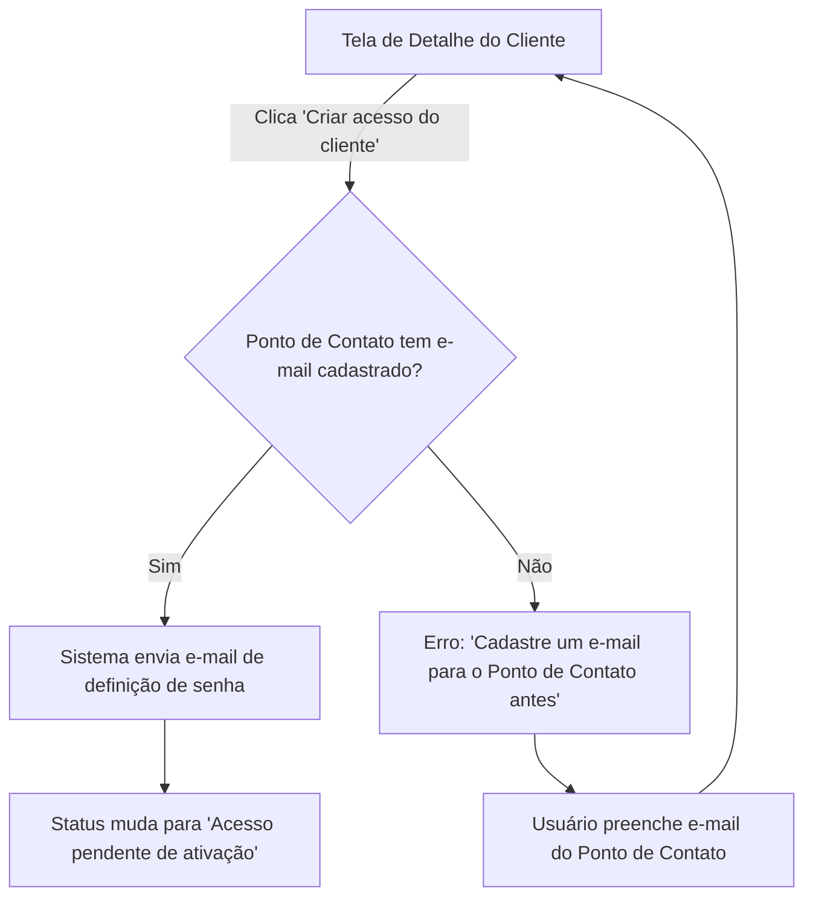

# Product Design Document — Múltiplus Software

**Módulo:** Cadastro de Clientes
**Versão:** 2.0
**Data:** 02/09/2026
**Baseado em:** SRS v1.4 (RF-001, RF-002, RF-003, RF-013, RF-020, RF-026 a RF-031)

---

## 1. Contexto e Inputs Utilizados

Este documento cobre a experiência de uso do módulo **Cadastro de Clientes**, expandido na
Sprint 2 para incluir o detalhamento de escopo absorvido após o fechamento da proposta:

- **RF-001** — Cadastro de cliente via CNPJ (preenchimento automático)
- **RF-002** — Dados complementares do cliente (segmento, origem do contato)
- **RF-003** — Painel central de clientes (listagem, busca)
- **RF-013** — Organização de links de documentos (Google Drive)
- **RF-020** — Restrição de dados sensíveis (valor, telefone) para Administrador Interno e Externo
- **RF-026** — Cadastro de Responsável Legal
- **RF-027** — Cadastro de Ponto de Contato com herança de dados
- **RF-028** — Cadastro de pessoas do operacional
- **RF-031** — Criação de acesso do cliente (login do Ponto de Contato)

**Personas que acessam este módulo:**
- **Administrador (Talita):** acesso total, inclusive dados sensíveis (valor, telefone)
- **Administrador Interno / Externo:** acesso ao cadastro, **sem ver valor e telefone** (RF-020)
- **Cliente final:** não acessa este módulo — vê os próprios dados na Área Exclusiva (módulo separado)

**Dependência externa relevante:** consulta de CNPJ via serviço terceiro (ex. BrasilAPI) —
documentada no SRS como sujeita a instabilidade (Seção 6.1). Impacta os estados de erro do fluxo.

---

## 2. Fluxos de UX

## Fluxo A: Cadastro de Novo Cliente (completo)

**Persona:** Administrador / Administrador Interno / Administrador Externo (conforme permissão)
**Objetivo:** cadastrar um novo cliente com todos os dados — PJ, Responsável Legal, Ponto de
Contato, pessoas do operacional — e, opcionalmente, criar o acesso do cliente
**Vinculado a:** RF-001, RF-002, RF-026, RF-027, RF-028, RF-031



**Passos:**
1. Acessa o Painel de Clientes — RF-003
2. Preenche dados da empresa via CNPJ (auto ou manual) — RF-001
3. Preenche segmento e origem do contato — RF-002
4. Preenche Responsável Legal — RF-026
5. Marca se o Ponto de Contato é a mesma pessoa; se sim, dados são herdados e só falta "cargo" — RF-027
6. Opcionalmente adiciona pessoas do operacional — RF-028
7. Opcionalmente já cria o acesso de login do cliente — RF-031
8. Salva — confirmação e retorno à listagem

**Pontos de decisão:**
- CNPJ inválido / serviço externo indisponível (já coberto na v1.0)
- Ponto de Contato = Responsável Legal → herança automática de dados
- Criar acesso do cliente agora ou depois (não é obrigatório no cadastro)

**Saídas do fluxo:** iguais à v1.0 (sucesso / cancelamento / erro persistente)

---

## Fluxo B: Criar Acesso do Cliente Depois do Cadastro

**Persona:** Administrador (ação também disponível pra Administrador Interno/Externo, a confirmar)
**Objetivo:** gerar o login do cliente a qualquer momento, não só na criação
**Vinculado a:** RF-031



---

## 3. Wireframes Estruturais

## Tela: Painel de Clientes (Listagem)

**Vinculado a:** RF-003
**Sem alteração relevante desde a v1.0** — ver estrutura completa na Seção 5 (histórico).

```
[HEADER: "Clientes" .......................... [AÇÃO: + Novo Cliente]]
[FILTROS: campo_busca (nome/CNPJ) | dropdown_segmento]
[LISTA: razao_social | cnpj | segmento | AÇÃO: ver detalhe]
[VAZIO — "Nenhum cliente cadastrado ainda" + AÇÃO: + Novo Cliente]
```

---

## Tela: Formulário — Novo/Editar Cliente (expandido)

**Vinculado a:** RF-001, RF-002, RF-026, RF-027, RF-028, RF-031
**Acessada por:** Administrador, Administrador Interno, Administrador Externo (conforme permissão)

```
[HEADER: "Novo Cliente" .......................... [AÇÃO: Cancelar]]

[SEÇÃO 1: Dados da Empresa]
  cnpj (obrigatório) — texto, com máscara e validação
  razao_social (obrigatório) — texto, auto-preenchido via CNPJ, editável
  endereco (opcional) — texto, auto-preenchido via CNPJ, editável
  segmento (obrigatório) — seleção
  origem_contato (obrigatório) — seleção

[SEÇÃO 2: Responsável Legal]
  nome (obrigatório) — texto
  endereco (obrigatório) — texto
  rg (obrigatório) — texto, com máscara
  cpf (obrigatório) — texto, com máscara e validação
  telefone (obrigatório) — texto, com máscara — ⚠️ campo sensível, ver RF-020
  email (obrigatório) — texto, validação de formato

[SEÇÃO 3: Ponto de Contato]
  checkbox: "É a mesma pessoa do Responsável Legal"
    [SE MARCADO]
      nome, endereço, rg, cpf, telefone, email — herdados, somente leitura
      cargo (obrigatório) — texto — único campo editável nesse caso
    [SE DESMARCADO]
      nome, endereço, rg, cpf, telefone, email, cargo — todos editáveis do zero

[SEÇÃO 4: Pessoas do Operacional] (opcional, lista dinâmica)
  [ITEM: nome | cargo | email | AÇÃO: remover]
  [AÇÃO: + Adicionar pessoa]

[SEÇÃO 5: Acesso do Cliente] (opcional)
  checkbox: "Criar acesso do cliente agora"
  [SE MARCADO: aviso "Um e-mail será enviado ao Ponto de Contato para definir a senha"]

[AÇÃO: Salvar] [AÇÃO: Cancelar]

[NOTIFICAÇÃO — erro de validação: mensagem inline por campo]
```

**Blocos e conteúdo:**
- Seções 1-2 seguem o mesmo padrão de auto-preenchimento e edição da v1.0
- Seção 3 é o ponto mais novo: a herança de dados (RF-027) precisa ficar visualmente clara —
  os campos herdados devem parecer "preenchidos automaticamente", não editáveis diretamente
  (se o usuário quiser mudar, desmarca o checkbox e preenche do zero)
- Seção 4 é totalmente opcional — cliente pode não ter ninguém do operacional cadastrado ainda
- Seção 5 é opcional e adiável — não é obrigatório criar o acesso no momento do cadastro

**Campos e validação (novos, além dos já documentados na v1.0):**

| Campo | Obrigatório? | Regra/Validação |
|---|---|---|
| responsavel_legal.rg | Sim | Formato de RG (varia por estado — validação simples de formato, não de dígito verificador) |
| responsavel_legal.cpf | Sim | Validação de dígito verificador de CPF |
| responsavel_legal.telefone | Sim | Máscara de telefone — **campo sensível, oculto para Administrador Interno/Externo (RF-020)** |
| ponto_contato.cargo | Sim (só quando herdado) | Único campo obrigatório extra quando "mesma pessoa" está marcado |
| pessoas_operacional[].email | Não | Validação de formato, se preenchido |

---

## Tela: Detalhe do Cliente (nova)

**Vinculado a:** RF-013, RF-020, RF-026, RF-027, RF-028, RF-031
**Acessada por:** Administrador, Administrador Interno, Administrador Externo (com visibilidade
de campos sensíveis conforme RF-020)

```
[HEADER: razao_social .......................... [AÇÃO: Editar] [AÇÃO: Criar acesso do cliente]]

[BLOCO: Dados da Empresa]
  cnpj | segmento | origem_contato

[BLOCO: Responsável Legal]
  nome | endereço | rg | cpf
  telefone — ⚠️ OCULTO para Administrador Interno/Externo (RF-020)
  email

[BLOCO: Ponto de Contato]
  nome | cargo | email
  telefone — ⚠️ OCULTO para Administrador Interno/Externo (RF-020)

[BLOCO: Pessoas do Operacional]
  [LISTA: nome | cargo | email]
  [VAZIO — "Nenhuma pessoa do operacional cadastrada"]

[BLOCO: Documentos]
  [LISTA: nome_documento | link | AÇÃO: abrir]
  [AÇÃO: + Adicionar link de documento]
  [VAZIO — "Nenhum documento vinculado ainda"]

[BLOCO: Status de Acesso]
  "Acesso do cliente: [Não criado / Pendente de ativação / Ativo / Bloqueado]"
  [AÇÃO: Bloquear acesso] (se ativo, RF-029) [AÇÃO: Criar acesso] (se não criado, RF-031)

[BLOCO: Projetos] (fora do escopo deste documento — ver módulo Controle de Projetos e Tarefas)
```

**Nota de permissão (RF-020):** o campo `telefone` some completamente da tela (não é só
desabilitado) para Administrador Interno e Externo — tanto no bloco de Responsável Legal
quanto no de Ponto de Contato. O mesmo vale para qualquer campo de valor financeiro que
venha a existir no cliente (nenhum ainda documentado no SRS além de telefone).

---

## 4. Estados e Casos-Limite

## Estados: Formulário Novo/Editar Cliente (adicionais à v1.0)

| Estado | O que acontece | Vinculado a |
|---|---|---|
| Ponto de Contato herdado, depois desfeito | Se o usuário desmarca o checkbox após ter herdado, os campos ficam editáveis mas mantêm os valores já copiados (não limpa) | RF-027 |
| Pessoa do operacional sem nenhum campo preenchido | Bloqueia "+ Adicionar pessoa" até nome ser preenchido; não salva item vazio | RF-028 |
| Acesso do cliente marcado, mas Ponto de Contato sem e-mail | Erro: "Preencha o e-mail do Ponto de Contato para criar o acesso" — bloqueia o salvamento dessa seção específica, não do cliente inteiro | RF-031 |

## Estados: Tela de Detalhe do Cliente (nova)

| Estado | O que acontece | Vinculado a |
|---|---|---|
| Carregando | Skeleton dos blocos | — |
| Sem documentos | "Nenhum documento vinculado ainda" + ação de adicionar | RF-013 |
| Sem pessoas do operacional | "Nenhuma pessoa do operacional cadastrada" | RF-028 |
| Acesso não criado | Botão "Criar acesso" visível, status "Não criado" | RF-031 |
| Acesso pendente | Status "Pendente de ativação" — cliente ainda não definiu senha | RF-031 |
| Acesso bloqueado | Status "Bloqueado" + botão para reativar | RF-029 |
| Visualização como Administrador Interno/Externo | Campo `telefone` (Responsável Legal e Ponto de Contato) não é renderizado — nem como campo oculto/mascarado, some da estrutura da tela | RF-020 |

---

## 5. Matriz de Rastreabilidade

| Tela/Fluxo | RF vinculado |
|---|---|
| Fluxo A: Cadastro de Novo Cliente (completo) | RF-001, RF-002, RF-026, RF-027, RF-028, RF-031 |
| Fluxo B: Criar Acesso do Cliente Depois | RF-031 |
| Tela: Painel de Clientes (Listagem) | RF-003 |
| Tela: Formulário Novo/Editar Cliente | RF-001, RF-002, RF-026, RF-027, RF-028, RF-031 |
| Tela: Detalhe do Cliente | RF-013, RF-020, RF-026, RF-027, RF-028, RF-029, RF-031 |

---

## 6. Pontos em Aberto

- ⚠️ Lista de valores para `segmento` e `origem_contato` — ainda não definida, validar com a Talita
- ⚠️ Confirmar se Administrador Interno/Externo também podem clicar em "Criar acesso do cliente"
  (Fluxo B), ou se essa ação é exclusiva do Administrador
- ⚠️ Confirmar se existe algum campo de **valor financeiro** no cadastro do cliente além do
  telefone — o SRS menciona "valor" em RF-020 mas nenhum RF anterior define esse campo
  explicitamente no cadastro de Pessoa Jurídica

---

## 7. Próximos Passos

Módulo pronto para a Sprint 2. Ao construir a versão visual/codada, usar a skill
`frontend-design` (já com a identidade visual da marca registrada). Depois deste módulo:

1. Modelar o próximo módulo (Controle de Projetos e Tarefas)
2. Resolver os pontos em aberto da Seção 6 antes ou durante a implementação

---

## Histórico de Revisões

| Versão | Data | Autor | Alterações |
|--------|------|-------|------------|
| 1.0 | 02/09/2026 | André | Versão inicial — módulo Cadastro de Clientes (RF-001 a RF-003) |
| 2.0 | 02/09/2026 | André | Expandido para Sprint 2: Responsável Legal, Ponto de Contato com herança, pessoas do operacional, documentos, criação/bloqueio de acesso do cliente, e mascaramento de dados sensíveis por perfil (RF-013, RF-020, RF-026 a RF-031). Nova tela de Detalhe do Cliente. |
