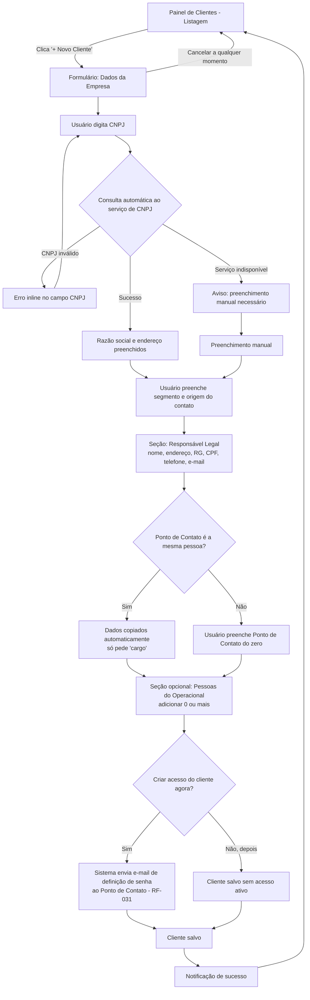
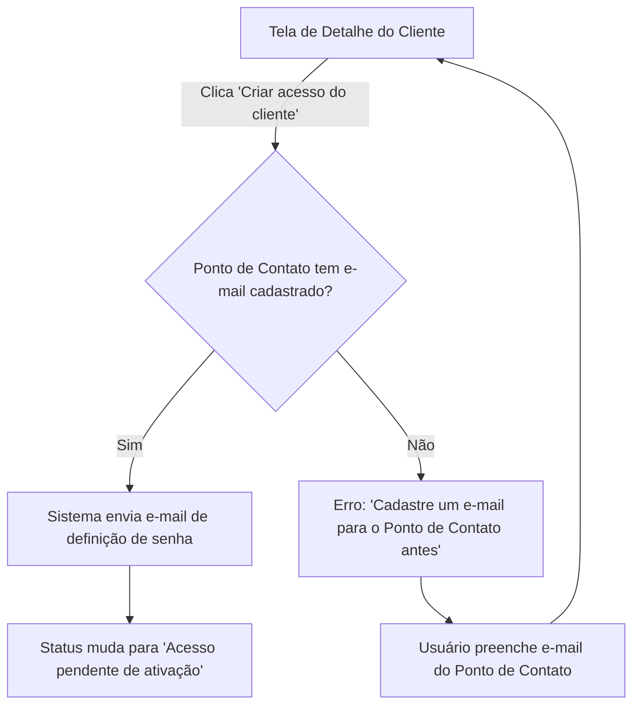

# Product Design Document — Múltiplus Software

**Módulo:** Cadastro de Clientes
**Versão:** 2.2
**Data:** 10/09/2026
**Baseado em:** SRS v1.7 (RF-001, RF-002 a RF-002d, RF-003, RF-013, RF-020, RF-026 a RF-031, RF-034, RF-035)

---

## 1. Contexto e Inputs Utilizados

Este documento cobre a experiência de uso do módulo **Cadastro de Clientes**, expandido na
Sprint 2 para incluir o detalhamento de escopo absorvido após o fechamento da proposta:

- **RF-001** — Cadastro de cliente via CNPJ (preenchimento automático)
- **RF-002** — Dados complementares do cliente (segmento, origem do contato)
- **RF-003** — Painel central de clientes (listagem, busca)
- **RF-013** — Organização de links de documentos (Google Drive)
- **RF-020** — Restrição de dados sensíveis (valor, telefone) para Colaborador Interno e Externo
- **RF-026** — Cadastro de Responsável Legal
- **RF-027** — Cadastro de Ponto de Contato com herança de dados
- **RF-028** — Cadastro de pessoas do operacional
- **RF-031** — Criação de acesso do cliente (login do Ponto de Contato)

**Personas que acessam este módulo:**

- **Administrador (Talita):** acesso total, inclusive dados sensíveis (valor, telefone)
- **Colaborador Interno / Externo:** acesso ao cadastro, **sem ver valor e telefone** (RF-020)
- **Cliente final:** não acessa este módulo — vê os próprios dados na Área Exclusiva (módulo separado)

**Dependência externa relevante:** consulta de CNPJ via serviço terceiro (ex. BrasilAPI) —
documentada no SRS como sujeita a instabilidade (Seção 6.1). Impacta os estados de erro do fluxo.

---

## 2. Fluxos de UX

## Fluxo A: Cadastro de Novo Cliente (completo)

**Nota (RF-034/RF-035):** este fluxo descreve o caminho de Pessoa Jurídica. Quando o tipo
escolhido é Pessoa Física, o formulário pula direto de "Dados da Pessoa" pra "Pessoas
Envolvidas" — não existem os passos de Responsável Legal nem Ponto de Contato — e o acesso do
cliente (Seção 5), quando criado, vai direto pra própria pessoa cadastrada, sem intermediário.

**Persona:** Administrador / Colaborador Interno / Colaborador Externo (conforme permissão)
**Objetivo:** cadastrar um novo cliente com todos os dados — PJ, Responsável Legal, Ponto de
Contato, pessoas do operacional — e, opcionalmente, criar o acesso do cliente
**Vinculado a:** RF-001, RF-002, RF-026, RF-027, RF-028, RF-031



**Passos:**

1. Acessa o Painel de Clientes — RF-003
2. Preenche dados da empresa via CNPJ (auto ou manual) — RF-001
3. Preenche segmento e origem do contato — RF-002
4. Preenche Responsável Legal — RF-026
5. Marca se o Ponto de Contato é a mesma pessoa; se sim, dados são herdados e só falta "cargo" — RF-027
6. Opcionalmente adiciona pessoas do operacional — RF-028
7. Opcionalmente já cria o acesso de login do cliente — RF-031
8. Salva — confirmação e retorno à listagem

**Pontos de decisão:**

- CNPJ inválido / serviço externo indisponível (já coberto na v1.0)
- Ponto de Contato = Responsável Legal → herança automática de dados
- Criar acesso do cliente agora ou depois (não é obrigatório no cadastro)

**Saídas do fluxo:** iguais à v1.0 (sucesso / cancelamento / erro persistente)

---

## Fluxo B: Criar Acesso do Cliente Depois do Cadastro

**Persona:** Administrador (ação também disponível pra Colaborador Interno/Externo, a confirmar)
**Objetivo:** gerar o login do cliente a qualquer momento, não só na criação
**Vinculado a:** RF-031



---

## 3. Wireframes Estruturais

## Tela: Painel de Clientes (Listagem)

**Vinculado a:** RF-003
**Atualizado na reunião de aprovação da Sprint 2** — coluna e filtro de cidade adicionados.

```
[HEADER: "Clientes" .......................... [AÇÃO: + Novo Cliente]]
[FILTROS: campo_busca (nome/CNPJ/CPF/cidade) | dropdown_segmento | dropdown_cidade]
[LISTA: razao_social/nome | cnpj/cpf | segmento | cidade | AÇÃO: ver detalhe]
[VAZIO — "Nenhum cliente cadastrado ainda" + AÇÃO: + Novo Cliente]
```

`dropdown_cidade` lista apenas cidades que já têm ao menos um cliente cadastrado (município
é opcional, RF-002c — clientes sem cidade não aparecem em nenhuma opção do filtro).
`campo_busca` passa a filtrar simultaneamente por nome, CNPJ/CPF e cidade num único campo.

---

## Tela: Formulário — Novo/Editar Cliente (revisado — PF/PJ + alterações da Sprint 2)

**Vinculado a:** RF-001, RF-002, RF-002a, RF-002b, RF-002c, RF-002d, RF-026, RF-027, RF-028, RF-031, RF-034, RF-035
**Acessada por:** Administrador, Colaborador Interno, Colaborador Externo (conforme permissão)

```
[HEADER: "Novo Cliente" .......................... [AÇÃO: Cancelar]]

[SEÇÃO 0: Tipo de Cliente] — RF-034
  seleção obrigatória: "Pessoa Física" ou "Pessoa Jurídica"
  → determina quais das seções abaixo aparecem

[SEÇÃO 1: Dados da Empresa/Pessoa]
  [SE Pessoa Jurídica]
    cnpj (opcional) — texto, com máscara e validação; se preenchido, auto-preenche razão social/endereço
    razao_social (obrigatório) — texto, auto-preenchido via CNPJ quando houver, editável
  [SE Pessoa Física]
    cpf (opcional) — texto, com máscara e validação; sem auto-preenchimento (RF-035)
    nome (obrigatório) — texto
  [Comum aos dois tipos]
    endereco (opcional) — texto livre
    estado (opcional) — seleção via API de localização (RF-002c)
    municipio (opcional) — busca/seleção, filtrado pelo estado escolhido (RF-002c)
    atividade_principal (opcional) — texto livre (RF-002a)
    porte (opcional, só PJ) — seleção: MEI, ME, EPP, Médio Porte, Grande Porte (RF-002b)
    segmento (opcional) — seleção, lista depende do tipo (PF/PJ)
      [SE "Outro"/"Outros" selecionado]
        segmento_customizado (obrigatório) — texto livre
        → valor salvo como segmento real do cliente, disponível em busca/filtro (RF-003)
    origem_contato (opcional) — seleção

[SEÇÃO 2: Responsável Legal] (somente Pessoa Jurídica — RF-026)
  nome (opcional) — texto
  endereco (opcional) — texto
  rg (opcional) — texto, com máscara
  cpf (opcional) — texto, com máscara e validação se preenchido
  telefone (opcional) — texto, com máscara — ⚠️ campo sensível, ver RF-020
  email (opcional) — texto, validação de formato se preenchido

[SEÇÃO 3: Ponto de Contato] (somente Pessoa Jurídica — RF-027)
  checkbox: "É a mesma pessoa do Responsável Legal"
    [SE MARCADO]
      nome, endereço, rg, cpf, telefone, email — herdados, somente leitura
      cargo (opcional) — texto — único campo editável nesse caso
    [SE DESMARCADO]
      nome, endereço, rg, cpf, telefone, email, cargo — todos editáveis do zero, todos opcionais

[SEÇÃO 4: Pessoas Envolvidas] (opcional, lista dinâmica) — RF-028, revisado
  [ITEM]
    tipo: "Pessoa" ou "Empresa/PJ envolvida"
    [SE Pessoa] nome (obrigatório), cpf (opcional), telefone (obrigatório), email (obrigatório)
    [SE Empresa/PJ] razao_social (obrigatório), cnpj (opcional), telefone (obrigatório), email (obrigatório)
    checkbox (fim do formulário): "É um colaborador?" (tem_acesso)
      [SE MARCADO] aviso: "Um e-mail será enviado para definir a senha de acesso"
    [AÇÃO: remover]
  [AÇÃO: + Adicionar pessoa envolvida]

[SEÇÃO 5: Acesso do Cliente] (opcional, só Pessoa Jurídica no fluxo via Ponto de Contato — RF-031)
  checkbox: "Criar acesso do cliente agora"
  [SE MARCADO: aviso "Um e-mail será enviado ao Ponto de Contato (PJ) ou à própria pessoa (PF) para definir a senha"]

[AÇÃO: Salvar] [AÇÃO: Cancelar]

[NOTIFICAÇÃO — erro de validação: mensagem inline por campo]
```

**Blocos e conteúdo:**

- Seção 0 é a mudança estrutural mais importante — tudo o que vem depois depende dela (RF-034)
- Seções 2 e 3 (Responsável Legal, Ponto de Contato) **somem completamente** quando o tipo é
  Pessoa Física — não ficam desabilitadas, não aparecem (RF-035: a própria pessoa cadastrada
  já é quem responde pelo cadastro e recebe o acesso)
- Seção 3: a herança de dados (RF-027) continua igual à v1.0 quando aplicável — os campos
  herdados parecem "preenchidos automaticamente", não editáveis diretamente
- Seção 4 (Pessoas Envolvidas) é totalmente opcional como seção, mas **se o usuário clicar em
  "+ Adicionar pessoa envolvida"**, nome/razão social, telefone e e-mail passam a ser exigidos
  pra confirmar aquele item — não dá pra salvar um item da lista em branco
- Seção 5 é opcional e adiável — não é obrigatório criar o acesso no momento do cadastro
- **Obrigatoriedade mínima (RF-002d):** a pedido da Talita, quase nada é obrigatório fora do
  essencial pra identificar o cliente — ver tabela abaixo

**Campos e validação (atualizada — obrigatoriedade mínima, RF-002d):**

| Campo                                                           | Obrigatório?                           | Regra/Validação                                                                                                       |
| --------------------------------------------------------------- | --------------------------------------- | ----------------------------------------------------------------------------------------------------------------------- |
| tipo (PF/PJ)                                                    | **Sim** (estrutural)              | —                                                                                                                      |
| razao_social / nome                                             | **Sim**                           | —                                                                                                                      |
| cnpj (se PJ) / cpf (se PF)                                      | **Sim**                           | Validação de formato/dígito verificador mantida                                                                      |
| segmento_customizado (quando "Outro/Outros")                    | **Sim**                           | Só quando "Outro/Outros" selecionado                                                                                   |
| endereco, estado, municipio                                     | Não                                    | —                                                                                                                      |
| atividade_principal                                             | Não                                    | —                                                                                                                      |
| porte (só PJ)                                                  | Não                                    | —                                                                                                                      |
| segmento, origem_contato                                        | Não                                    | —                                                                                                                      |
| responsavel_legal.* (nome, endereço, rg, cpf, telefone, email) | Não                                    | Formato mantido se preenchido —**telefone é campo sensível, oculto para Colaborador Interno/Externo (RF-020)** |
| ponto_contato.* (mesmo herdado)                                 | Não                                    | `cargo` deixa de ser obrigatório mesmo quando herdado                                                                |
| pessoas_envolvidas[].nome ou razao_social                       | **Sim, se o item for adicionado** | Trava a criação do item, não o formulário inteiro                                                                   |
| pessoas_envolvidas[].telefone                                   | **Sim, se o item for adicionado** | Máscara de telefone                                                                                                    |
| pessoas_envolvidas[].email                                      | **Sim, se o item for adicionado** | Validação de formato                                                                                                  |
| pessoas_envolvidas[].cpf ou cnpj                                | Não                                    | Validação de formato/dígito verificador se preenchido                                                                |

---

## Tela: Detalhe do Cliente (nova)

**Vinculado a:** RF-013, RF-020, RF-026, RF-027, RF-028, RF-031
**Acessada por:** Administrador, Colaborador Interno, Colaborador Externo (com visibilidade
de campos sensíveis conforme RF-020)

```
[HEADER: razao_social/nome .......................... [AÇÃO: Editar] [AÇÃO: Criar acesso do cliente]]

[BLOCO: Dados da Empresa/Pessoa]
  cnpj/cpf | segmento | origem_contato | atividade_principal | porte (só PJ) | municipio/estado

[BLOCO: Responsável Legal] (só Pessoa Jurídica)
  nome | endereço | rg | cpf
  telefone — ⚠️ OCULTO para Colaborador Interno/Externo (RF-020)
  email

[BLOCO: Ponto de Contato] (só Pessoa Jurídica)
  nome | cargo | email
  telefone — ⚠️ OCULTO para Colaborador Interno/Externo (RF-020)

[BLOCO: Pessoas Envolvidas]
  [LISTA: tipo | nome/razao_social | telefone | email | "Colaborador" (se tem_acesso) | AÇÃO: criar acesso (se ainda não tem)]
  [VAZIO — "Nenhuma pessoa envolvida cadastrada"]

[BLOCO: Documentos]
  [LISTA: nome_documento | link | AÇÃO: abrir]
  [AÇÃO: + Adicionar link de documento]
  [VAZIO — "Nenhum documento vinculado ainda"]

[BLOCO: Status de Acesso] (Pessoa Jurídica: via Ponto de Contato; Pessoa Física: via a própria pessoa)
  "Acesso do cliente: [Não criado / Pendente de ativação / Ativo / Bloqueado]"
  [AÇÃO: Bloquear acesso] (se ativo, RF-029) [AÇÃO: Criar acesso] (se não criado, RF-031)

[BLOCO: Projetos] (fora do escopo deste documento — ver módulo Controle de Projetos e Tarefas)
```

**Nota (RF-028 revisado):** o bloco de Pessoas Envolvidas agora distingue quem tem acesso
(rótulo "Colaborador") de quem é só registro — e o botão "criar acesso" some da linha assim
que `tem_acesso` for marcado, seja no cadastro (checkbox inline) ou depois (RF-033).

**Nota de permissão (RF-020):** o campo `telefone` some completamente da tela (não é só
desabilitado) para Colaborador Interno e Externo — tanto no bloco de Responsável Legal
quanto no de Ponto de Contato. O mesmo vale para qualquer campo de valor financeiro que
venha a existir no cliente (nenhum ainda documentado no SRS além de telefone).

---

## 4. Estados e Casos-Limite

## Estados: Formulário Novo/Editar Cliente (adicionais à v1.0)

| Estado                                                     | O que acontece                                                                                                                                | Vinculado a |
| ---------------------------------------------------------- | --------------------------------------------------------------------------------------------------------------------------------------------- | ----------- |
| Ponto de Contato herdado, depois desfeito                  | Se o usuário desmarca o checkbox após ter herdado, os campos ficam editáveis mas mantêm os valores já copiados (não limpa)              | RF-027      |
| Pessoa do operacional sem nenhum campo preenchido          | Bloqueia "+ Adicionar pessoa" até nome ser preenchido; não salva item vazio                                                                 | RF-028      |
| Acesso do cliente marcado, mas Ponto de Contato sem e-mail | Erro: "Preencha o e-mail do Ponto de Contato para criar o acesso" — bloqueia o salvamento dessa seção específica, não do cliente inteiro | RF-031      |

## Estados: Tela de Detalhe do Cliente (nova)

| Estado                                          | O que acontece                                                                                                                              | Vinculado a |
| ----------------------------------------------- | ------------------------------------------------------------------------------------------------------------------------------------------- | ----------- |
| Carregando                                      | Skeleton dos blocos                                                                                                                         | —          |
| Sem documentos                                  | "Nenhum documento vinculado ainda" + ação de adicionar                                                                                    | RF-013      |
| Sem pessoas do operacional                      | "Nenhuma pessoa do operacional cadastrada"                                                                                                  | RF-028      |
| Acesso não criado                              | Botão "Criar acesso" visível, status "Não criado"                                                                                        | RF-031      |
| Acesso pendente                                 | Status "Pendente de ativação" — cliente ainda não definiu senha                                                                         | RF-031      |
| Acesso bloqueado                                | Status "Bloqueado" + botão para reativar                                                                                                   | RF-029      |
| Visualização como Colaborador Interno/Externo | Campo`telefone` (Responsável Legal e Ponto de Contato) não é renderizado — nem como campo oculto/mascarado, some da estrutura da tela | RF-020      |

---

## 5. Matriz de Rastreabilidade

| Tela/Fluxo                                   | RF vinculado                                                                                       |
| -------------------------------------------- | -------------------------------------------------------------------------------------------------- |
| Fluxo A: Cadastro de Novo Cliente (completo) | RF-001, RF-002, RF-026, RF-027, RF-028, RF-031, RF-034, RF-035                                     |
| Fluxo B: Criar Acesso do Cliente Depois      | RF-031, RF-033                                                                                     |
| Tela: Painel de Clientes (Listagem)          | RF-003                                                                                             |
| Tela: Formulário Novo/Editar Cliente        | RF-001, RF-002, RF-002a, RF-002b, RF-002c, RF-002d, RF-026, RF-027, RF-028, RF-031, RF-034, RF-035 |
| Tela: Detalhe do Cliente                     | RF-013, RF-020, RF-026, RF-027, RF-028, RF-029, RF-031                                             |

---

## 6. Pontos em Aberto

Resolvidos durante a implementação da Sprint 2 (2026-09-09) — decisões registradas aqui
para não se perderem, mas sem reabrir o desenho do módulo:

- ~~Lista de valores para `segmento` e `origem_contato`~~ — implementado como texto livre
  por enquanto (não bloqueante); troca por lista fechada fica para quando a Talita definir
  os valores, sem exigir nova migration (`String` simples no schema).
- ~~Confirmar se Colaborador Interno/Externo podem "Criar acesso do cliente"~~ — não podem:
  a ação cria uma linha em `usuarios`, e a política de RLS `usuarios_write` já restringe
  isso ao ADMIN desde a Sprint 1. A escrita em todo o cadastro (Cliente, Responsável Legal,
  Ponto de Contato, Pessoas do Operacional, Documentos) seguiu o mesmo padrão ADMIN-only de
  `clientes_write`.
- ~~Campo de valor financeiro~~ — não existe nenhum no cadastro de Pessoa Jurídica; RF-020
  mascara telefone, e é o único campo sensível mascarado nesta sprint.

**Novo ponto em aberto (reunião de aprovação da Sprint 2):** o `segmento` está implementado
como texto livre na Sprint 2 (decisão pragmática do Claude Code). A revisão RF-002 desta
versão volta a especificar lista fechada + campo customizado obrigatório em "Outro/Outros" —
isso é uma migração de schema (`String` livre → enum/lista + coluna extra), não é mais um
ajuste de UI só. Sinalizar pro Claude Code antes de implementar.

---

## 7. Próximos Passos

Módulo entregue na Sprint 2 (RF-001, 002, 003, 013, 020, 026 a 031) — schema, RLS,
mascaramento de telefone via view Postgres, domínio, 29 testes (unit + integration +
smoke) e interface com a identidade visual da marca aplicada de fato (gradiente
institucional como "capa" no cabeçalho de Detalhe do Cliente, Archivo para dado/tabela,
Source Serif 4 só para texto corrido). Ver memória do projeto (sessão Claude Code) para o
detalhamento de dois bugs reais encontrados e corrigidos: view de mascaramento sem
`security_invoker` ignorava RLS da tabela base; BrasilAPI exige header `User-Agent` no
`fetch()` do Node (403 sem ele).

1. Modelar o próximo módulo (Controle de Projetos e Tarefas)

---

## Histórico de Revisõe

# Product Design Document — Múltiplus Software

**Módulo:** Cadastro de Clientes
**Versão:** 2.0
**Data:** 02/09/2026
**Baseado em:** SRS v1.4 (RF-001, RF-002, RF-003, RF-013, RF-020, RF-026 a RF-031)

---

## 1. Contexto e Inputs Utilizados

Este documento cobre a experiência de uso do módulo **Cadastro de Clientes**, expandido na
Sprint 2 para incluir o detalhamento de escopo absorvido após o fechamento da proposta:

- **RF-001** — Cadastro de cliente via CNPJ (preenchimento automático)
- **RF-002** — Dados complementares do cliente (segmento, origem do contato)
- **RF-003** — Painel central de clientes (listagem, busca)
- **RF-013** — Organização de links de documentos (Google Drive)
- **RF-020** — Restrição de dados sensíveis (valor, telefone) para Administrador Interno e Externo
- **RF-026** — Cadastro de Responsável Legal
- **RF-027** — Cadastro de Ponto de Contato com herança de dados
- **RF-028** — Cadastro de pessoas do operacional
- **RF-031** — Criação de acesso do cliente (login do Ponto de Contato)

**Personas que acessam este módulo:**

- **Administrador (Talita):** acesso total, inclusive dados sensíveis (valor, telefone)
- **Administrador Interno / Externo:** acesso ao cadastro, **sem ver valor e telefone** (RF-020)
- **Cliente final:** não acessa este módulo — vê os próprios dados na Área Exclusiva (módulo separado)

**Dependência externa relevante:** consulta de CNPJ via serviço terceiro (ex. BrasilAPI) —
documentada no SRS como sujeita a instabilidade (Seção 6.1). Impacta os estados de erro do fluxo.

---

## 2. Fluxos de UX

## Fluxo A: Cadastro de Novo Cliente (completo)

**Persona:** Administrador / Administrador Interno / Administrador Externo (conforme permissão)
**Objetivo:** cadastrar um novo cliente com todos os dados — PJ, Responsável Legal, Ponto de
Contato, pessoas do operacional — e, opcionalmente, criar o acesso do cliente
**Vinculado a:** RF-001, RF-002, RF-026, RF-027, RF-028, RF-031


**Passos:**

1. Acessa o Painel de Clientes — RF-003
2. Preenche dados da empresa via CNPJ (auto ou manual) — RF-001
3. Preenche segmento e origem do contato — RF-002
4. Preenche Responsável Legal — RF-026
5. Marca se o Ponto de Contato é a mesma pessoa; se sim, dados são herdados e só falta "cargo" — RF-027
6. Opcionalmente adiciona pessoas do operacional — RF-028
7. Opcionalmente já cria o acesso de login do cliente — RF-031
8. Salva — confirmação e retorno à listagem

**Pontos de decisão:**

- CNPJ inválido / serviço externo indisponível (já coberto na v1.0)
- Ponto de Contato = Responsável Legal → herança automática de dados
- Criar acesso do cliente agora ou depois (não é obrigatório no cadastro)

**Saídas do fluxo:** iguais à v1.0 (sucesso / cancelamento / erro persistente)

---

## Fluxo B: Criar Acesso do Cliente Depois do Cadastro

**Persona:** Administrador (ação também disponível pra Administrador Interno/Externo, a confirmar)
**Objetivo:** gerar o login do cliente a qualquer momento, não só na criação
**Vinculado a:** RF-031


---

## 3. Wireframes Estruturais

## Tela: Painel de Clientes (Listagem)

**Vinculado a:** RF-003
**Sem alteração relevante desde a v1.0** — ver estrutura completa na Seção 5 (histórico).

```
[HEADER: "Clientes" .......................... [AÇÃO: + Novo Cliente]]
[FILTROS: campo_busca (nome/CNPJ) | dropdown_segmento]
[LISTA: razao_social | cnpj | segmento | AÇÃO: ver detalhe]
[VAZIO — "Nenhum cliente cadastrado ainda" + AÇÃO: + Novo Cliente]
```

---

## Tela: Formulário — Novo/Editar Cliente (expandido)

**Vinculado a:** RF-001, RF-002, RF-026, RF-027, RF-028, RF-031
**Acessada por:** Administrador, Administrador Interno, Administrador Externo (conforme permissão)

```
[HEADER: "Novo Cliente" .......................... [AÇÃO: Cancelar]]

[SEÇÃO 1: Dados da Empresa]
  cnpj (obrigatório) — texto, com máscara e validação
  razao_social (obrigatório) — texto, auto-preenchido via CNPJ, editável
  endereco (opcional) — texto, auto-preenchido via CNPJ, editável
  segmento (obrigatório) — seleção
  origem_contato (obrigatório) — seleção

[SEÇÃO 2: Responsável Legal]
  nome (obrigatório) — texto
  endereco (obrigatório) — texto
  rg (obrigatório) — texto, com máscara
  cpf (obrigatório) — texto, com máscara e validação
  telefone (obrigatório) — texto, com máscara — ⚠️ campo sensível, ver RF-020
  email (obrigatório) — texto, validação de formato

[SEÇÃO 3: Ponto de Contato]
  checkbox: "É a mesma pessoa do Responsável Legal"
    [SE MARCADO]
      nome, endereço, rg, cpf, telefone, email — herdados, somente leitura
      cargo (obrigatório) — texto — único campo editável nesse caso
    [SE DESMARCADO]
      nome, endereço, rg, cpf, telefone, email, cargo — todos editáveis do zero

[SEÇÃO 4: Pessoas do Operacional] (opcional, lista dinâmica)
  [ITEM: nome | cargo | email | AÇÃO: remover]
  [AÇÃO: + Adicionar pessoa]

[SEÇÃO 5: Acesso do Cliente] (opcional)
  checkbox: "Criar acesso do cliente agora"
  [SE MARCADO: aviso "Um e-mail será enviado ao Ponto de Contato para definir a senha"]

[AÇÃO: Salvar] [AÇÃO: Cancelar]

[NOTIFICAÇÃO — erro de validação: mensagem inline por campo]
```

**Blocos e conteúdo:**

- Seções 1-2 seguem o mesmo padrão de auto-preenchimento e edição da v1.0
- Seção 3 é o ponto mais novo: a herança de dados (RF-027) precisa ficar visualmente clara —
  os campos herdados devem parecer "preenchidos automaticamente", não editáveis diretamente
  (se o usuário quiser mudar, desmarca o checkbox e preenche do zero)
- Seção 4 é totalmente opcional — cliente pode não ter ninguém do operacional cadastrado ainda
- Seção 5 é opcional e adiável — não é obrigatório criar o acesso no momento do cadastro

**Campos e validação (novos, além dos já documentados na v1.0):**

| Campo                       | Obrigatório?            | Regra/Validação                                                                                    |
| --------------------------- | ------------------------ | ---------------------------------------------------------------------------------------------------- |
| responsavel_legal.rg        | Sim                      | Formato de RG (varia por estado — validação simples de formato, não de dígito verificador)      |
| responsavel_legal.cpf       | Sim                      | Validação de dígito verificador de CPF                                                            |
| responsavel_legal.telefone  | Sim                      | Máscara de telefone —**campo sensível, oculto para Administrador Interno/Externo (RF-020)** |
| ponto_contato.cargo         | Sim (só quando herdado) | Único campo obrigatório extra quando "mesma pessoa" está marcado                                  |
| pessoas_operacional[].email | Não                     | Validação de formato, se preenchido                                                                |

---

## Tela: Detalhe do Cliente (nova)

**Vinculado a:** RF-013, RF-020, RF-026, RF-027, RF-028, RF-031
**Acessada por:** Administrador, Administrador Interno, Administrador Externo (com visibilidade
de campos sensíveis conforme RF-020)

```
[HEADER: razao_social .......................... [AÇÃO: Editar] [AÇÃO: Criar acesso do cliente]]

[BLOCO: Dados da Empresa]
  cnpj | segmento | origem_contato

[BLOCO: Responsável Legal]
  nome | endereço | rg | cpf
  telefone — ⚠️ OCULTO para Administrador Interno/Externo (RF-020)
  email

[BLOCO: Ponto de Contato]
  nome | cargo | email
  telefone — ⚠️ OCULTO para Administrador Interno/Externo (RF-020)

[BLOCO: Pessoas do Operacional]
  [LISTA: nome | cargo | email]
  [VAZIO — "Nenhuma pessoa do operacional cadastrada"]

[BLOCO: Documentos]
  [LISTA: nome_documento | link | AÇÃO: abrir]
  [AÇÃO: + Adicionar link de documento]
  [VAZIO — "Nenhum documento vinculado ainda"]

[BLOCO: Status de Acesso]
  "Acesso do cliente: [Não criado / Pendente de ativação / Ativo / Bloqueado]"
  [AÇÃO: Bloquear acesso] (se ativo, RF-029) [AÇÃO: Criar acesso] (se não criado, RF-031)

[BLOCO: Projetos] (fora do escopo deste documento — ver módulo Controle de Projetos e Tarefas)
```

**Nota de permissão (RF-020):** o campo `telefone` some completamente da tela (não é só
desabilitado) para Administrador Interno e Externo — tanto no bloco de Responsável Legal
quanto no de Ponto de Contato. O mesmo vale para qualquer campo de valor financeiro que
venha a existir no cliente (nenhum ainda documentado no SRS além de telefone).

---

## 4. Estados e Casos-Limite

## Estados: Formulário Novo/Editar Cliente (adicionais à v1.0)

| Estado                                                     | O que acontece                                                                                                                                | Vinculado a |
| ---------------------------------------------------------- | --------------------------------------------------------------------------------------------------------------------------------------------- | ----------- |
| Ponto de Contato herdado, depois desfeito                  | Se o usuário desmarca o checkbox após ter herdado, os campos ficam editáveis mas mantêm os valores já copiados (não limpa)              | RF-027      |
| Pessoa do operacional sem nenhum campo preenchido          | Bloqueia "+ Adicionar pessoa" até nome ser preenchido; não salva item vazio                                                                 | RF-028      |
| Acesso do cliente marcado, mas Ponto de Contato sem e-mail | Erro: "Preencha o e-mail do Ponto de Contato para criar o acesso" — bloqueia o salvamento dessa seção específica, não do cliente inteiro | RF-031      |

## Estados: Tela de Detalhe do Cliente (nova)

| Estado                                            | O que acontece                                                                                                                              | Vinculado a |
| ------------------------------------------------- | ------------------------------------------------------------------------------------------------------------------------------------------- | ----------- |
| Carregando                                        | Skeleton dos blocos                                                                                                                         | —          |
| Sem documentos                                    | "Nenhum documento vinculado ainda" + ação de adicionar                                                                                    | RF-013      |
| Sem pessoas do operacional                        | "Nenhuma pessoa do operacional cadastrada"                                                                                                  | RF-028      |
| Acesso não criado                                | Botão "Criar acesso" visível, status "Não criado"                                                                                        | RF-031      |
| Acesso pendente                                   | Status "Pendente de ativação" — cliente ainda não definiu senha                                                                         | RF-031      |
| Acesso bloqueado                                  | Status "Bloqueado" + botão para reativar                                                                                                   | RF-029      |
| Visualização como Administrador Interno/Externo | Campo`telefone` (Responsável Legal e Ponto de Contato) não é renderizado — nem como campo oculto/mascarado, some da estrutura da tela | RF-020      |

---

## 5. Matriz de Rastreabilidade

| Tela/Fluxo                                   | RF vinculado                                           |
| -------------------------------------------- | ------------------------------------------------------ |
| Fluxo A: Cadastro de Novo Cliente (completo) | RF-001, RF-002, RF-026, RF-027, RF-028, RF-031         |
| Fluxo B: Criar Acesso do Cliente Depois      | RF-031                                                 |
| Tela: Painel de Clientes (Listagem)          | RF-003                                                 |
| Tela: Formulário Novo/Editar Cliente        | RF-001, RF-002, RF-026, RF-027, RF-028, RF-031         |
| Tela: Detalhe do Cliente                     | RF-013, RF-020, RF-026, RF-027, RF-028, RF-029, RF-031 |

---

## 6. Pontos em Aberto

Resolvidos durante a implementação da Sprint 2 (2026-09-09) — decisões registradas aqui
para não se perderem, mas sem reabrir o desenho do módulo:

- ~~Lista de valores para `segmento` e `origem_contato`~~ — implementado como texto livre
  por enquanto (não bloqueante); troca por lista fechada fica para quando a Talita definir
  os valores, sem exigir nova migration (`String` simples no schema).
- ~~Confirmar se Administrador Interno/Externo podem "Criar acesso do cliente"~~ — não podem:
  a ação cria uma linha em `usuarios`, e a política de RLS `usuarios_write` já restringe
  isso ao ADMIN desde a Sprint 1. A escrita em todo o cadastro (Cliente, Responsável Legal,
  Ponto de Contato, Pessoas do Operacional, Documentos) seguiu o mesmo padrão ADMIN-only de
  `clientes_write`.
- ~~Campo de valor financeiro~~ — não existe nenhum no cadastro de Pessoa Jurídica; RF-020
  mascara telefone, e é o único campo sensível mascarado nesta sprint.

---

## 7. Próximos Passos

Módulo entregue na Sprint 2 (RF-001, 002, 003, 013, 020, 026 a 031) — schema, RLS,
mascaramento de telefone via view Postgres, domínio, 29 testes (unit + integration +
smoke) e interface com a identidade visual da marca aplicada de fato (gradiente
institucional como "capa" no cabeçalho de Detalhe do Cliente, Archivo para dado/tabela,
Source Serif 4 só para texto corrido). Ver memória do projeto (sessão Claude Code) para o
detalhamento de dois bugs reais encontrados e corrigidos: view de mascaramento sem
`security_invoker` ignorava RLS da tabela base; BrasilAPI exige header `User-Agent` no
`fetch()` do Node (403 sem ele).

1. Modelar o próximo módulo (Controle de Projetos e Tarefas)
2. **Antes de desenhar a atribuição de tarefas nesse módulo**, resolver o ADR-005
   (`docs/architecture-multiplus-software.md`) — sobreposição entre Administrador Externo
   (RF-019) e Pessoa do Operacional (RF-028): na prática, quem executa uma tarefa costuma
   ser alguém do próprio time do cliente, e hoje essas duas entidades não têm vínculo

---

## Histórico de Revisões

| Versão | Data       | Autor                    | Alterações                                                                                                                                                                                                                                                               |
| ------- | ---------- | ------------------------ | -------------------------------------------------------------------------------------------------------------------------------------------------------------------------------------------------------------------------------------------------------------------------- |
| 1.0     | 02/09/2026 | André                   | Versão inicial — módulo Cadastro de Clientes (RF-001 a RF-003)                                                                                                                                                                                                          |
| 2.0     | 02/09/2026 | André                   | Expandido para Sprint 2: Responsável Legal, Ponto de Contato com herança, pessoas do operacional, documentos, criação/bloqueio de acesso do cliente, e mascaramento de dados sensíveis por perfil (RF-013, RF-020, RF-026 a RF-031). Nova tela de Detalhe do Cliente. |
| 2.1     | 09/09/2026 | André (via Claude Code) | Sprint 2 implementada e entregue — pontos em aberto da Seção 6 resolvidos e documentados; Seção 7 atualizada.                                                                                                                                                         |
| 2.2     | 09/09/2026 | André (via Claude Code) | Adicionado "+ Adicionar pessoa" na tela de Detalhe do Cliente (RF-028 não ficava só na criação). Registrado ADR-005 (sobreposição Administrador Externo / Pessoa do Operacional) como bloqueio a resolver antes do módulo de Projetos e Tarefas.                    |
