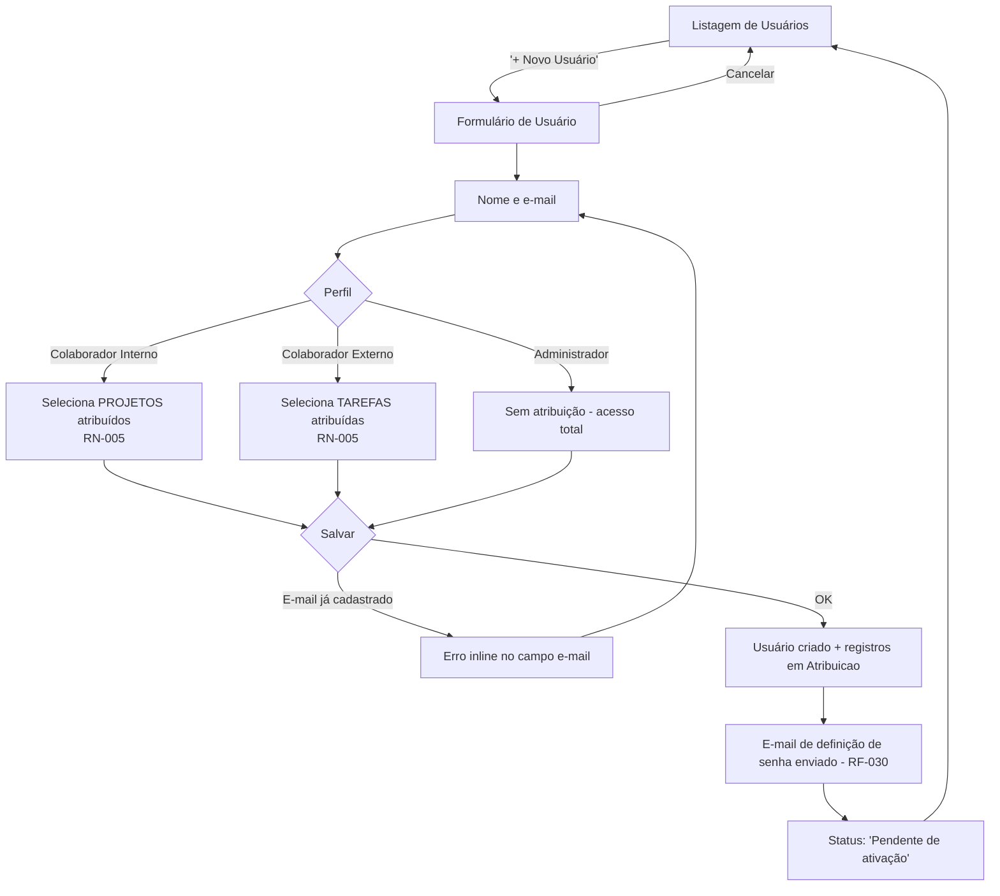
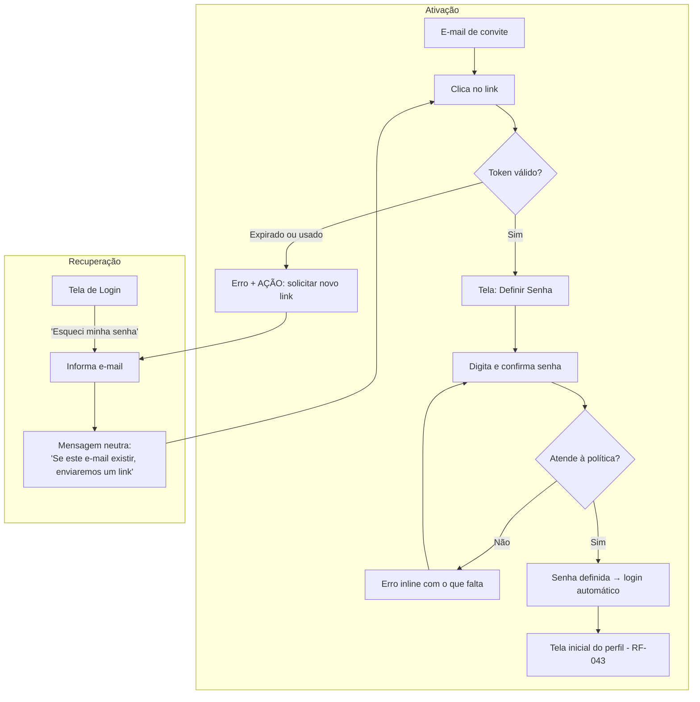
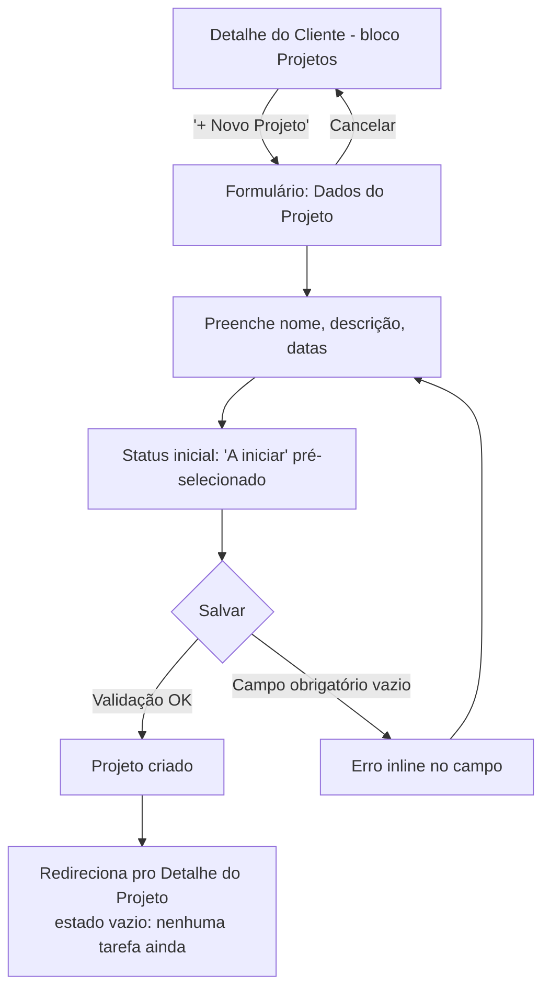
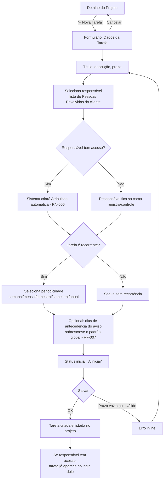
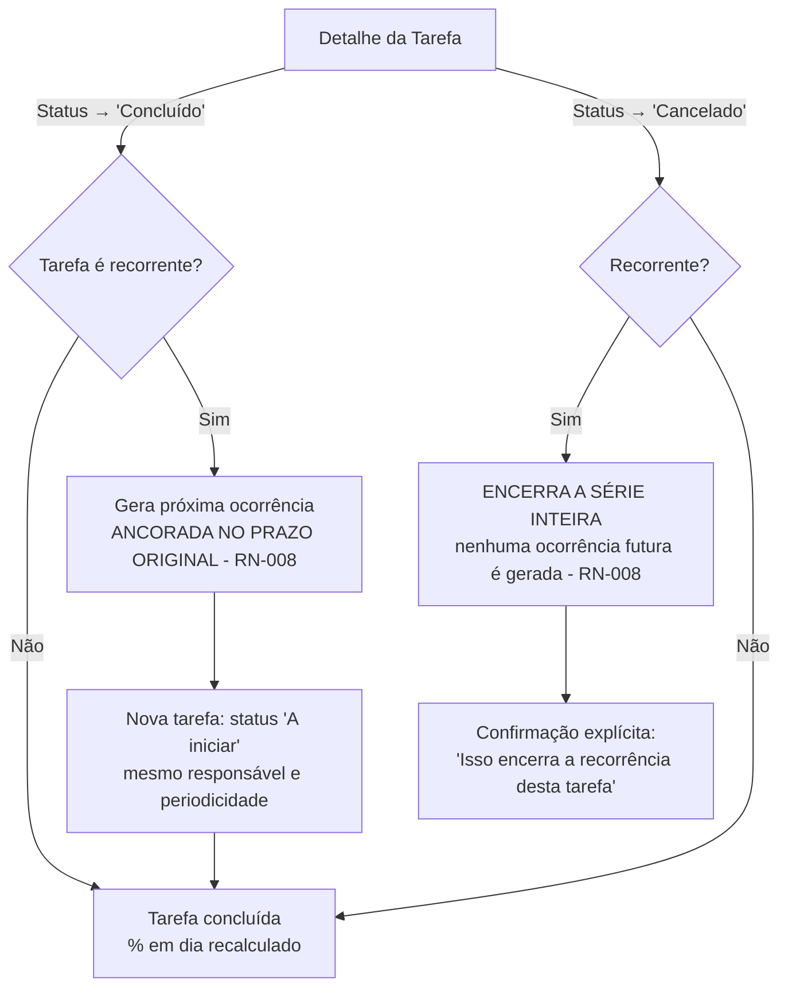
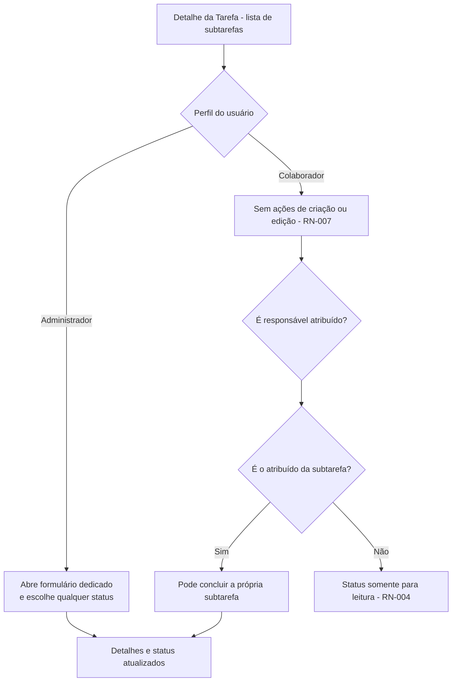
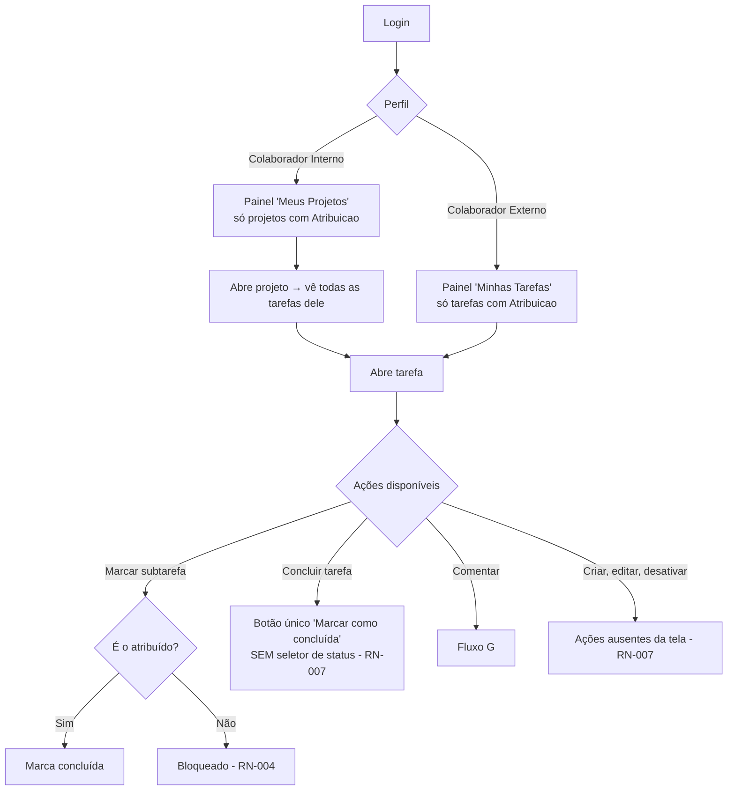
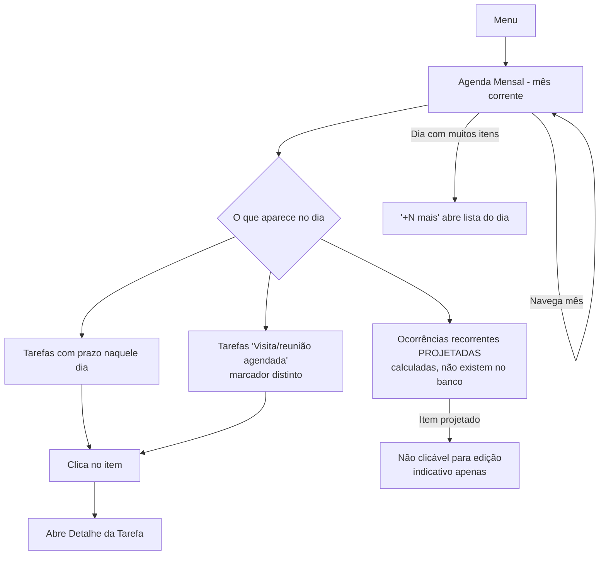
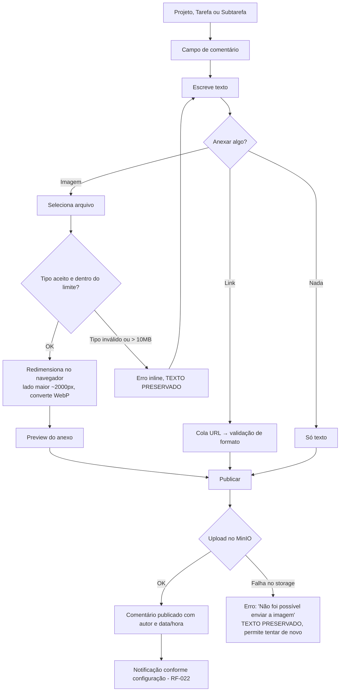
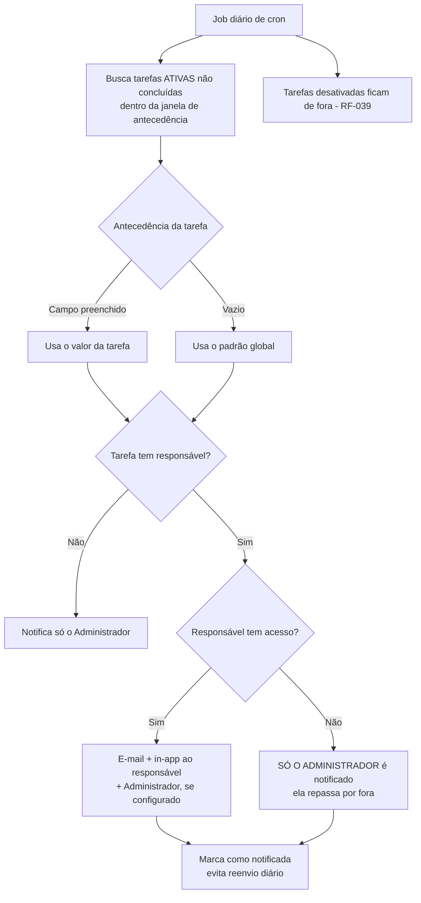

# Product Design Document — Múltiplus Software

**Módulos:** Administração e Acesso (Sprint 3) + Projetos e Tarefas (Sprint 4)
**Versão:** 1.0
**Data:** 14/09/2026
**Autor:** André (Somma)
**Baseado em:** SRS v2.0 + RFs novos RF-038 a RF-047 (ver documento complementar)

---

## 1. Contexto e Inputs Utilizados

Este documento cobre a experiência de uso de dois módulos, desenhados na mesma sessão de
planejamento porque um é pré-requisito do outro:

**Sprint 3 — Administração e Acesso** (módulo novo, identificado como lacuna no planejamento)
- RF-030 — Criação de usuário interno pela Talita (já existia no SRS, nunca virou tela)
- RF-032 — Recuperação de senha (idem)
- RF-040 — Gestão de usuários internos (novo)
- RF-041 — Gestão de atribuições (novo)
- RF-042 — Perfil próprio do usuário (novo)
- RF-043 — Navegação e tela inicial por perfil (novo, transversal)
- RF-039 — Padrão de desativação / soft delete (novo, transversal)

**Sprint 4 — Projetos e Tarefas**
- RF-004, RF-005, RF-006, RF-008, RF-024, RF-025 — núcleo Projeto/Tarefa/Subtarefa
- RF-009, RF-036, RF-037 — indicador e visões gerenciais do Administrador
- RF-018 a RF-021 — permissões aplicadas nas telas
- RF-016, RF-017 — comentários com anexo
- RF-007, RF-022, RF-023 — notificações
- RF-013 (parte de projeto), RF-038, RF-046, RF-047

**Fora do escopo destes módulos:** RF-010 (Licenças Ambientais, Sprint 5), RF-011/RF-012
(Área Exclusiva do Cliente, Sprint 6), RF-044/RF-045 (migração e LGPD, Sprint 7).

**Personas:**
- **Administrador (Talita):** acesso total; única persona que cria, edita e desativa registros
- **Colaborador Interno:** escopo por projeto atribuído; só visualiza e conclui
- **Colaborador Externo:** escopo por tarefa atribuída; só visualiza e conclui
- **Cliente final:** não acessa estes módulos (Área Exclusiva, sprint futura)

**Por que a Sprint 3 vem antes:** as telas de Colaborador Interno e Externo (Sprint 4) só
exibem o que está registrado em `Atribuicao`. Sem uma tela que crie usuário interno e faça
atribuição, essas telas não teriam como ser testadas nem demonstradas para a Talita — só
inserindo linha manualmente no Postgres.

---

## 2. Decisões Transversais (valem para todas as sprints)

### 2.1 Navegação e tela inicial por perfil (RF-043)

Item de menu que o perfil não acessa **não aparece** — não fica desabilitado. Mesma lógica
já aplicada ao telefone no RF-020.

| Perfil | Itens de menu | Tela inicial pós-login |
|---|---|---|
| Administrador | Prazos · Agenda · Clientes · Projetos · Usuários · Notificações · Perfil | **Prazos** (Tela 12) |
| Colaborador Interno | Meus Projetos · Perfil | Meus Projetos (Tela 9) |
| Colaborador Externo | Minhas Tarefas · Perfil | Minhas Tarefas (Tela 10) |
| Cliente | (Área Exclusiva — Sprint 6) | — |

**Justificativa da tela inicial do Administrador:** o Painel de Prazos já vem ordenado por
urgência e filtrado só com pendentes. Abrir num dashboard genérico adiaria em um clique a
informação que define o trabalho do dia.

### 2.2 Padrão de desativação — soft delete (RF-039)

Aplica-se a Projeto, Tarefa, Subtarefa, Cliente, Pessoa Envolvida, Documento e Usuário.

**Modelo:** colunas `ativo` (boolean, padrão `true`), `desativado_em`, `desativado_por`.

**Comportamento padrão:**
- Listagens escondem desativados por padrão; toggle "Mostrar desativados" revela, com
  marcação visual clara
- Registro desativado é **somente leitura** — não edita, não comenta, não marca subtarefa
- Desativado sai de toda visão gerencial e cálculo: não entra no "% em dia" (RF-009), não
  aparece na Agenda (RF-036) nem no Painel de Prazos (RF-037), não dispara notificação de
  prazo (RF-007)
- "Desativar" pede confirmação explicando o efeito; "Reativar" volta ao estado anterior
- **Só o Administrador** desativa e reativa (RN-007)

**Cascata:** desativar um projeto torna suas tarefas e subtarefas inacessíveis junto, **sem**
marcar cada filho individualmente. Assim, reativar o projeto devolve tudo ao estado anterior.
Marcar cada filho tornaria a reativação uma operação destrutiva de informação.

> Decisão de modelo de dados — registrar como **ADR-008** no ADD.

---

# PARTE I — Sprint 3: Administração e Acesso

## 3. Fluxos de UX — Administração e Acesso

### Fluxo AA: Criar usuário interno e atribuir trabalho

**Persona:** Administrador (Talita)
**Objetivo:** dar acesso a um novo colaborador e já definir o que ele enxerga
**Vinculado a:** RF-030, RF-040, RF-041, RN-005



**Pontos de decisão:** o perfil escolhido determina a **granularidade** da atribuição —
projeto para Interno, tarefa para Externo (RN-005). Administrador não recebe atribuição.

**Saídas:** usuário criado e convidado / e-mail duplicado / cancelamento.

---

### Fluxo AB: Definir e recuperar senha

**Persona:** qualquer usuário (interno ou cliente)
**Objetivo:** ativar o acesso recebido por e-mail, ou recuperar acesso perdido
**Vinculado a:** RF-030, RF-031, RF-032



**Nota de segurança:** a mensagem da recuperação é **sempre a mesma**, exista ou não o
e-mail. Confirmar quais e-mails estão cadastrados entregaria a composição da carteira de
clientes a quem tentar adivinhar.

**Esta tela é usada por quatro requisitos diferentes** que hoje assumem que ela existe:
RF-028 (checkbox "é um colaborador"), RF-030, RF-031 e RF-033.

---

## 4. Wireframes — Administração e Acesso

### Tela A1: Listagem de Usuários

**Vinculado a:** RF-040, RF-039
**Acessada por:** Administrador apenas

```
[HEADER: "Usuários" .......................... [AÇÃO: + Novo Usuário]]
[FILTROS: campo_busca (nome/e-mail) | dropdown_perfil | toggle "Mostrar desativados"]
[LISTA: nome | email | perfil | status_acesso | nº atribuições | AÇÃO: ver/editar]
[VAZIO — "Nenhum usuário além de você" + AÇÃO: + Novo Usuário]
```

**Blocos e conteúdo:**
- `status_acesso`: Ativo | Pendente de ativação | Desativado
- `nº atribuições`: quantos projetos (Interno) ou tarefas (Externo) — zero é sinal de alerta,
  esse usuário loga e não vê nada
- Usuário vinculado a uma Pessoa Envolvida (FK do ADR-005) mostra essa origem

**Ações disponíveis:**
- Editar → Tela A2
- Reenviar convite (se pendente)
- Desativar / Reativar (RF-039) — desativar revoga o acesso sem apagar histórico de
  comentários e conclusões

---

### Tela A2: Formulário Novo/Editar Usuário

**Vinculado a:** RF-030, RF-040, RF-041

```
[HEADER: "Novo Usuário" .......................... [AÇÃO: Cancelar]]

[SEÇÃO 1: Identificação]
  nome (obrigatório) — texto
  email (obrigatório) — validação de formato + unicidade

[SEÇÃO 2: Perfil de Acesso]
  perfil (obrigatório) — seleção: Administrador | Colaborador Interno | Colaborador Externo
  → determina a Seção 3

[SEÇÃO 3: Atribuições] — RF-041, RN-005
  [SE Colaborador Interno]
    seleção múltipla de PROJETOS
    aviso: "Verá todas as tarefas e subtarefas dos projetos selecionados"
  [SE Colaborador Externo]
    seleção múltipla de TAREFAS (agrupadas por cliente > projeto)
    aviso: "Verá apenas as tarefas selecionadas, sem visão do projeto"
  [SE Administrador]
    aviso: "Acesso total ao sistema — sem atribuição específica"

[AÇÃO: Salvar e enviar convite] [AÇÃO: Cancelar]
```

| Campo | Obrigatório? | Regra/Validação |
|---|---|---|
| nome | **Sim** | — |
| email | **Sim** | Formato válido; único no sistema |
| perfil | **Sim** | Lista fechada |
| atribuições | Não | Permitido salvar sem; sinalizado na listagem |

---

### Tela A3: Gestão de Atribuições

**Vinculado a:** RF-041, RF-018, RF-019, RN-005, RN-006

Acessível tanto pelo usuário (A2) quanto pelo projeto/tarefa — o mesmo vínculo visto dos
dois lados.

```
[HEADER: "Atribuições — [nome do usuário]"]
[RESUMO: perfil | granularidade aplicável]

[BLOCO: Atribuições Ativas]
  [LISTA: entidade (projeto ou tarefa) | cliente | origem | AÇÃO: remover]
    → origem: "Manual" ou "Automática (responsável de tarefa)" — RN-006
  [VAZIO — "Nenhuma atribuição — este usuário não visualiza nada ao entrar"]

[AÇÃO: + Adicionar atribuição]
```

**Nota sobre atribuição automática (RN-006):** quando uma Pessoa Envolvida com acesso é
definida responsável por uma tarefa, o `Atribuicao` é criado automaticamente; ao trocar o
responsável, é removido. Essas linhas aparecem aqui marcadas como "Automática" — remover
manualmente uma atribuição automática exigiria também tirar a pessoa de responsável, então a
ação de remover fica **bloqueada** nesses casos, com explicação.

---

### Tela A4: Definir Senha

**Vinculado a:** RF-030, RF-031, RF-032

```
[LOGO/IDENTIDADE]
[TÍTULO: "Definir sua senha"]
[TEXTO: "Olá, [nome]. Crie uma senha para acessar o Múltiplus Software."]
  senha (obrigatório) — campo protegido, com opção de exibir
  confirmar_senha (obrigatório) — deve coincidir
[REQUISITOS DE SENHA: lista com marcação do que já foi atendido]
[AÇÃO: Definir senha e entrar]
[ESTADO — token inválido/expirado: mensagem + AÇÃO: solicitar novo link]
```

### Tela A5: Esqueci Minha Senha

**Vinculado a:** RF-032

```
[TÍTULO: "Recuperar acesso"]
  email (obrigatório) — validação de formato
[AÇÃO: Enviar link] [AÇÃO: Voltar ao login]
[APÓS ENVIO — sempre a mesma mensagem:
  "Se este e-mail estiver cadastrado, você receberá um link em instantes."]
```

### Tela A6: Meu Perfil

**Vinculado a:** RF-042
**Acessada por:** todos os perfis

```
[HEADER: "Meu Perfil"]
[BLOCO: Meus Dados]
  nome (editável) | email (somente leitura — só o Administrador altera)
  perfil (somente leitura)
[BLOCO: Segurança]
  [AÇÃO: Alterar senha] → senha atual + nova + confirmação
[BLOCO: Minhas Atribuições] (somente leitura, não-Administrador)
  [LISTA: projetos ou tarefas atribuídas]
```

---

## 5. Estados — Administração e Acesso

| Tela | Estado | Comportamento | Vinculado a |
|---|---|---|---|
| A1 Listagem | Só a Talita cadastrada | "Nenhum usuário além de você" + ação de criar | RF-040 |
| A1 Listagem | Usuário sem atribuição | Sinalizado visualmente — loga e não vê nada | RF-041 |
| A1 Listagem | Usuário desativado | Oculto por padrão; visível com o toggle, em modo leitura | RF-039 |
| A2 Formulário | E-mail duplicado | Erro inline no campo, sem perder o resto do formulário | RF-040 |
| A3 Atribuições | Atribuição automática | Remoção bloqueada com explicação (trocar responsável na tarefa) | RN-006 |
| A4 Definir Senha | Token expirado ou já usado | Erro + ação de solicitar novo link | RF-032 |
| A4 Definir Senha | Senha fraca | Requisitos exibidos com marcação do que falta | RF-032 |
| A5 Recuperação | E-mail inexistente | Mesma mensagem do caso de sucesso (não confirma cadastro) | RNF-001 |
| A6 Perfil | Colaborador | Campo de e-mail somente leitura | RF-042 |

---

# PARTE II — Sprint 4: Projetos e Tarefas

## 6. Fluxos de UX — Núcleo

### Fluxo A: Criar Projeto para um Cliente

**Persona:** Administrador
**Vinculado a:** RF-004, RF-024, RF-038



---

### Fluxo B: Criar Tarefa com Prazo, Responsável e Recorrência

**Persona:** Administrador apenas (RN-007)
**Vinculado a:** RF-005, RF-006, RF-024, RN-002, RN-006, RN-008



**Pontos de decisão:** responsável **com** acesso gera `Atribuicao` automático (RN-006);
**sem** acesso fica só como controle. Recorrência abre o seletor de periodicidade.

---

### Fluxo C: Concluir Tarefa e Gerar Ocorrência Recorrente

**Vinculado a:** RF-006, RF-024, RN-002, RN-008



**Regra crítica (RN-008):** a próxima ocorrência conta a partir do **prazo original**, nunca
da data de conclusão. Tarefa mensal com prazo 10/09 concluída em 20/09 gera a próxima em
**10/10**, não 20/10. Sem isso, a série derivaria para frente a cada atraso, e um prazo
regulatório anual sairia do lugar ao longo dos anos.

---

### Fluxo D: Gerenciar Subtarefas e Atualizar Status

**Vinculado a:** RF-008, RF-021, RF-025, RN-004, RN-007



**Definição atual:** subtarefas são registros completos, não itens de checklist. A RN-004
restringe a conclusão ao responsável atribuído e ao Administrador; RN-007 mantém edição e
seleção livre de status exclusivas do Administrador.

---

### Fluxo E: Colaborador executa a tarefa atribuída

**Vinculado a:** RF-018, RF-019, RF-021, RF-024, RN-004, RN-005, RN-007



**Detalhe de permissão (RN-007):** o colaborador **não tem seletor de status**. Ele tem uma
única ação, "Marcar como concluída", que move a tarefa para "Concluído". Os outros oito
valores do RF-024 são exclusivos do Administrador — vários deles ("Protocolado", "Sob análise
do órgão ambiental") pressupõem contato com o órgão, que é trabalho da Talita.

---

### Fluxo F: Talita consulta a agenda e age sobre um prazo

**Persona:** Administrador, exclusivo
**Vinculado a:** RF-036, RF-006, RF-024



**Decisão de projeção (lacuna resolvida):** a RF-006 só cria a próxima ocorrência quando a
anterior é concluída ou vence — então um mês futuro estaria quase vazio no banco. A agenda
**calcula e exibe** as ocorrências futuras como itens indicativos, sem criá-las. Não mexe no
modelo de dados nem no job de cron, e não gera registros órfãos ao cancelar uma série
(RN-008). A lógica de projeção exige teste unitário dedicado.

> Registrar como **ADR-009** no ADD.

---

## 7. Wireframes — Projetos e Tarefas

### Tela 1: Painel de Projetos (listagem)

**Vinculado a:** RF-004, RF-009, RF-024, RF-039
**Acessada por:** Administrador (todos); Colaborador Interno (só atribuídos, via RLS)

```
[HEADER: "Projetos" .......................... [AÇÃO: + Novo Projeto] (só Admin)]
[FILTROS: campo_busca (nome do projeto/cliente) | dropdown_cliente | dropdown_status
          | toggle "Mostrar desativados" (só Admin)]
[LISTA: nome_projeto | cliente | status | prazo_mais_proximo | % em dia | AÇÃO: ver detalhe]
[VAZIO — "Nenhum projeto cadastrado ainda" + AÇÃO: + Novo Projeto]
```

- `% em dia` calculado sobre as tarefas ativas do projeto (RF-009, sem tolerância — RN-001)
- `prazo_mais_proximo`: menor prazo entre as tarefas pendentes
- Para Colaborador Interno, a restrição é por RLS, não filtro de UI

---

### Tela 2: Formulário Novo/Editar Projeto

**Vinculado a:** RF-004, RF-024, RF-038
**Acessada por:** Administrador apenas

```
[HEADER: "Novo Projeto" .......................... [AÇÃO: Cancelar]]

[SEÇÃO 1: Identificação]
  cliente (obrigatório) — seleção; pré-preenchido se veio do Detalhe do Cliente
  nome_projeto (obrigatório) — texto
  descricao (opcional) — texto longo

[SEÇÃO 2: Prazos e Status]
  data_inicio (opcional) — data
  data_prevista_conclusao (opcional) — data
  status (obrigatório) — A iniciar | Em andamento | Concluído | Cancelado (padrão: A iniciar)

[AÇÃO: Salvar] [AÇÃO: Cancelar]
```

| Campo | Obrigatório? | Regra/Validação |
|---|---|---|
| cliente | **Sim** | Deve existir e estar ativo; não editável após criação |
| nome_projeto | **Sim** | — |
| descricao | Não | — |
| data_inicio / data_prevista_conclusao | Não | Conclusão ≥ início, se ambas preenchidas |
| status | **Sim** | Lista fechada RF-024 |

---

### Tela 3: Detalhe do Projeto

**Vinculado a:** RF-004, RF-005, RF-009, RF-013, RF-016, RF-024, RF-039

```
[HEADER: nome_projeto | cliente ..... [AÇÃO: Editar] [AÇÃO: + Nova Tarefa] [AÇÃO: Desativar]]
                                       (todas as ações só para Administrador — RN-007)

[BLOCO: Resumo]
  status (badge) | data_inicio | data_prevista_conclusao
  INDICADOR: "% em dia" — ex. "8 de 10 tarefas em dia (80%)" — só Administrador

[BLOCO: Tarefas]
  [FILTROS: status | responsável | só pendentes (padrão) | mostrar desativadas (só Admin)]
  [LISTA: titulo | prazo | responsavel | status | ícone recorrente | progresso (3/5) | AÇÃO: abrir]
  [ORDENAÇÃO padrão: prazo mais próximo primeiro]
  [VAZIO — "Nenhuma tarefa neste projeto" + AÇÃO: + Nova Tarefa]

[BLOCO: Documentos] — RF-013
  [LISTA: nome_documento | link | AÇÃO: abrir]
  [AÇÃO: + Adicionar link de documento] (só Admin)

[BLOCO: Comentários do Projeto] — RF-016, ver Seção 8
```

Tarefa com prazo vencido e não concluída aparece marcada como atrasada — sem tolerância
(RN-001), vira atrasada no dia seguinte ao prazo.

---

### Tela 4: Formulário Nova/Editar Tarefa

**Vinculado a:** RF-005, RF-006, RF-007, RF-024, RN-002, RN-006, RN-008
**Acessada por:** Administrador apenas (RN-007)

```
[HEADER: "Nova Tarefa" — projeto X ............ [AÇÃO: Cancelar]]

[SEÇÃO 1: Identificação]
  titulo (obrigatório) — texto
  descricao (opcional) — texto longo

[SEÇÃO 2: Prazo e Responsável]
  prazo (obrigatório) — data
  responsavel (opcional) — seleção entre Pessoas Envolvidas ativas do cliente
    [SE tem_acesso = sim] aviso: "Esta pessoa passará a visualizar esta tarefa" (RN-006)
    [SE tem_acesso = não] aviso: "Registro apenas para controle — não acessa o sistema"

[SEÇÃO 3: Recorrência] — RF-006, RN-002, RN-008
  checkbox: "Tarefa recorrente"
  [SE MARCADO]
    periodicidade (obrigatório) — Semanal | Mensal | Trimestral | Semestral | Anual
    nota: "A próxima ocorrência será contada a partir do prazo, não da data de conclusão"

[SEÇÃO 4: Aviso de Prazo] — RF-007
  dias_antecedencia (opcional) — número
    placeholder: "Padrão do sistema: [N] dias" — preenchido só se quiser sobrescrever

[SEÇÃO 5: Status]
  status (obrigatório) — 9 valores do RF-024 (padrão: A iniciar)

[AÇÃO: Salvar] [AÇÃO: Cancelar]
```

| Campo | Obrigatório? | Regra/Validação |
|---|---|---|
| titulo | **Sim** | — |
| prazo | **Sim** | Data válida; permite data passada (cadastro retroativo) |
| responsavel | Não | Só Pessoas Envolvidas ativas do cliente daquele projeto |
| periodicidade | **Sim, se recorrente** | Lista fechada RN-002 |
| dias_antecedencia | Não | Inteiro > 0; vazio herda o padrão global |
| status | **Sim** | Lista fechada RF-024 |

**Troca de responsável:** ao salvar com responsável diferente, o `Atribuicao` do anterior é
removido e um novo é criado para quem tem acesso (RN-006, decisão já fechada e testada).

---

### Tela 5: Detalhe da Tarefa

**Vinculado a:** RF-005, RF-008, RF-016, RF-021, RF-024, RF-025, RF-046, RN-004, RN-007

```
[HEADER: titulo_tarefa | projeto > cliente ..... [AÇÃO: Editar] [SELETOR: status]]
         ↑ trilha completa só para Admin e Colaborador Interno
         ↑ Colaborador Externo: apenas "titulo_tarefa | [nome do cliente]" — RF-046
         ↑ Colaborador: sem [Editar]; no lugar do seletor, botão "Marcar como concluída"

[BLOCO: Resumo]
  prazo (+ badge "Atrasada" se vencida e não concluída) | responsavel
  recorrência: "Mensal" ou "Não recorrente"
  descricao

[BLOCO: Subtarefas] — RF-008
  PROGRESSO: "3 de 5 concluídas"
  [ITEM: titulo | prazo | responsável | status]
    → clicar no item abre card expansível com descrição, prazo, responsável,
      etiquetas, status e comentários
    → clicar no status abre as opções; escolha livre só para Administrador
    → responsável atribuído pode concluir a própria subtarefa (RN-004)
  [AÇÃO: + Nova subtarefa] abre formulário dedicado (só Administrador)
  [VAZIO — "Nenhuma subtarefa ainda"]

[BLOCO: Comentários da Tarefa] — ver Seção 8
```

**Subtarefa — campos:** `titulo` (obrigatório), `descricao`, `prazo` (opcional), `atribuido_a`
(obrigatório, Pessoa Envolvida ou equipe), `etiquetas` (opcional — RF-025) e `status`
(`EM_ANDAMENTO`, `CONCLUIDO` ou `CANCELADO`). Comentários ficam no card da subtarefa.

### Tela 5.1: Nova Subtarefa

Formulário dedicado, acessado pela tarefa pai. Campos: título, descrição, prazo opcional,
status inicial (Em andamento por padrão), responsável e etiquetas. Após salvar, a subtarefa
aparece na lista da tarefa e abre seu card para acompanhamento e comentários.

---

### Tela 9: Painel "Meus Projetos" (Colaborador Interno)

**Vinculado a:** RF-018, RN-005, RN-007

```
[HEADER: "Meus Projetos"]          ← sem ação de criação (RN-007)
[FILTROS: campo_busca | dropdown_status]
[LISTA: nome_projeto | cliente | status | prazo_mais_proximo | tarefas_pendentes | AÇÃO: abrir]
[VAZIO — "Você ainda não foi atribuído a nenhum projeto"]
```

- Restrição por `Atribuicao` via RLS, não filtro de UI
- **Não exibe "% em dia"** — indicador gerencial, exclusivo do Administrador
- Sem telefone nem valor em ponto algum (RF-020)

---

### Tela 10: Painel "Minhas Tarefas" (Colaborador Externo)

**Vinculado a:** RF-019, RF-046, RN-005, RN-007

```
[HEADER: "Minhas Tarefas"]
[FILTROS: toggle "Só pendentes" (padrão ligado) | dropdown_status]
[LISTA: titulo | cliente (só o nome) | prazo (+ badge Atrasada) | status | progresso | AÇÃO: abrir]
[ORDENAÇÃO: prazo mais próximo primeiro]
[VAZIO — "Nenhuma tarefa atribuída a você no momento"]
```

- Exibe o **nome do cliente apenas** (RF-046) — sem CNPJ/CPF, endereço, segmento ou telefone,
  e sem link de navegação para o cliente
- Não exibe o projeto — o Colaborador Externo não tem visão de projeto (RF-019/RN-005)

---

### Tela 11: Agenda Mensal do Administrador

**Vinculado a:** RF-036, RF-006, RF-024
**Acessada por:** Administrador apenas — ausente do menu dos demais perfis

```
[HEADER: "Agenda" ......... [NAV: ← Setembro 2026 →] [AÇÃO: Hoje]]
[FILTROS: dropdown_cliente | dropdown_projeto | toggle "Só visitas/reuniões"]

[GRADE MENSAL: 7 colunas (Dom–Sáb) × 5-6 linhas]
  [CÉLULA DIA]
    número_do_dia (dia atual destacado)
    [ITEM: titulo_tarefa | cliente | marcador de tipo]
      → tipos: prazo normal | prazo atrasado | visita/reunião agendada | ocorrência projetada
    ["+N mais" se exceder o espaço → abre lista do dia]
  [DIA SEM ITENS: célula vazia]

[LEGENDA: significado de cada marcador]
[VAZIO — "Nenhum prazo neste mês"]
```

"Visualmente distinta" (exigência do RF-036) é decisão do `frontend-design` — aqui se define
apenas que **existe** um marcador de tipo por item e que a legenda é obrigatória.

---

### Tela 12: Painel de Subtarefas por Prazo (Administrador)

**Vinculado a:** RF-037, RF-024, RF-043, RN-001
**É a tela inicial do Administrador (RF-043)**

```
[HEADER: "Prazos"]
[FILTROS: toggle "Só pendentes" (PADRÃO LIGADO) | dropdown_cliente | dropdown_projeto | campo_busca]

[LISTA — ordenada por prazo mais próximo primeiro; sem prazo no final]
  [LINHA: subtarefa | tarefa pai | cliente | projeto | responsável | prazo | status
          | AÇÃO: abrir card da subtarefa]

[VAZIO com filtro pendentes — "Nenhuma subtarefa pendente nesta seleção."]
[VAZIO sem subtarefa alguma — "Nenhuma subtarefa cadastrada ainda"]
```

- "Só pendentes" ligado esconde Concluído e Cancelado; desligado mostra tudo mantendo a
  ordenação por prazo
- Atrasada = prazo passado e não concluída, sem margem (RN-001)
- Subtarefas sem prazo aparecem depois das que têm data e não entram no indicador "% em dia"
- Subtarefas, tarefas e projetos desativados nunca aparecem aqui (RF-039)

---

## 8. Comentários e Notificações

### Fluxo G: Comentar com anexo

**Vinculado a:** RF-016, RF-017



**Regra inegociável:** se o upload falhar, o texto digitado **não pode ser perdido**. É o erro
mais comum nesse tipo de tela e o mais irritante para quem escreveu um parágrafo.

### Componente: Bloco de Comentários

**Aparece em:** Detalhe do Projeto, Detalhe da Tarefa e cada item de Subtarefa

```
[BLOCO: Comentários (N)]
  [NOVO COMENTÁRIO]
    campo_texto (obrigatório se não houver anexo)
    [AÇÃO: anexar imagem] [AÇÃO: adicionar link]
    [PREVIEW do anexo, com AÇÃO: remover]
    [AÇÃO: Publicar]
  [LISTA — mais recente primeiro]
    [ITEM: autor | perfil | data/hora | texto | imagem (thumb, abre ampliada) | link]
  [VAZIO — "Nenhum comentário ainda"]
```

| Campo | Obrigatório? | Regra |
|---|---|---|
| texto | Sim, se não houver anexo | Não permite comentário totalmente vazio |
| imagem | Não | Uma por comentário (RF-017); **WebP, JPEG ou PNG; máximo 10MB** |
| link | Não | Uma URL por comentário; validação de formato |

**Decisão de upload (RF-017 revisado):** formatos WebP, JPEG e PNG; limite absoluto de 10MB;
**redimensionamento automático no navegador** antes do envio (lado maior ~2000px, conversão
para WebP). Uma foto de celular de 8MB vira algo em torno de 400KB sem perda perceptível em
tela. O limite de 10MB existe como trava contra o caso patológico, não como uso esperado.
**Motivo do limite:** o arquivo vive no MinIO do VPS Contabo e é sincronizado para o
Cloudflare R2, cujo free tier é de 10GB — sem compressão, poucas centenas de anexos
estourariam a franquia.

**Permissões:** Colaborador Externo pode comentar (RF-019: "comentar e finalizar").
Comentário publicado **não é editável nem removível** — é registro histórico, e em contexto de
prazo regulatório o histórico tem valor probatório (RF-047).

---

### Fluxo H: Notificação de prazo próximo

**Vinculado a:** RF-007, RF-039, RN-001



**Decisão sobre responsável sem login:** desde o ADR-007 o responsável pode ser uma Pessoa
Envolvida sem acesso ao sistema. Nesse caso o sistema **não envia e-mail para ela** — notifica
apenas o Administrador, que repassa pelo canal que já usa. Evita enviar e-mail transacional a
alguém que forneceu o contato ao cliente da Talita, não à Múltiplus (RNF-002/LGPD).

---

### Tela 13: Configuração de Notificações por Perfil

**Vinculado a:** RF-007, RF-022, RF-023
**Acessada por:** Administrador apenas

```
[HEADER: "Notificações"]
[AVISO: "A configuração vale para todos os usuários do perfil, não por pessoa"]

[MATRIZ: linhas = eventos | colunas = perfis]
                          Admin   Col.Interno   Col.Externo
  Prazo se aproximando     [e][s]    [e][s]        [e][s]
  Tarefa concluída         [e][s]    [e][s]        [e][s]
  Projeto concluído        [e][s]    [e][s]        [e][s]
  Novo comentário          [e][s]    [e][s]        [e][s]
  Atribuição recebida      [e][s]    [e][s]        [e][s]
        ([e] = e-mail, [s] = dentro do sistema)

[CONFIG GERAL]
  dias_antecedencia_padrao (obrigatório) — número, padrão 7 — RF-007
  nota: "Uma tarefa pode ter antecedência própria, que prevalece sobre este valor"

[AÇÃO: Salvar]
```

**Eventos notificáveis (RF-022 revisado):**

| Evento | Origem | Quando dispara |
|---|---|---|
| Prazo se aproximando | RF-007 | X dias antes do vencimento |
| Tarefa concluída | RF-023 | Status vai para "Concluído" |
| Projeto concluído | RF-023 | Status do projeto vai para "Concluído" |
| Novo comentário | novo | Alguém comenta em item que envolve o destinatário |
| Atribuição recebida | novo | O usuário passa a ser responsável ou é atribuído |

**Padrão inicial sugerido:** Administrador recebe tudo (e-mail + in-app); colaboradores
recebem prazo, comentário e atribuição. A Talita ajusta depois nesta tela — que é o propósito
do RF-022.

**Eventos deliberadamente fora:** "tarefa atrasada" (dispara depois do vencimento, quando já
não há o que prevenir, e a Talita já vê no Painel de Prazos) e "mudança de status" (ruído
excessivo, dado que a tarefa percorre vários dos 9 valores).

---

### Componente: Notificações in-app

**Vinculado a:** RF-023

```
[HEADER GLOBAL: ícone de sino + contador de não lidas]
  [PAINEL ao clicar]
    [LISTA — não lidas primeiro]
      [ITEM: ícone do tipo | texto | tempo relativo | AÇÃO: abrir item relacionado]
    [AÇÃO: marcar todas como lidas]
    [VAZIO — "Nenhuma notificação"]
```

Abrir a notificação leva ao item de origem e marca como lida. Exige tabela nova de
notificações, conforme a nota técnica já registrada no RF-023.

---

## 9. Estados e Casos-Limite — Projetos e Tarefas

### Painel de Projetos (Tela 1)

| Estado | O que acontece | Vinculado a |
|---|---|---|
| Vazio | "Nenhum projeto cadastrado ainda" + ação de criar (só Admin) | RF-004 |
| Carregando | Skeleton de linhas | — |
| Colaborador Interno sem atribuição | "Você ainda não foi atribuído a nenhum projeto" | RF-018 |

### Detalhe do Projeto (Tela 3)

| Estado | O que acontece | Vinculado a |
|---|---|---|
| Sem tarefas | "% em dia" exibe "—" (não 0%); estado vazio convida a criar | RF-009 |
| Todas concluídas | "% em dia" = 100%; sugere mudar status para "Concluído" | RF-009, RF-024 |
| Projeto cancelado | Ações de criação desabilitadas; somente leitura | RF-024 |
| Projeto desativado | Somente leitura; tarefas inacessíveis junto, sem marcação individual | RF-039 |

### Detalhe da Tarefa (Tela 5)

| Estado | O que acontece | Vinculado a |
|---|---|---|
| Tarefa atrasada | Badge "Atrasada" + contagem de dias vencidos | RN-001 |
| Sem subtarefas | "Nenhuma subtarefa ainda" (+ formulário dedicado, só Admin) | RF-008 |
| Não atribuído à subtarefa | Status somente para leitura | RN-004, RF-021 |
| Visualização como colaborador | Sem [Editar], sem seletor de status; só "Marcar como concluída" | RN-007 |
| Colaborador Externo | Vê só esta tarefa e o nome do cliente; sem navegação ao projeto | RF-019, RF-046 |
| Ocorrência recorrente nova | Aparece "A iniciar", com indicação de origem por recorrência | RF-006 |
| Série recorrente cancelada | Indica que a recorrência foi encerrada; sem geração futura | RN-008 |

### Agenda Mensal (Tela 11)

| Estado | O que acontece | Vinculado a |
|---|---|---|
| Carregando | Skeleton da grade | — |
| Mês sem prazos | Grade renderizada vazia, com mensagem discreta | RF-036 |
| Dia com excesso de itens | "+N mais" abre a lista completa do dia | RF-036 |
| Ocorrência projetada | Item indicativo, não clicável para edição | RF-006, RF-036 |
| Perfil não-Administrador | Rota bloqueada, item ausente do menu | RF-036, RF-043 |

### Painel de Tarefas por Prazo (Tela 12)

| Estado | O que acontece | Vinculado a |
|---|---|---|
| Tudo em dia | "Nenhuma tarefa pendente com prazo. Tudo em dia." | RF-037 |
| Filtro sem resultado | "Nenhuma tarefa corresponde aos filtros" + limpar filtros | RF-037 |
| Mostrando todas | Concluídas/canceladas visualmente atenuadas, na mesma ordem | RF-037, RF-024 |
| Perfil não-Administrador | Rota bloqueada, item ausente do menu | RF-037, RF-043 |

### Painéis de colaborador (Telas 9 e 10)

| Estado | O que acontece | Vinculado a |
|---|---|---|
| Sem atribuição | Mensagem explicativa, sem ação de criação | RF-018, RF-019 |
| Atribuição removida na sessão | A tarefa some da lista no próximo carregamento | RN-006 |
| Acesso direto por URL a item não atribuído | Bloqueado por RLS — página de "sem permissão" | RF-018, RF-019, RNF-001 |

### Comentários e Notificações

| Componente | Estado | Comportamento |
|---|---|---|
| Comentários | Enviando | Botão desabilitado + indicador; texto travado, não perdido |
| Comentários | Falha de upload | Erro específico do anexo; texto preservado; permite republicar |
| Comentários | Arquivo fora do padrão | Erro nomeando formatos aceitos e o limite de 10MB |
| Comentários | Item desativado | Lista visível, campo de novo comentário ausente |
| Notificações | Sem não lidas | Sem contador; painel lista o histórico recente |
| Notificações | Item de origem desativado | Notificação permanece, abre em modo leitura |
| Config (Tela 13) | Salvo | Confirmação; vale imediatamente para novos eventos |

---

## 10. Matriz de Rastreabilidade

### Sprint 3 — Administração e Acesso

| Tela/Fluxo | RF vinculado |
|---|---|
| Fluxo AA: Criar usuário e atribuir | RF-030, RF-040, RF-041, RN-005 |
| Fluxo AB: Definir e recuperar senha | RF-030, RF-031, RF-032 |
| Tela A1: Listagem de Usuários | RF-040, RF-039 |
| Tela A2: Formulário de Usuário | RF-030, RF-040, RF-041 |
| Tela A3: Gestão de Atribuições | RF-041, RF-018, RF-019, RN-005, RN-006 |
| Tela A4: Definir Senha | RF-030, RF-031, RF-032 |
| Tela A5: Esqueci Minha Senha | RF-032 |
| Tela A6: Meu Perfil | RF-042 |
| Transversal: navegação e tela inicial | RF-043 |
| Transversal: desativação | RF-039, RN-007 |

### Sprint 4 — Projetos e Tarefas

| Tela/Fluxo | RF vinculado |
|---|---|
| Fluxo A: Criar Projeto | RF-004, RF-024, RF-038 |
| Fluxo B: Criar Tarefa | RF-005, RF-006, RF-007, RF-024, RN-002, RN-006, RN-008 |
| Fluxo C: Concluir / recorrência | RF-006, RF-024, RN-002, RN-008 |
| Fluxo D: Subtarefas e atualização de status | RF-008, RF-021, RF-025, RN-004, RN-007 |
| Fluxo E: Colaborador executa | RF-018, RF-019, RF-021, RF-024, RN-004, RN-005, RN-007 |
| Fluxo F: Agenda | RF-036, RF-006, RF-024 |
| Fluxo G: Comentar com anexo | RF-016, RF-017, RF-047 |
| Fluxo H: Notificação de prazo | RF-007, RF-039, RN-001 |
| Tela 1: Painel de Projetos | RF-004, RF-009, RF-024, RF-039 |
| Tela 2: Formulário de Projeto | RF-004, RF-024, RF-038 |
| Tela 3: Detalhe do Projeto | RF-004, RF-005, RF-009, RF-013, RF-016, RF-024, RF-039 |
| Tela 4: Formulário de Tarefa | RF-005, RF-006, RF-007, RF-024, RN-002, RN-006, RN-008 |
| Tela 5: Detalhe da Tarefa | RF-005, RF-008, RF-016, RF-021, RF-024, RF-025, RF-046, RN-004, RN-007 |
| Tela 9: Meus Projetos | RF-018, RN-005, RN-007 |
| Tela 10: Minhas Tarefas | RF-019, RF-046, RN-005, RN-007 |
| Tela 11: Agenda Mensal | RF-036, RF-006, RF-024 |
| Tela 12: Painel de Prazos | RF-037, RF-024, RF-043, RN-001 |
| Tela 13: Config de Notificações | RF-007, RF-022, RF-023 |
| Componente: Comentários | RF-016, RF-017, RF-047 |
| Componente: Notificações in-app | RF-023 |

---

## 11. Mapa de Cobertura RF → Sprint

### Já entregue

| Sprint | RFs |
|---|---|
| 1 — Infra e autenticação | RF-014, RF-015, políticas de RLS de RF-018/019/021 |
| 2 — Cadastro de Clientes | RF-001, 002, 002a-d, 003, 013 (cliente), 020, 026, 027, 028, 029, 031, 033, 034, 035 |

### Planejado

| Sprint | RFs |
|---|---|
| **3 — Administração e Acesso** | RF-030, 032, 039, 040, 041, 042, 043 |
| **4 — Projetos e Tarefas** | RF-004, 005, 006, 007, 008, 009, 013 (projeto), 016, 017, 022, 023, 024, 025, 036, 037, 038, 046, 047 + telas de RF-018/019/021 |
| **5 — Licenças Ambientais** | RF-010 |
| **6 — Área Exclusiva do Cliente** | RF-011, RF-012 |
| **7 — Fechamento** | RF-044 (migração assistida), RF-045 (exclusão LGPD) |

### Três pontos que o mapa revelou

1. **RF-005 está meio implementado.** O ADD v1.8 registra que `Tarefa.responsavel` e a RN-006
   entraram como campo novo na Sprint 2, com trigger e testes — mas sem UI, porque o módulo de
   Projetos não existia. Conferir o repositório antes de planejar a Sprint 4, para não
   reconstruir o que já está feito.
2. **RF-013 está pela metade.** O critério de aceite fala em vincular documento **a um
   projeto**; a Sprint 2 implementou apenas no cliente. A parte de projeto cai na Sprint 4.
3. **RF-044 é contratual.** A migração assistida (planilhas/Trello/Drive) está nos Critérios
   de Aceite Globais do SRS. Colocá-la na Sprint 7 significa que é a última coisa antes da
   entrega — se a Talita espera migrar antes de usar de verdade, precisa subir na ordem.

---

## 12. Testes Sugeridos (aplicando o Padrão de Testes por Sprint)

### Sprint 3 — Administração e Acesso

- [ ] **Permissão/RLS:** usuário recém-criado sem atribuição não enxerga projeto nem tarefa
- [ ] **Permissão/RLS:** Colaborador Externo atribuído à Tarefa Y não acessa a Tarefa Z por URL direta
- [ ] **Permissão/RLS:** apenas Administrador acessa a listagem e o formulário de usuários
- [ ] **Smoke:** criar usuário → receber convite → definir senha → logar → cair na tela inicial do perfil
- [ ] **Unitário:** token de definição de senha expirado é rejeitado; token usado não reutiliza
- [ ] **Integração:** recuperação de senha devolve a mesma resposta para e-mail existente e inexistente
- [ ] **Regressão:** suíte completa das Sprints 1 e 2 passando

### Sprint 4 — Projetos e Tarefas

- [ ] **Unitário (RN-008):** recorrência ancora no prazo original — prazo 10/09 concluído em
      20/09 gera 10/10; caso-limite: mês com menos dias (prazo 31/01 mensal → 28/02)
- [ ] **Unitário (RN-008):** cancelar tarefa recorrente encerra a série, sem nova ocorrência
- [ ] **Unitário (RN-001):** "% em dia" — tarefa exatamente no dia do prazo e tarefa vencida ontem
- [ ] **Unitário:** projeção de ocorrências futuras da agenda (ADR-009) para cada periodicidade
- [ ] **Permissão/RLS (RN-004):** colaborador não conclui subtarefa de outra pessoa, mesmo com
      acesso ao projeto — atenção à armadilha de `NULL` em PL/pgSQL já documentada no ADR-007
- [ ] **Permissão/RLS (RN-007):** colaborador não cria, edita nem desativa nada; endpoints
      bloqueados, não só botão escondido na UI
- [ ] **Permissão/RLS (RF-046):** Colaborador Externo recebe só o nome do cliente, sem os
      demais dados cadastrais
- [ ] **Permissão/RLS (RF-039):** registro desativado sai de "% em dia", Agenda, Painel de
      Prazos e notificações
- [ ] **Smoke:** criar projeto → criar tarefa recorrente → concluir → nova ocorrência no prazo certo
- [ ] **Smoke:** comentar com imagem (upload real no MinIO) e com falha de upload simulada,
      confirmando que o texto é preservado
- [ ] **Integração externa:** falha no MinIO no upload de anexo (Seção 6.1 do SRS)
- [ ] **Regressão:** suíte completa das Sprints 1 a 3 passando

---

## 13. Próximos Passos

1. ~~Aplicar os RFs novos ao SRS~~ — **feito na Sprint 3 (16/09/2026), SRS v2.1:** RF-038 a
   RF-047 nas seções 3.16 a 3.18, RN-007/RN-008/RN-009, e as revisões de RN-002 e RN-004. As
   revisões de RF-006, RF-007, RF-017, RF-022, RF-024 e RF-036 valem para telas da Sprint 4 e
   entram junto com elas, para não descrever no SRS um comportamento que ainda não existe
2. ~~Registrar **ADR-008** e **ADR-009** no ADD~~ — **feito, ADD v1.9.** O ADR-008 traz
   também as consequências que só apareceram na implementação (função `SECURITY DEFINER`
   para a herança, `false` em vez de `NULL`, e por que `clientes_write` não pode exigir
   `ativo`)
3. ~~Conferir no repositório o que já existe de `Tarefa.responsavel` e RN-006~~ — **feito na
   auditoria que abriu a Sprint 3:** ambos existem desde a Sprint 2, com trigger e testes, e
   foram reaproveitados (a origem "automática" da Tela A3 é derivada de `Tarefa.responsavel`)
4. Validar com a Talita os três pontos que são decisão de negócio, não técnica:
   - quais status de tarefa o colaborador pode movimentar (definido como apenas "Concluído")
   - o Colaborador Externo ver o nome do cliente (implicação de confidencialidade se for
     terceiro de fora da Múltiplus)
   - a posição da migração assistida (RF-044) no roadmap
5. Aplicar a skill `frontend-design` tela a tela na execução visual, respeitando a identidade
   já aplicada na Sprint 2 (gradiente institucional no cabeçalho de detalhe, Archivo para
   dado/tabela, Source Serif 4 para texto corrido)

---

## Histórico de Revisões

| Versão | Data | Autor | Alterações |
|--------|------|-------|------------|
| 1.0 | 14/09/2026 | André | Versão inicial — módulos Administração e Acesso (Sprint 3) e Projetos e Tarefas (Sprint 4). Inclui decisões transversais de navegação (RF-043) e desativação (RF-039), mapa de cobertura RF → sprint e testes sugeridos por sprint. |
| 1.1 | 16/09/2026 | André | Parte I implementada na Sprint 3 (Telas A1 a A6, navegação e desativação). Próximos Passos 1 a 3 concluídos. Dois desvios registrados, ambos por dependência da Sprint 4: o menu do Administrador traz só Clientes, Usuários e Perfil, e a tela inicial dele é Clientes até o Painel de Prazos existir; as seções de atribuição das Telas A2 e A3 estão completas, mas sem projeto ou tarefa para listar enquanto o CRUD desses módulos não for construído. |
